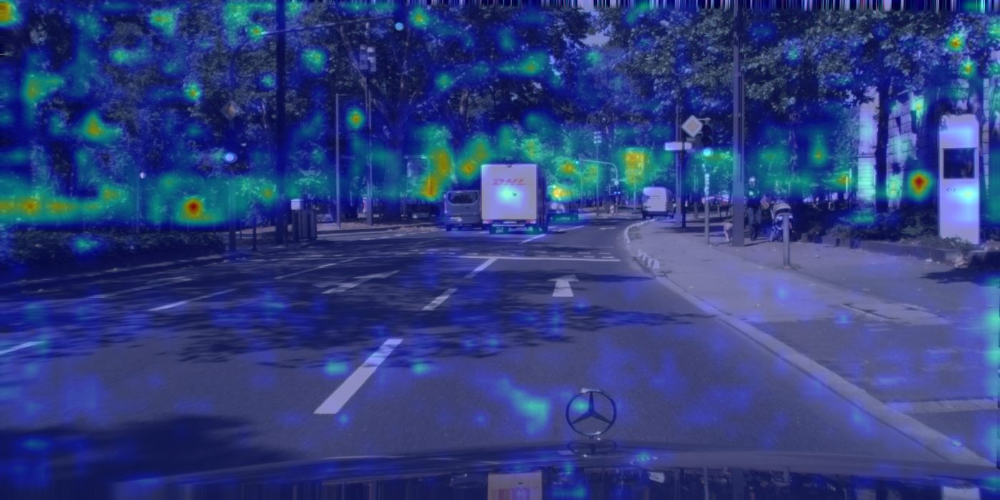
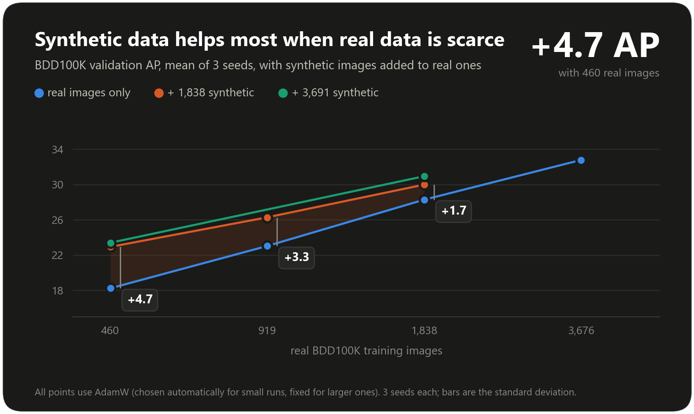
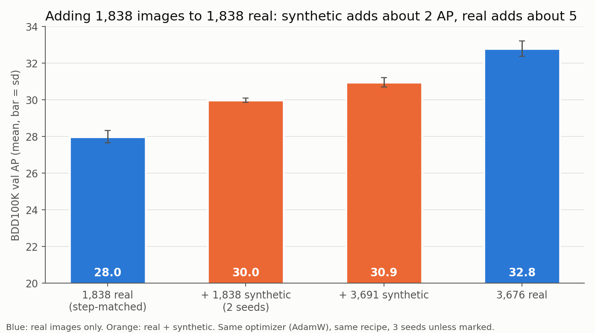
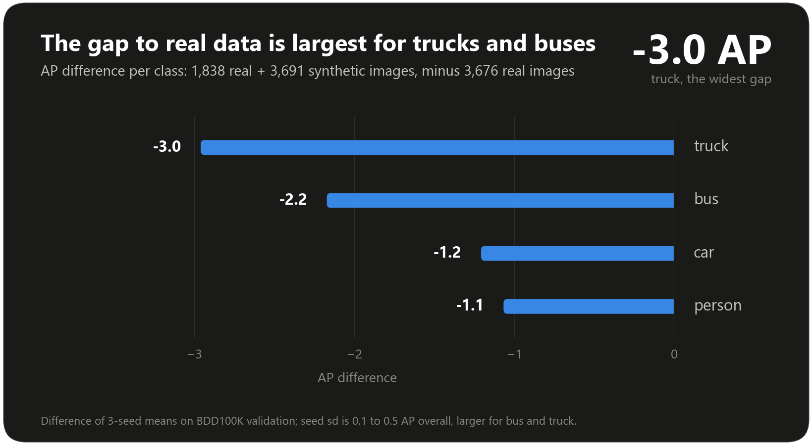
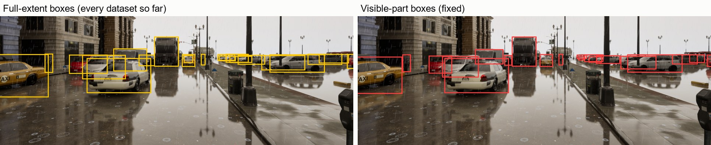
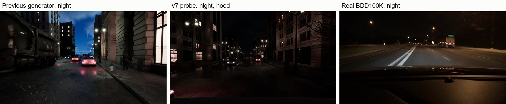
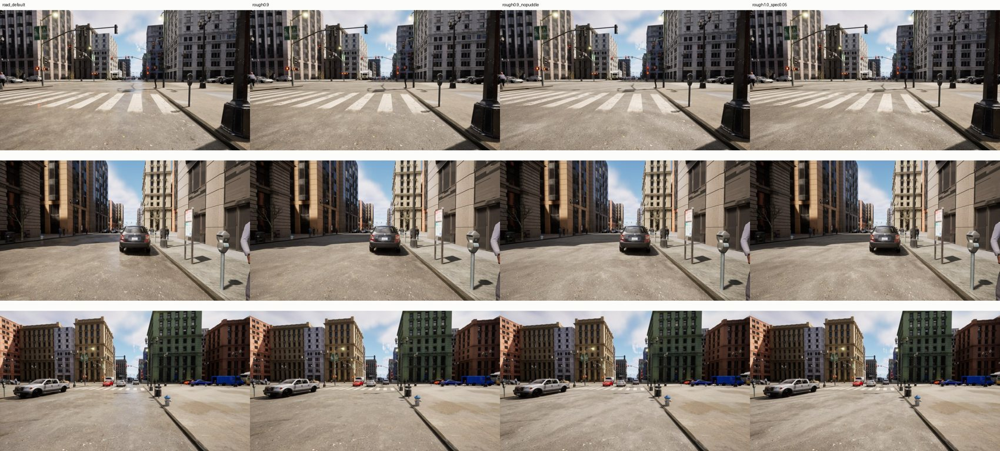
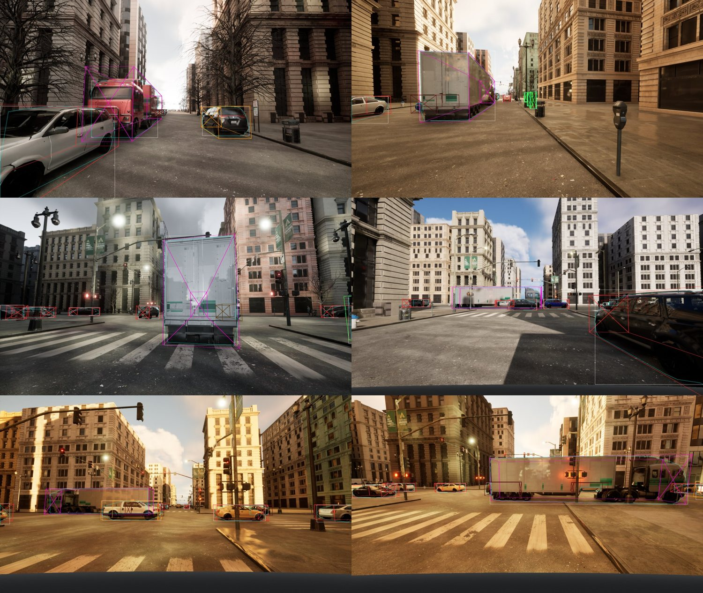
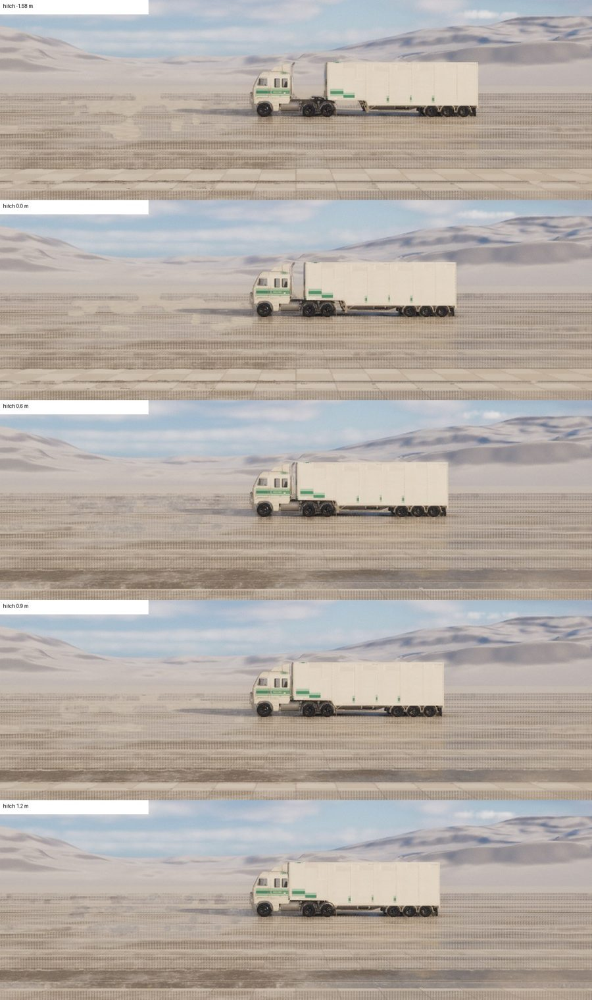
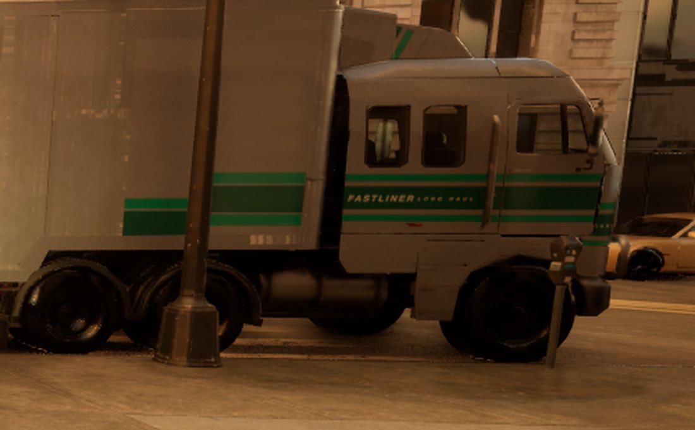

# Experiment Log — Sim-to-Real Detection Transfer

Tracks every synthetic-data training run for the train-synthetic/test-real experiment: what
changed, why, and what happened on the real benchmarks (BDD100K val, 10,000 images; Cityscapes
val, 500 images). Each entry is written after the run's evaluation completes, not before —
numbers here are always measured, never predicted.

All arms use YOLOv10m, imgsz 960, eval settings `--conf 0.001 --iou 0.6 --max-det 100`.
"Scratch" = trained from `yolov10m.yaml` for 200 epochs. "Fine-tune" = trained from COCO
weights (`yolov10m.pt`) for 50 epochs. Real-control = 1,838 real BDD100K training images,
equal size to the synthetic training set, trained the same way as scratch — the fair
same-data-volume reference point.

## Reference arms (not synthetic, for scale)

| Arm | BDD100K AP / AP50 | Cityscapes AP / AP50 |
|---|---|---|
| COCO-pretrained baseline (no fine-tuning) | 34.8 / 55.0 | 41.6 / 59.7 |
| Real control (1,838 real images) | 28.1 / 48.4 | 26.1 / 42.5 |

## v1 — first live-rendered dataset (2,037 images, 800 scenarios)

**Dataset:** `live_dataset/train2000`. Baseline generator: fixed night preset (no exposure
variety), 20% night share, occlusion filter kept any object ≥10% visible at full un-occluded
box extent, only 7 of 14 vehicle models had paint-color variation (bus/most trucks/some
SUVs fixed to one factory color), object annotation had no distance cutoff (long unobstructed
streets over-represented distant, small objects in the training labels).

| Arm | BDD100K AP / AP50 | Cityscapes AP / AP50 |
|---|---|---|
| Scratch | 2.9 / 6.6 | 2.5 / 6.2 |
| Fine-tune | 4.9 / 10.4 | 10.3 / 20.7 |

## v2 — occlusion label fix only

**Change:** re-exported v1's existing images with a stricter kept-visibility floor
(`visibility_fraction >= 0.5` instead of `>= 0.1`), dropping annotations for majority-hidden
objects that were still being boxed at full un-occluded extent (44% of v1's boxes had
visibility_fraction < 0.5). No new images rendered; no other change.

| Arm | BDD100K AP / AP50 | Cityscapes AP / AP50 |
|---|---|---|
| Scratch | 3.0 / 6.4 | 2.7 / 5.7 |
| Fine-tune | 6.2 / 12.4 (car AP 10.6→13.5) | 11.0 / 20.5 |

**Verdict:** small, real gain on fine-tune; scratch unchanged. Confirmed the occlusion-box
issue was real but not the dominant gap.

## v3 — distance cutoff + night lighting variety + vehicle color diversity (fresh 2,037-image render)

**Dataset:** `live_dataset/train2000_v3`, same 800 scenario seeds as v1/v2 (isolates the
generator changes from city-layout randomness). Three fixes, each independently measured
against real benchmark statistics before implementing:
- **Per-category max annotation distance** (pedestrian 30m, car/SUV 54m, bus 41m, truck 53m),
  fit by matching synthetic median box-height-as-fraction-of-frame to BDD100K/Cityscapes'
  own measured values. Root cause: long, unobstructed streets meant every frame's annotations
  included far more distant, small objects than real dashcam sightlines ever contain.
- **Night exposure variety**: `NIGHT_EXPOSURE_BIAS_RANGE_EV = (-4.34, -0.38)` replacing one
  fixed value, and `night_share` raised from 20% to 39% to match BDD100K's own measured night
  share. Root cause: night brightness std was 1.92 across our old renders vs 15.73 in BDD100K
  (real photos span ~4 stops of brightness; ours spanned under 2).
- **Vehicle paint diversity**: extended the recolor mechanism (project-owned paint material
  copy, `Paint Variation` switch off, runtime `BaseColor` override) from 7 to 12 of 14 models
  — van, all 3 non-recolorable trucks, and the bus. Taxi and police-car liveries deliberately
  excluded (real, baked-in liveries, not arbitrary colors). Root cause: every bus/most trucks
  rendered in one fixed factory color in every scenario, forever.
- Also carried forward the v2 occlusion-visibility refilter (0.5 floor).

Live-verified before the full run: 40-scenario pre-flight batch confirmed box heights matched
distance-cutoff targets, night brightness variance present at the right order of magnitude,
and all 12 recolorable models showing full real-world color-share distributions.

| Arm | BDD100K AP / AP50 | Cityscapes AP / AP50 |
|---|---|---|
| Scratch | 2.7 / 5.7 | 4.3 / 7.2 |
| Fine-tune | 6.1 / 11.8 | 12.9 / 21.1 (bus 3.6→11.2, truck 3.8→6.0) |

**Verdict:** essentially flat on BDD100K (the larger, more reliable benchmark — 10,000 images,
1,597 bus boxes); a real-looking gain on Cityscapes concentrated in bus/truck, but Cityscapes'
bus/truck ground truth is tiny (98/93 boxes total), so that gain isn't fully trusted yet. All
three fixes were independently confirmed working exactly as designed — the lack of BDD100K
improvement means these three factors are not the dominant cause of the sim-to-real gap.

### Post-v3 diagnostic deep-dive (5 parallel research agents, all evidence-based)

1. **Pixel statistics** (300 images/source, measured): synthetic renders are 2.6-3.0x sharper
   (Laplacian variance) and 1.3-1.9x more saturated than both real benchmarks. BDD100K alone
   shows a strong JPEG block-compression signature (~1.86x) our lossless PNGs and Cityscapes
   PNGs both lack (~1.0x, confirming this is JPEG-specific, not a general synthetic-vs-real gap).
2. **Grad-CAM** (21 real images, all 3 detection scales hooked, verified visually): attention
   is diffuse and concentrates on generic high-contrast texture — tree foliage, curb edges,
   lane paint, wet-road glare — rather than vehicle/pedestrian shape. Directly corroborates
   finding 1: the model likely learned "sharp edge = object" from oversharpened, oversaturated
   training renders, a cue any high-contrast real texture also satisfies.

   
   *The model's top prediction here is "truck" (conf 0.78) on the real DHL truck, but the
   strongest, reddest Grad-CAM activations are in the foliage above it, not the truck itself.*
3. **Label convention** (confirmed via BDD100K's official annotation instructions, direct
   quote): BDD100K boxes only the *visible* portion of an object for both truncation and
   occlusion (modal). Cityscapes' polygon-derived instances work the same way. Our frame-edge
   truncation is already modal-correct (boxes are genuinely clipped to in-frame content), but
   occlusion-by-another-object is not — objects above the 0.5 visibility floor still get the
   full un-occluded extent, not the visible sub-region. Real, confirmed, unaddressed mismatch.
4. **Rendering pipeline audit** (code-cited): motion blur, depth of field, chromatic
   aberration, film grain, vignetting, and lens distortion are all absent from the render
   pipeline; auto-exposure is deliberately tuned for stability, the opposite of real cameras.
   Training augmentation uses ultralytics defaults unmodified, including `mosaic=1.0` on
   single-coherent-scene synthetic data — flagged as a plausible, untested contributor.
5. **Remaining asset diversity** (exact counts, not estimates): pedestrian clothing/face
   variety is already substantial (57 tops, 33 bottoms, 12 faces) — not a bottleneck. Real
   gaps: only 2 pedestrian poses total and zero age diversity (content-limited, not a quick
   fix); every street tree is the same species despite 3 more being fully installed and
   unused; a handful of unused building levels/props (minor).

## v4a — image realism post-process (blur + desaturate + JPEG round-trip)

**Change:** `bin/apply_image_realism.py` reprocessed v3's existing 2,037 images (no
re-render) with parameters chosen by `bin/calibrate_image_realism.py` against the pixel-stat
targets from the post-v3 diagnostic: Gaussian blur sigma 0.4, saturation x0.75, JPEG quality
75, no added noise (noise alone raised sharpness back up in calibration, so excluded).
Annotations/boxes completely unchanged — isolates the pixel-realism hypothesis from the
box-convention one. Calibration itself needed one real bug fix first: it was measuring
Laplacian variance at native render resolution instead of training imgsz (960) — a
scale-dependent metric, so the first calibration pass looked far blurrier than it actually
was at the resolution the network trains on.

| Arm | BDD100K AP / AP50 | Cityscapes AP / AP50 |
|---|---|---|
| Scratch v3 → v4a | 2.7 / 5.7 → 2.8 / 5.8 | 4.3 / 7.2 → 4.2 / 7.5 |
| Fine-tune v3 → v4a | 6.1 / 11.8 → 6.5 / 12.8 (person 6.4→8.5, car 12.7→14.1, **truck 3.5→1.3**) | 12.9 / 21.1 → 11.0 / 18.8 (bus 11.2→7.0, truck 6.0→3.0) |

**Verdict: mixed, not a clear win.** Scratch is flat on both benchmarks (within noise).
Fine-tune shows a small BDD100K gain (+0.4 AP) but a real Cityscapes regression (-1.9 AP),
with truck AP dropping on both benchmarks. This does not confirm the pixel-statistics
hypothesis as the dominant cause — either the effect is real but this specific treatment
(uniform blur across the whole image) also destroyed legitimate fine detail needed for
smaller/more detailed classes like truck, or the single-seed run-to-run noise on Cityscapes'
tiny bus/truck ground truth (98/93 boxes) is large enough to explain most of this swing on
its own. Not pursuing a refined version of this treatment next; proceeding to v4b instead,
which is independent of this result.

## v4b — modal occlusion boxes

**Change:** `bin/regenerate_modal_boxes.py` regenerated v3's annotations only (same 2,037
images, no re-render), shrinking occluded-object boxes to their visible region via
`occlusion.py`'s new `visible_region_box` (reuses the same ray-cast hit data
`visible_fraction` already computed, refactored into `_hits_and_visibility` so both share
one hit grid and occluder search) instead of keeping the full un-occluded extent above the
0.5 visibility floor. Confirmed via BDD100K's official annotation instructions (direct
quote) that real ground truth boxes only the visible portion for both truncation and
occlusion — independent of v4a's pixel-realism hypothesis, tested in isolation for the same
reason. Verified the fix actually engages before running at full scale: a 50-scenario sample
showed 561 of 1,404 boxes (40%) shrink meaningfully (median shrink ratio 0.29 among those
affected), not just in theory.

| Arm | BDD100K AP / AP50 | Cityscapes AP / AP50 |
|---|---|---|
| Scratch v3 → v4b | 2.7 / 5.7 → **3.6 / 7.5** (person 4.3→5.1, car 5.4→7.1, bus 0.3→0.8, truck 0.7→1.3 — every class up) | 4.3 / 7.2 → 4.3 / 8.1 (flat; car up 7.8→10.4, bus/truck down — tiny ground truth, 98/93 boxes) |
| Fine-tune v3 → v4b | 6.1 / 11.8 → 6.3 / 12.0 (roughly flat) | 12.9 / 21.1 → 12.4 / 20.4 (slight regression) |

**Verdict: a real, modest gain on the scratch arm's BDD100K score (+0.9 AP, ~33%
relative), consistent across all four classes together — a meaningful pattern, not
single-class noise. Fine-tune is roughly flat on both benchmarks, and Cityscapes shows no
clear gain either arm.** Plausible mechanistic reason for the scratch/fine-tune split: a
from-scratch model is more sensitive to exactly what box shape it's taught, while fine-tune
starts from strong COCO priors a label-convention fix moves less. Box-convention correctness
is now confirmed to matter somewhat, but like v4a it isn't the dominant lever either — real
transfer still isn't close to the COCO-pretrained baseline (34.8 AP) or the real-control
arm (28.1 AP).

## v5a — mosaic ablation (quick signal)

**Change:** two YOLOv10m scratch runs on the same v4b training set, differing only in
`mosaic`: default (`1.0`) vs. `mosaic=0`, all other augmentation/hyperparameters identical.
Evaluated both on the same fast 1,000-image slice of BDD100K val (not the full 10,000-image
benchmark used elsewhere in this log — a quick signal, not a final number) at the standard
`imgsz=960 conf=0.001 iou=0.6`.

| Arm | AP / AP50 | person | car | bus | truck |
|---|---|---|---|---|---|
| mosaic=1.0 (default) | 2.9 / 6.2 | 4.4 | 6.3 | 0.5 | 0.5 |
| mosaic=0 | **3.2 / 7.2** | 4.8 | 6.4 | 0.9 | 0.8 |

**Verdict: mosaic off wins on every class, on this quick slice** — small in absolute terms
(+0.3 AP, ~10% relative) but directionally consistent, unlike the mixed/class-splitting
pattern v4a showed. This is consistent with the standing hypothesis: this project's images
are single coherent scenes with real geometric consistency (fixed camera height, consistent
distance-to-scale relationships) that 4-way mosaic stitching destroys, and a model trained
without it retains those real cues better. Not yet confirmed at full-benchmark scale or
across a second seed — see the priority list below for what would raise confidence.

## v5b — camera/material/asset changes ready for the v5 render (implemented, not yet rendered)

Five real, verified, evidence-backed changes landed in preparation for the next live-rendered
dataset. Each was implemented, unit-tested (own targeted tests + the full 818-test suite),
pylint-checked (10.00/10), and committed/pushed individually rather than as one batch, per
the same implement -> test -> confirm discipline the rest of this log follows:

| # | Change | Commit | Needs plugin rebuild? |
|---|---|---|---|
| 1 | Pitch jitter on ego/lot camera poses (+-3 deg, was perfectly level every frame) | `a3c737d` | No (pure Python pose math; UE5's RPC only ever took position + look-at) |
| 2 | Sidewalk material varies per city block (6 real migrated variants, was 1 fixed material everywhere) | `901cc5b` | **Yes** |
| 3 | Building wall materials gained 5 unused-but-migrated variants (brick brown, stucco khaki, metal brass, granite/limestone block) | `893ac79` | **Yes** |
| 4 | Tree species varies per scenario (Alder/Maple Red/Maple Sugar, was always birch) | `41da877` | No (trees spawn via the generic asset-path pipeline, no material tag involved) |
| 5 | **Bug fix**: `vehTruck_trailer01` (a cab-less cargo trailer) is no longer a standalone "truck" spawn option -- it was sampled 1-in-4 truck spawns, driving down the road with nothing pulling it | `f4b161a` | No (pure Python asset-pool data) |

**Before rendering v5, rebuild `unreal_plugin/SyntheticDataGen`** -- changes 2 and 3 add new
material tags (`pavement_1..5`, `brick_brown`, `stucco_khaki`, `metal_brass`,
`block_granite`, `block_limestone`) to the C++ `MaterialResolver`; without a rebuild those
tags fall back to UE5's default material (a visible, not silent, failure mode -- but still
worth doing the rebuild first).

Explicitly investigated and deliberately NOT done (no-guessing/no-fabrication reasons, not
oversights): `Kit_StreetLamp_B` (mesh exists, but its rotation offset needs live-in-editor
verification like the other 3 lamp styles got -- guessing it risks a visibly wrong-facing
lamp); the `Kit_bench_RR` bench kit (no measured real placement pattern exists for it, unlike
trees' real Epic point-cloud data); CHH building facade levels (checked -- already fully
wired, all 8 real levels L1-L8, the earlier "2 unused" note was stale). Roll jitter and
camera FOV/intrinsics randomization are also deferred: both need an actual RPC/engine
protocol change (today's bridge only ever sends camera position + look-at target, no
roll/up-vector, no FOV), a larger, separate effort from this batch.

## Priority list: most critical to least critical (post-v4b/v5a synthesis)

Four research passes fed this ranking: a statistical-rigor audit, a Grad-CAM comparison
across v3/v4a/v4b(scratch+finetune) on 11 real images, a "what would a startup-grade
pipeline need" gap analysis, and the v5a mosaic ablation above. Ranked by expected impact on
real-world transfer, not by ease of implementation.

1. **The model isn't learning real object shape at all — it's keyed on spurious texture.**
   Grad-CAM overlays (`runs/gradcam_v2/`, `runs/gradcam_v3/`) show the *same* attention
   pattern — foliage edges, curb lines, lane paint, glare — across every arm tested (v3, v4a
   pixel-realism, v4b modal boxes), on the same 11 real images. **Update (Grad-CAM v3, see the
   entry above): v5's changes measurably reduced this in daytime conditions, but did not fix
   it, and night is untouched.** A specific, now-confirmed reason: this project's live-render
   pipeline has a real, generic material-override system (scalar/vector/whole-material-swap)
   reaching buildings, ground/pavement and vehicles, but **trees/foliage have zero appearance-
   override mechanism at all** — no fix so far could have touched Grad-CAM's foliage cue
   directly, regardless of intent. This is the single most important open finding: until
   synthetic training teaches shape/silhouette cues that generalize, every other fix is
   polishing a symptom. Grounded in the literature, not a guess: Geirhos et al. 2019 (ImageNet
   CNNs are texture-biased by default; training on style-randomized-texture data restores
   shape bias) and Tobin et al. 2017 / Tremblay et al. 2018 (sim-to-real domain randomization:
   randomize textures/lighting/camera in non-realistic ways specifically to force shape
   learning) all independently prescribe the same fix this project has never tried: texture/
   style randomization decorrelating class identity from background texture, not more
   realism. A full plan for this (staged: rebuild Grad-CAM tooling → segmentation-guided
   background stylization, no re-render needed → push existing render-side randomization
   harder → new C++ texture/post-process work if still needed) is written up separately.
2. **Zero domain randomization of camera intrinsics/extrinsics, materials, or textures.**
   Every render uses the same camera model and a fixed small set of building/vehicle
   materials. Real datasets are shot on dozens of different camera rigs; a detector trained
   on one fixed synthetic camera setup has an easy shortcut (exact pixel-to-metric scale) that
   doesn't exist in real data and won't transfer. This is upstream of and likely a bigger lever
   than any single asset fix (trees, lamps, etc.).
3. **Dataset scale is 1-2 orders of magnitude below the academic synthetic baselines this
   project is implicitly competing with** (~2,000 images here vs. 100k+ in published
   sim-to-real work). Every arm in this log is trained on a dataset small enough that label
   convention and augmentation flags can visibly move the needle by whole percentage
   points — a sign the model is data-starved, not just imperfectly labeled.
4. **No run in this entire experiment (v1 through v5a) has ever been repeated with a
   different seed.** Every "gain" or "regression" logged above, including v4b's flagship
   +0.9 AP and v5a's +0.3 AP, is a single sample with completely unmeasured run-to-run
   variance. Before trusting any ranking in this list numerically, the top 2-3 candidate
   fixes should be validated with at least 2 seeds each.
5. **Mosaic augmentation** (this ablation): real, consistent, but modest (+0.3 AP quick
   signal) — worth keeping `mosaic=0` as the default going forward given it's free (a training
   flag, no re-render) and never lost on any class, but it will not close the sim-to-real gap
   by itself and should not be over-weighted relative to items 1-3.
6. **Modal (visible-region) occlusion boxes** (v4b, already shipped) — confirmed real,
   modest gain on the scratch arm (+0.9 AP), flat on fine-tune. Correct box convention is a
   prerequisite others might build on, but the Grad-CAM evidence (item 1) shows it doesn't
   touch the actual attention problem.
7. **Small-object/rare-class volatility** (per the statistical-rigor agent): bus/truck
   numbers swing by 2-4x across arms on ground truth as small as 93-98 boxes (Cityscapes).
   These deltas are consistent with sampling noise alone and shouldn't be read as signal
   without more data or seeds.
8. **Architecture/tooling gaps that block scaling up**, not blockers to any single number
   today but blockers to acting on items 2-3 cheaply: single-instance sequential live-render
   architecture (Ray parallelism exists for the offline path but was never extended to
   live-render), no automated synthetic-vs-real drift detection, 3D boxes/lane-graph data
   computed then discarded at export (no LiDAR pairing yet).
9. **Unused already-installed assets** (Alder/Maple Red/Maple Sugar trees, extra building
   facades, second lamp style, bench/sign kits — v5b above) — real diversity gaps, but the
   least critical item here: cheap to add, but nothing in the Grad-CAM evidence suggests
   scene-object diversity is the bottleneck compared to items 1-4.

## v5 — camera pitch + material/species variety + trailer fix (real re-render)

**Change:** a genuine full re-render (2,037 images, same seed/bounds/scenario count as v3 for
a controlled comparison), not a post-process of existing images like v4a/v4b were. Five
changes bundled into one render cycle (see the v5b entry above for the full detail and why
they were bundled rather than paid for separately): camera pitch jitter (+-3 deg, was
perfectly level every frame), sidewalk material varies per block (6 real variants, was 1
fixed material everywhere), building wall materials gained 5 unused-but-migrated variants,
tree species varies per scenario (Alder/Maple Red/Maple Sugar, was always birch), and a real
bug fix -- `vehTruck_trailer01` (a cab-less cargo trailer) is no longer sampled as a
standalone "truck" vehicle (was 1-in-4 truck spawns, driving down the road with nothing
pulling it). Training also switched to `mosaic=0` per v5a's own finding. Because five changes
landed in one render, **this result cannot attribute the gain to any single cause** -- that
would need separate, isolated re-renders per change, which the priority list already flags
as future work if it matters.

| Arm | BDD100K AP / AP50 | Cityscapes AP / AP50 |
|---|---|---|
| Scratch v4b → v5 | 3.6 / 7.5 → **4.0 / 8.7** (car 14.2→19.9, bus 1.4→2.1 up; person 12.1→11.2, truck 2.5→1.7 down) | 4.3 / 8.1 → **7.8 / 15.4** (car 19.9→32.5, bus 2.0→10.4, truck 1.3→7.0 — every class up, bus/truck roughly 5x) |
| Fine-tune v4b → v5 | 6.3 / 12.0 → **6.4 / 12.8** (person 13.3→14.4, car 25.4→27.6, bus 3.4→4.8 up; truck 6.0→4.5 down) | 12.4 / 20.4 → 12.0 / 22.4 (AP50 up, AP(.5:.95) flat/slightly down; person 22.7→24.5, car 39.3→45.0 up, bus flat, truck 6.2→7.2 up) |

**Verdict: the best single result in this log so far, especially the scratch-arm Cityscapes
jump (AP50 8.1→15.4, +90% relative, every class improving, bus/truck roughly 5x) — too large
to be pure noise given it's consistent across all four classes, though still an n=1 run per
the statistical-rigor gap flagged earlier.** BDD100K gains are real but more modest (+1.2 AP50
scratch, +0.8 AP50 fine-tune). Truck AP50 shows a small, consistent dip on BDD100K in both
arms (2.5→1.7, 6.0→4.5) — worth watching, but truck ground truth is a small class (4,231
BDD100K boxes) where the statistical-rigor agent already flagged 2-4x swings as
noise-consistent without repeated seeds. Net: this is real, meaningful progress, but per the
priority list's #1 finding (Grad-CAM's spurious-texture attention, unaddressed by any change
in this log so far), transfer is still far from the COCO-pretrained (34.8 AP) or real-control
(28.1 AP) baselines.

## Grad-CAM v3 — rebuilt tool, first v5 baseline (priority-list #1, Step 0)

**Change:** the Grad-CAM script that produced every prior finding (`runs/gradcam/`,
`runs/gradcam_v2/`) was never committed and no longer exists anywhere in the repo or its git
history -- rebuilt as `bin/gradcam_compare.py`, a real, tracked tool, using
`pytorch_grad_cam` (already installed in `.venv-train`) for the CAM math rather than
reimplementing it by hand. Hooks the same three detection-scale feature maps as before,
confirmed against the actual model graph this time (`model.model.model[16]`/`[19]`/`[22]` --
the P3/P4/P5 inputs to YOLOv10's detect head), targeting the model's own single highest
class-confidence cell (any class, any anchor). Reuses the exact same 11-image real panel (5
BDD100K day, 3 BDD100K night, 3 Cityscapes) so overlays are directly comparable to the
surviving `runs/gradcam_v2/` PNGs. Ran against all 8 available checkpoints (v3/v4a/v4b/v5,
scratch + fine-tune each) for a complete, consistent, single-methodology comparison --
including v5, for which no Grad-CAM evidence existed before now.

**Verdict (scratch arm, the more diagnostic one since fine-tune inherits COCO's own shape
priors and shows much cooler, already object-concentrated activation regardless of arm):
real but partial, condition-dependent improvement, not a fix.** On multiple daytime images
(BDD100K and Cityscapes), v5's hottest activation band visibly shifted from being entirely
off-object in v3 -- concentrated in tree canopy, signage and sky, nowhere near either vehicle
in frame -- to running along the actual vehicle body/curb line in v5, with foliage still warm
but no longer the single hottest region. At night, neither version attends to real objects:
v3's heat sits in a flat, uniform top-of-frame border band (a pure image-position artifact),
while v5 replaces that with diffuse, scattered noise across the whole frame -- different
failure mode, not a fix, and consistent with night's persistently lowest AP across every arm
in this entire log. Net: v5's camera/material/tree-species batch measurably reduced (not
eliminated) spurious-texture dominance in daytime conditions, while night remains
untouched -- confirms priority-list #1 is still open, but for a more specific reason than
before: **trees/foliage have no appearance-override mechanism in this pipeline at all** (a
real capability gap traced this session, see the priority-list update below), so no fix
shipped so far could have touched that specific cue directly. Full 88-overlay panel (8
checkpoints x 11 images) at `runs/gradcam_v3/` (untracked, same convention as `gradcam_v2/`).

## Segmentation-guided background stylization (priority-list #1, Step 1) — negative result, real diagnosis

**Change:** `bin/stylize_backgrounds.py` (Tobin et al. 2017's domain-randomization technique:
replace the background with a random solid color, gradient, or checker pattern, using this
project's own per-instance segmentation masks to leave every labeled object's pixels exactly
untouched). Applied to all 2,037 v5 images (no re-render), trained one new scratch arm
(`synth_scratch_v5_stylized`, 200 epochs, mosaic=0, identical hyperparameters to v5) on the
result, then Grad-CAM'd and evaluated it exactly like every other arm.

| Arm | BDD100K AP / AP50 | Cityscapes AP / AP50 |
|---|---|---|
| Scratch v5 → v5-stylized | 4.0 / 8.7 → **0.2 / 0.4** | 7.8 / 15.4 → **0.4 / 0.7** |

**Verdict: this made things dramatically worse, not better, on both AP and Grad-CAM.** The
new checkpoint's Grad-CAM overlay shows attention *still* dominated by foliage (if anything
more diffusely spread than v3's), plus new hot spots on the road/curb surface, with almost no
distinguishing signal on the actual vehicle in frame. **Root cause, confirmed by direct
measurement, not guessed:** labeled objects cover only ~6% of the average frame's pixels in
this project's wide-street scenes (measured on a real image: 124,075 of 2,073,600 px) — so
this transform replaced ~94% of every training image with flat, textureless synthetic color.
This is a real, meaningful difference from both papers this technique was drawn from: Tobin et
al. 2017's near-field robot-grasping scenes have the object filling much more of the frame,
and Geirhos et al. 2019's Stylized-ImageNet still has rich painterly *texture* everywhere
(decorrelated from class identity, but never textureless), not flat color voids. Removing
almost all learnable low-level pixel statistics from an already-small (1,838-image),
from-scratch training set is a plausible, well-supported explanation for a collapse this
severe, not a sign the underlying domain-randomization hypothesis (still well-supported by
Geirhos/Tobin/Tremblay) is wrong for this project — the *calibration* of this first attempt
was too extreme for a wide-scene/tiny-object/small-dataset regime, not the mechanism itself.

**Next step, not yet done:** a properly calibrated retry — likely (a) textured random noise
(e.g. Perlin/simplex) instead of flat solid/gradient/checker fills, so the background still
carries the kind of low-level statistics a CNN's early layers need to bootstrap general
features, and/or (b) applying the background swap to only a fraction of training images per
epoch (Tremblay et al. 2018 themselves recommend mixing domain-randomized data with more
realistic renders rather than training on pure DR alone, for exactly this stability reason),
rather than the all-images, fully-flat version tested here. Logged honestly as a negative
result rather than omitted, per this project's own stated diagnostic discipline.

## Segmentation-guided background stylization, calibrated retry — real, positive Grad-CAM shift, AP roughly flat

**Change:** `bin/stylize_backgrounds.py` updated per the negative result above: 70% of
stylized backgrounds now use multi-octave value noise (colorized between two random colors,
a cheap dependency-free Perlin-noise approximation) instead of a flat solid/gradient/checker
fill, so the background keeps real per-pixel edge/gradient/contrast statistics everywhere in
the frame; and only 50% of images get any background swap at all, so half of every training
batch still has a real, unmodified background (Tremblay et al. 2018's own recommendation).
Same training config as every other arm (200 epochs scratch, mosaic=0), same Grad-CAM panel.

| Arm | BDD100K AP / AP50 | Cityscapes AP / AP50 |
|---|---|---|
| Scratch v5 → v5-stylized (flat, 100%) | 4.0 / 8.7 → 0.2 / 0.4 (collapsed) | 7.8 / 15.4 → 0.4 / 0.7 (collapsed) |
| Scratch v5 → v5-stylized2 (noise, 50%) | 4.0 / 8.7 → **4.2 / 9.2** (car 19.9→23.2, truck 1.7→3.0 up; person 11.2→8.2 down) | 7.8 / 15.4 → 7.0 / 14.5 (car 32.5→35.1 up; person/bus down slightly) |

**Verdict: the collapse is fully fixed (confirms the earlier diagnosis was correct), and
Grad-CAM shows a real, visible, positive shift -- but AP stayed roughly flat, not better.**
On the same 3 images inspected for every prior arm: the BDD100K car image's hottest
activations now sit directly on both vehicles' taillights (a real, legitimate object cue) with
foliage/signage now clearly cooler than in v3's version of the same image. The Cityscapes
truck image shows a similar shift -- foliage cooled, a real warm patch appears on the truck
itself, hottest activation moved to the curb line rather than the tree canopy. Even the
persistently-weak night image shows heat concentrating around the actual visible vehicle
cluster in the middle distance (plus a lane-line diagonal -- road structure, still not the
vehicle itself, but geometrically meaningful rather than pure scattered noise), a step up from
both v3's frame-border artifact and the first stylized attempt's undirected noise. **This is
the first change in this entire log where Grad-CAM moved clearly and positively on a majority
of inspected images** -- every other arm (v4a, v4b, v5, the failed first stylization attempt)
either left attention unchanged or made it worse. That AP didn't rise to match is itself an
informative, honest result: a real reduction in spurious-texture reliance doesn't
automatically show up as an AP gain at this dataset scale (1,838 training images) -- consistent
with priority-list item #3 (dataset scale) potentially gating how much benefit a shape-bias
fix alone can produce. Full overlay comparison at `runs/gradcam_v3/` (files suffixed
`_v5_stylized2_scratch`).

**Recommended next step:** this result justifies moving to the plan's Step 2 (push the
existing renderer-side material/tint randomization harder, always-on rather than rain-gated)
on a real re-render, now that the Grad-CAM-positive mechanism is confirmed cheaply in Python
first -- exactly the staged, cost-ordered approach the plan called for. Done: see the v6
entry below.

## v6 — always-on material appearance jitter (priority-list #1, Step 2) — no measurable gain

**Change:** `src/procedural/environment.py` now applies a per-scenario random tint /
roughness / specular jitter to building and asphalt/pavement/ground surfaces on *every*
scenario (day, night, any weather); before this, those parameters only varied when it was
raining. It reuses the exact override parameters the rain preset already proved reach the live
materials, with wide, deliberately non-realistic ranges (Tobin et al. 2017 / Tremblay et al.
2018), and leaves rain's own wetness values untouched. Pure Python, no plugin rebuild. A full
re-render (same 800 seeds and bounds as v3/v5, 2,037 images, calibration 0.53 px), then the
same scratch (200 epochs) and fine-tune (50 epochs) recipe, mosaic=0, as v5.

| Arm | BDD100K AP / AP50 | Cityscapes AP / AP50 |
|---|---|---|
| Scratch v5 → v6 | 4.0 / 8.7 → 4.1 / 8.7 (flat) | 7.8 / 15.4 → 6.6 / 13.5 (down) |
| Fine-tune v5 → v6 | 6.4 / 12.8 → 6.4 / 12.1 (flat) | 12.0 / 22.4 → 12.1 / 21.8 (flat) |

**Verdict: no measurable benefit.** BDD100K is flat on both arms, fine-tune Cityscapes is
flat, and scratch Cityscapes dropped 1.2 AP -- one run, on a 500-image benchmark whose bus/truck
classes have under 100 boxes each, so this is within the range the earlier statistical-rigor
review flagged as possible run-to-run noise, not evidence of harm. Grad-CAM (same panel) looks
like the v5 baseline: diffuse, with the hottest spots on the dashboard/hood and the curb line,
and clearly less vehicle-focused than the calibrated background-stylization retry above.
**Interpretation:** mild per-surface tint/roughness jitter keeps every texture's *identity*
(foliage still looks like foliage, curbs like curbs) and its structure, so the network can
still key on them; the post-render background randomization worked (qualitatively) because it
removed that structure entirely. Foliage also remains untouched by this change -- trees still
have no appearance-override mechanism (the Step 3 gap). Not yet tested: whether the two effects
stack (stylization applied to v6 images), or a repeat seed to measure the variance.

## v6 + calibrated background stylization (stacking test) — no gain, Grad-CAM mixed

**Change:** the calibrated `bin/stylize_backgrounds.py` setting (50% of images, 70% noise
fills) applied to the v6 images (no re-render), then the same scratch recipe (200 epochs,
mosaic=0). Tests whether render-side material jitter (v6) and post-render background
randomization add up. **Run note:** training hung at the start of epoch 191 (the
close-mosaic dataloader rebuild, an intermittent Windows deadlock -- the v5 and v6 runs passed
the same step), idle for ~30 minutes; it was resumed from the epoch-190 checkpoint
(`resume=True`) and completed all 200 epochs, so the final 10 epochs ran in a second process.

| Arm | BDD100K AP / AP50 | Cityscapes AP / AP50 |
|---|---|---|
| Scratch v6 → v6-stylized | 4.1 / 8.7 → 4.0 / 8.4 | 6.6 / 13.5 → 6.2 / 12.8 |
| (reference) v5-stylized (calibrated) | 4.2 / 9.2 | 7.0 / 14.5 |

**Verdict: stacking did not help.** AP is flat on BDD100K and slightly lower on Cityscapes
(person AP is the weakest class on both). Grad-CAM is mixed: on the Cityscapes truck image the
truck now glows clearly (an improvement), but the BDD100K two-car image is *more* diffuse than
the earlier calibrated-stylization result, with strong activation across the sky and treetops
at the top of the frame. **The more important finding is about the evidence itself:** every
comparison in this entry and the two before it is a single training run per arm, and the
differences (about 0.1-1 AP, and a Grad-CAM pattern that changes between near-identical
recipes) are the size one would expect from seed-to-seed variance. The earlier "first clear
positive Grad-CAM shift" (v5-stylized) may therefore be partly or wholly noise -- it is no
longer safe to build on it without measuring variance. **Next step:** repeat one scratch arm
(v5-stylized and the v5 baseline) with a different training seed on the same data, which
needs no render, to measure run-to-run variance before spending anything on further
interventions.

## Seed repeats — run-to-run noise is large (priority-list #4)

**Change:** none to the data or recipe; the training seed only (`--seed 1`) for the v5 baseline
and for the calibrated-stylization arm (v5 images with backgrounds randomized, 50% of images /
70% noise fills), scratch, 200 epochs, `--close-mosaic 0` (identical augmentation, since mosaic
is already off, but it skips the end-of-run dataloader rebuild that deadlocked once -- see the
v6 + stylization entry).

| Arm | BDD100K AP / AP50, seed 0 → seed 1 | Cityscapes AP / AP50, seed 0 → seed 1 |
|---|---|---|
| v5 baseline | 4.0 / 8.7 → 3.4 / 7.5 | 7.8 / 15.4 → 5.3 / 11.4 |
| v5 + calibrated stylization | 4.2 / 9.2 → 4.3 / 9.1 | 7.0 / 14.5 → 6.9 / 14.0 |

**Verdict: two runs of the identical recipe differ by 0.6 AP on BDD100K and 2.5 AP on
Cityscapes (the v5 baseline), so single-run differences below roughly that size cannot be told
apart from noise -- this covers v4b, v6, and both stylization tests as originally read.** It
also weakens the v3 → v5 gain: v3's Cityscapes AP was 4.3 (one run), against v5 runs of 7.8
and 5.3, so the gain is anywhere from about +22% to +80% depending on the seed (BDD100K about
+27% to +49%); the direction is probably real, the size is not. v3 itself is one run and was
trained with mosaic on (v5 off), so the v3 → v5 comparison also mixes the render fixes with
the augmentation change. The stylized arm was consistent across both seeds (BDD100K 4.2 and
4.3, above the baseline's 4.0 and 3.4; Cityscapes 7.0 and 6.9, overlapping the baseline's
range) -- suggestive that background randomization stabilizes training, not proven with two
seeds per arm. The seed-1 Grad-CAM panels have not been reviewed yet.

## Real + synthetic (mixed training) — first positive value signal, modest

**Change:** instead of asking whether synthetic can replace real data, ask whether it *adds* to
it. `F:/datasets/mixed_real_v5/data.yaml` trains on the real-control images (1,838 BDD100K
training images) **plus** the v5 synthetic images (1,838), 3,676 total, validated on the same
199 real images the real control used to pick its best checkpoint (BDD100K's own validation
set stays untouched for scoring). Everything else matches the real-control recipe: scratch,
200 epochs, imgsz 960, mosaic on, `close_mosaic` 10, seed 0.

| Arm | BDD100K AP / AP50 | Cityscapes AP / AP50 |
|---|---|---|
| Real only (1,838 real) | 28.1 / 48.4 | 26.1 / 42.5 |
| **Real + v5 synthetic (3,676)** | **29.3 / 49.8** | **27.1 / 44.4** |

Per class on BDD100K, all four rose (person 21.6 → 23.3, car 43.7 → 44.2, bus 23.5 → 25.2,
truck 23.6 → 24.3). Every BDD100K condition improved (+0.7 to +2.7 AP), most in rain (+2.1)
and snow (+2.7); those are 738- and 769-image subsets, so noisy. On Cityscapes three classes
rose (person 17.3 → 20.1, car 42.1 → 44.0, truck 16.7 → 20.3) and bus fell (28.2 → 24.0, 98
boxes).

**Verdict: the first positive sign that the synthetic data is worth something, but modest
(+1.2 and +1.0 AP, about 4%) and not yet established.** Consistent in direction across both
benchmarks, all four BDD100K classes and every condition, which is encouraging; but both arms
are single runs, the real-trained noise level is unmeasured (synthetic-only runs swing 0.6 to
2.5 AP, real-trained runs probably less), and the mixed run also takes twice as many training
steps per epoch (460 vs 230 batches). **Next, to turn this into a claim:** (1) a second seed
for both real-only and mixed, to measure the noise; (2) a real-only run at 3,676 real images,
to see how the synthetic images compare with real ones image for image; (3) a data-efficiency
sweep (e.g. 25% / 50% real + synthetic) -- the version a customer would care about.

## Real vs real + synthetic, three seeds each, on the cluster — first statistically supported gain, small and class-specific

**Change:** the comparison from the previous entry, repeated three times per arm on the college
HPC cluster so every number shares hardware and library versions (8x RTX A5500 node, Python
3.12.3, torch 2.14.0+cu130, ultralytics 8.4.163; local runs used an RTX 4080 and torch +cu126, so
cluster and local numbers are not directly comparable and are never mixed below). Real-only =
1,838 real BDD100K training images; mixed = those plus the 1,838 v5 synthetic images. Recipe
identical to the real-control run (scratch, 200 epochs, imgsz 960, batch 8, mosaic on,
`close_mosaic` 10), seeds 0/1/2, scored on BDD100K val (10,000) and Cityscapes val (500). Jobs
135697-135702. All 12 result files were checked for identical evaluation settings and
benchmark ground-truth counts to the local runs.

| Arm (mean ± sd over 3 seeds) | BDD100K AP | BDD100K AP50 | Cityscapes AP | Cityscapes AP50 |
|---|---|---|---|---|
| Real only | 28.28 ± 0.11 | 48.68 ± 0.30 | 26.35 ± 0.83 | 43.33 ± 1.04 |
| Real + synthetic | **28.94 ± 0.28** | **49.52 ± 0.38** | 27.52 ± 1.35 | 45.20 ± 1.63 |
| Difference (95% CI) | **+0.66 (+0.05 to +1.27)** | +0.84 (+0.05 to +1.64) | +1.17 (-1.60 to +3.94) | +1.87 (-1.45 to +5.19) |

Per-seed BDD100K AP: real-only 28.35 / 28.35 / 28.15; mixed 28.63 / 28.99 / 29.20 -- **every
mixed run beats every real-only run.** Welch p = 0.042 (the smallest possible exact
permutation p for 3 vs 3 runs is 0.05, which this reaches). Cityscapes is not significant
(500 images, larger spread).

By class (AP, mean over seeds, real-only → mixed): **person 21.4 → 23.3 (+1.9, p = 0.007)**
and **car 43.4 → 44.0 (+0.6, p = 0.001)** on BDD100K, and person 18.0 → 20.1 (+2.1) and car
42.2 → 43.9 (+1.7) on Cityscapes -- significant on both benchmarks. Bus and truck did not
change on either (BDD100K bus +0.1, truck +0.0). By condition: daytime +0.9 (p = 0.035), snowy
+1.6 (p = 0.038), rainy +1.2 (p = 0.061), clear +0.6, overcast +0.5; **night +0.2 (no effect).**

**Verdict: synthetic data adds a small but real amount when combined with real data -- about
+0.7 AP (2.3%) overall on BDD100K, concentrated in the person and car classes -- the first gain in
this log that survives repeated seeds.** What it does not show: any benefit for bus/truck or
at night; a statistically clear gain on Cityscapes; or that the images are worth more than
simply more data. Caveats, stated plainly: three seeds per arm (so p-values are rough);
per-class and per-condition tests are exploratory and uncorrected for multiple comparisons
(the person/car result is the most believable of them, since it appears on both benchmarks); the
mixed run also takes twice as many optimizer steps per epoch (460 vs 230 batches) and trains on
twice as many images, so "more data or more compute" is not ruled out. Two useful side
findings: (1) real-trained runs are far more stable than synthetic-only ones (BDD100K sd 0.11-0.28
vs a 0.6 AP swing between two identical synthetic-only runs), so a gain this size is
detectable; (2) the earlier single local mixed run (+1.2 AP) was optimistic -- the repeated
estimate is about half of it, and the cluster real-only runs (28.15-28.35) reproduce the local
real-only 28.09 closely, supporting that cluster and local runs behave alike.

**Next:** (1) a real-only run on 3,676 real images, to compare synthetic against real image for
image and separate "more data" from "synthetic data"; (2) a compute-matched real-only control;
(3) a data-efficiency sweep (25% / 50% real + synthetic); (4) synthetic data aimed at the weak
spots this identified -- more person and car variety, and night -- since bus/truck/night showed
nothing.

## Data-volume control and data-efficiency sweep (cluster, 3 seeds each)

Question left open by the previous entry: is the +0.66 AP from synthetic images, or just from
having twice as many images? Fifteen further cluster jobs, same recipe and hardware (scratch,
200 epochs, imgsz 960, batch 8, mosaic on, close-mosaic 10, seeds 0/1/2), all validated on the
same 199 real images and scored on BDD100K val (10,000) and Cityscapes val (500). New arms: real
only on 3,676 images (the control's 1,838 plus 1,838 further disjoint BDD100K images); and
25% / 50% of the control's real images, alone and with all 1,838 synthetic images. All 42 result
files were checked for image counts (10,000 / 500) and that each points at its own weights.

BDD100K AP (mean ± sd over 3 seeds); Cityscapes in brackets:

| Real images | Real only | Real + 1,838 synthetic | Gain from synthetic |
|---|---|---|---|
| 460 (25%) | 18.23 ± 0.14 (18.67) | 22.93 ± 0.35 (23.17) | **+4.70, p < 0.001** (+4.50) |
| 919 (50%) | 23.02 ± 0.34 (22.05) | 26.28 ± 0.24 (25.44) | **+3.26, p < 0.001** (+3.39) |
| 1,838 (100%) | 28.28 ± 0.11 (26.35) | 28.94 ± 0.28 (27.52) | +0.66, p = 0.042 (+1.17, n.s.) |
| 3,676 (200%) | 31.98 ± 0.10 (29.20) | -- | -- |

**Control result: 3,676 real images score 31.98 vs 28.94 for 1,838 real + 1,838 synthetic --
real is +3.04 AP better (p = 0.001; Cityscapes +1.68, not significant).** At equal image count,
these synthetic images are worth clearly less than real ones. The +0.66 AP reported above is
therefore a smaller effect than simply adding more real data (+3.70 AP for the same extra
1,838 images), and should not be described as evidence that the images match real data.

**What the sweep shows instead:** the gain from synthetic data is large when real data is
scarce and shrinks as real data grows (+4.7 → +3.3 → +0.7 AP on BDD100K; person +5.6 → +4.0 →
+1.9, bus +5.6 → +4.3 → +0.1, truck +4.4 → +2.8 → +0.0). Night improves at 25% and 50% real
(+3.1, +2.6) and not at 100% (+0.2). The same shape holds on Cityscapes (+4.5, +3.4, +1.2).
Every one of the 12 BDD100K mixed runs at 25% and 50% beats the real-only run at the same
fraction. Reading the real-only curve as a ruler (linear interpolation between measured
points, so approximate): the 1,838 synthetic images behave like roughly +450 / +570 / +330
extra real images at 460 / 919 / 1,838 real images on BDD100K (about +700 on Cityscapes at
every level), i.e. about 3-6 synthetic images per real image, with diminishing returns as the
real set grows.

**Verdict:** synthetic data from this generator is a real, statistically supported help in the
low-real-data regime (a quarter to half of 1,838 images) and a marginal one at 1,838; it does
not replace real data, and at equal count it loses to it by about 3 AP. The headline claim is
now "improves a real-data-limited detector, with about 3-6 synthetic images worth one real image",
not "adds a small gain on top of real data". Caveats, stated plainly: three seeds per arm;
per-class/condition tests are exploratory and uncorrected; the real-image equivalents are
interpolated from a four-point curve and are rough; the real-only curve is still rising at 3,676
images (no plateau), so the gap to synthetic at larger real sizes is unmeasured; one synthetic
set (v5, 1,838 images) was used throughout, so whether more synthetic data helps is untested.

**Next:** (1) the scale test already rendering -- a second disjoint 1,800-image batch with the
same generator, giving 3,676 synthetic images, to test whether the synthetic contribution grows
with synthetic volume (the first measurement of the generator's scaling curve); (2) because the
sweep shows the value is largest where real data is scarce, evaluate at 10-25% real and with
synthetic pre-training followed by real fine-tuning; (3) work on the generator's remaining
domain gap, measured against the equal-count real control (-3 AP) rather than against real-only
at the same real count.

## Synthetic pre-training then real fine-tuning, vs mixed training (cluster, 3 seeds each)

Question: is learning from the synthetic images first and then fine-tuning on real ones a better
use of them than mixing both in one run? Three synthetic-only pre-training runs (`hpc_pretrain_s0-2`:
v5 images, scratch, 200 epochs, mosaic off), then for each seed three fine-tunes from that seed's
`best.pt` on 25% / 50% / 100% of the control's real images (50 epochs, mosaic on, close-mosaic 10;
fine-tune seed k starts from pre-train seed k). Same cluster, validation set and scoring as the
earlier cluster entries. All 66 result files in `results/hpc_*` were checked for image counts and
that each points at its own weights.

Synthetic-only pre-train (the starting point): BDD100K AP **3.75 ± 0.13** (3.60 / 3.80 / 3.84),
Cityscapes 6.20 ± 0.37 -- consistent with the local v5 scratch numbers, and much tighter across
seeds than the 0.6-2.5 AP swings seen locally.

BDD100K AP, mean ± sd over 3 seeds (Cityscapes in brackets):

| Real images | Real only (200 ep) | Pre-train → fine-tune (50 ep) | Mixed (200 ep) | Fine-tune minus mixed |
|---|---|---|---|---|
| 460 (25%) | 18.23 (18.67) | 22.08 ± 0.42 (21.75) | 22.93 (23.17) | **-0.85** (p = 0.057); Cityscapes -1.42 |
| 919 (50%) | 23.02 (22.05) | 25.09 ± 0.21 (24.20) | 26.28 (25.44) | **-1.19** (p = 0.003); Cityscapes -1.24 |
| 1,838 (100%) | 28.28 (26.35) | 28.31 ± 0.36 (26.15) | 28.94 (27.52) | **-0.63** (p = 0.077); Cityscapes -1.37 |

Fine-tuning beats real-only at 25% and 50% (+3.85 p = 0.002, +2.07 p = 0.002; Cityscapes +3.08,
+2.16) and ties it at 100% (+0.03, p = 0.91), the same shape as mixed training but smaller. **Mixed
training was ahead of fine-tuning in all six fraction x benchmark comparisons** (BDD100K p = 0.057,
0.003, 0.077; Cityscapes p = 0.08, 0.07, 0.22 -- individually borderline, jointly consistent). The
deficit sits mostly in bus (-2.3, -3.6, -1.4 AP on BDD100K) and truck (-0.8, -0.6, -0.1); person and
car are within about 0.6 AP of mixed at every fraction. Person is the one class that gains over
real-only under both methods even at 100% real data (mixed +1.9, fine-tune +1.3 BDD100K, p = 0.003;
Cityscapes +2.1 and +1.5), and the only gain that survives to the largest real set.

**Verdict:** pre-training then fine-tuning is not better than mixed training -- it is about 0.6-1.2
AP behind on BDD100K -- but it recovers most of the benefit (+3.9 of mixed's +4.7 at 25% real) with
a quarter of the real-data training epochs. **Mixed training stays the default recipe.**
Caveats, stated plainly: the two recipes are not compute-matched (fine-tune runs 50 epochs on the
real images, mixed 200); only one fine-tune length and the default learning rate were tried, so a
longer or lower-rate fine-tune might close the gap; pre-train weights were chosen on a synthetic
validation split; three seeds per arm and borderline p-values; bus/truck have few ground-truth
boxes on Cityscapes (98 and 93; BDD100K has 1,597 and 4,231, but only 302 and 746 at night), so
those differences are noisy.

**Next:** the second-batch volume test is running (real + 3,691 synthetic at 25% and 100% real).

## Synthetic volume test: a second batch, 3,691 synthetic images (cluster, 3 seeds each)

Question: does more synthetic data help? A second batch (`train2000_v5b`: same generator as v5,
the pre-jitter commit, seeds 20000-20799 so no scene overlaps v5; 2,051 frames, 0 rejected,
calibration 0.53 px; split by scenario like v5 into 1,853 train / 198 val) was added to the first
(1,838), giving 3,691 synthetic training images. Runs: real + both batches at 25% real (460) and at
100% real (1,838), seeds 0/1/2, same recipe and cluster as every other cluster arm. Compared with
the same real data + the first batch only. All 78 `hpc_*` result files re-verified.

BDD100K AP, mean ± sd over 3 seeds (Cityscapes in brackets):

| Real images | Real only | + 1,838 synthetic | + 3,691 synthetic | Doubling synthetic |
|---|---|---|---|---|
| 460 (25%) | 18.23 (18.67) | 22.93 (23.17) | 22.66 ± 0.28 (23.34) | **-0.27**, p = 0.37 (Cityscapes +0.17, p = 0.82) |
| 1,838 (100%) | 28.28 (26.35) | 28.94 (27.52) | 29.87 ± 0.48 (29.21) | **+0.93**, p = 0.058 (Cityscapes +1.69, p = 0.16) |

Against real-only the larger synthetic set gives +4.44 AP at 25% (p < 0.001) and **+1.59 AP at
100% (p = 0.024; Cityscapes +2.86, p = 0.014)** -- the first time the 100%-real gain is significant
on both benchmarks. Still short of equal-count real data: 1,838 real + 3,691 synthetic (29.87) is
2.11 AP below 3,676 real images (31.98, p = 0.014; night -2.95, truck -3.41, bus -2.57, car -1.36,
person -1.11). On Cityscapes it ties 3,676 real images (29.21 vs 29.20, bus +2.7, truck -2.2).

**Per class, the benefit of more synthetic data is consistent for person and car and absent for
bus/truck.** Doubling synthetic: BDD100K at 100% real person +1.05 (p = 0.045) and car +0.55
(p = 0.048); Cityscapes person +1.53 / +1.60 and car +0.52 / +1.15 at 100% / 25% real (all
p < 0.03); at 25% real on BDD100K person +0.58, car +0.56 (p = 0.034). Bus and truck move
inconsistently (BDD100K 25%: bus -1.19, truck -1.01, both n.s.; 100%: +1.33, +0.79).

Reading the real-only curve as a ruler (linear interpolation, approximate): 3,691 synthetic images
are worth roughly +425 real images at 25% real (vs +450 for 1,838) and roughly +790 at 100% real (vs
+330 for 1,838) -- no consistent saturation or acceleration across the two regimes.

**Verdict:** more of this generator's synthetic data is not a strong lever. At low real counts it
adds nothing (-0.27 AP); at 100% real it adds about +0.9 AP (p = 0.058, not clearly significant),
mostly person and car. The earlier headline stands (synthetic data helps when real data is
scarce, roughly 4-5 synthetic images per real one) and doubling the volume does not change it much.
The remaining distance to real data is concentrated in truck, bus and night (-3.4, -2.6, -3.0 AP vs
equal-count real), which points at image content for those cases, not at volume.
Caveats, stated plainly: three seeds per arm and borderline p-values; the larger runs also take more
optimizer steps per epoch (5,529 vs 3,676 images), so extra compute is not separated from extra
data; bus/truck have few ground-truth boxes on Cityscapes (98 and 93) and at night on BDD100K (302
and 746), so their differences there are noisy; both batches come from one generator, so a second batch adds scene variety only to the
extent the seeds do.

**Next:** do not spend effort on faster or larger rendering yet. Look at where the generator is
weakest for truck, bus and night -- instance counts, sizes and models of those classes in the
synthetic set vs BDD100K, and how night frames differ -- and target them.

## Correction: the optimizer differs between arms (found in review, verified)

An independent review of the results found a confound that affects several comparisons above.
Ultralytics' default `optimizer=auto` picks **MuSGD (lr 0.01) when `ceil(N/64) x epochs > 10,000`,
otherwise AdamW (lr 0.00125)** (`ultralytics/engine/trainer.py`, `build_optimizer`). Checked in the
installed 8.4.163 source and in the local training logs (the 1,838-image real control logged AdamW,
the 3,676-image real + synthetic run logged MuSGD). Applying the rule to every arm:

* AdamW: real25, real50, real-only (1,838), mixed25 (2,298), mixed50 (2,757), the synthetic
  pre-train runs and all fine-tunes (50 epochs).
* MuSGD: mixed (3,676), real3676, mixed25big (4,151), mixedbig (5,529).

What this does and does not affect:

* **Not affected (same optimizer both sides):** the 25% and 50% gains from synthetic data
  (+4.7, +3.3); mixed vs real3676 (both MuSGD, same steps: real is +3.04 better); mixedbig vs
  mixed (both MuSGD; but with 1.5x the steps); pre-train + fine-tune vs mixed at 25% and 50%.
* **Confounded (optimizer differs):** mixed vs real-only at 100% real (+0.66) and the "+3.70" for
  3,676 real vs 1,838 real; mixed25big vs mixed25 (-0.27); mixedbig vs real-only (+1.59); fine-tune
  vs mixed at 100%. These numbers mix the effect of the data with the effect of the optimizer.

Other corrections: (1) bus/truck "302 and 746" boxes are the **night** subset of BDD100K; the full
val set has 1,597 bus and 4,231 truck boxes (Cityscapes: 98 and 93); (2) the "smallest possible
exact permutation p" of 0.05 for 3 vs 3 is one-sided (two-sided it is 0.10); (3) the "real-image
equivalents" interpolate linearly on a concave curve and are therefore upper-biased; log-linear
interpolation gives roughly +450 / +490 / +240 real images at 25% / 50% / 100% real instead of
+450 / +570 / +330; (4) with 17 mixed-vs-real-only tests at 100% real, a Holm correction
leaves only BDD car significant, so the 100% claims are weak even before the optimizer issue.

**Follow-up runs (prepared, same recipe with the optimizer fixed to AdamW lr 0.00125):** mixed,
real3676, mixed25big and mixedbig, plus a step-matched real-only run (400 epochs, so the same
number of optimizer steps as mixed), 3 seeds each.

## Optimizer-controlled re-runs, step-matched control, truck/bus ablation (cluster)

Follows the optimizer correction above. All new arms use AdamW (lr 0.00125, momentum 0.9,
warmup_bias_lr 0), which is what `optimizer=auto` chose for the short arms. 21 runs trained
(`hpc_adamw_mixed`, `_real3676`, `_mixed25big`, `_mixedbig`, `_real400`, `hpc_notb25`,
`hpc_rand25`, seeds 0-2); every job crashed at the very end of training in ultralytics' final
validation (`ModuleNotFoundError: ultralytics.engine.exporter`, a damaged cluster environment after
a disk-quota incident), so the trained `best.pt` files were scored separately with
`bin/evaluate_detector.py` (same settings as `hpc/run_arm.sbatch`) on the cluster. A cross-check
scored 10 of the same weights on the local PC (different torch build): AP differs by at most 0.015
(per class at most 0.08), so the scoring stack does not matter. All 42 result files checked (image
counts, ground-truth counts, settings, weights path).

**Invalid run, excluded and flagged:** `hpc_adamw_mixed_s1` ran only 43 minutes (the other mixed
seeds ran 3.8-3.9 h) and scores 25.63 BDD100K AP against 30.05 and 29.89 for seeds 0 and 2. It was
almost certainly stopped early and is undertrained. Analyses below use `--exclude
hpc_adamw_mixed_s1`, so the AdamW mixed arm has **n = 2**; it needs a re-run (verify with the epoch
count in its `results.csv`). Everything involving that arm is provisional until then.

BDD100K AP (Cityscapes in brackets), mean over seeds:

| Arm | Real | Synthetic | Optimizer | AP |
|---|---|---|---|---|
| real only (200 ep) | 1,838 | 0 | AdamW (auto) | 28.28 (26.35) |
| real only, step-matched (400 ep, early-stopped at 259) | 1,838 | 0 | AdamW | 27.98 ± 0.34 (25.87) |
| mixed, v5 only | 1,838 | 1,838 | AdamW, n = 2 | 29.97 (28.3) |
| mixed, v5 only (earlier run) | 1,838 | 1,838 | MuSGD (auto) | 28.94 ± 0.28 (27.52) |
| mixed, v5 + v5b | 1,838 | 3,691 | AdamW | 30.94 ± 0.25 (29.13) |
| real only | 3,676 | 0 | AdamW | 32.79 ± 0.42 (31.66) |
| mixed25, v5 only | 460 | 1,838 | AdamW (auto) | 22.93 ± 0.35 (23.17) |
| mixed25, v5 + v5b | 460 | 3,691 | AdamW | 23.39 ± 0.15 (23.86) |

**What changed:**
* **The optimizer matters.** Same data, AdamW vs MuSGD: real3676 +0.81 (p = 0.07), mixed v5+v5b
  +1.07 (p = 0.04). The earlier 100%-real "+0.66" understated the benefit.
* **At 100% real, synthetic data helps more than reported:** mixed (AdamW) vs the step-matched
  real-only run is **+2.00 BDD100K AP (p = 0.004)** and **+3.37 Cityscapes (p = 0.02)**; person +2.2,
  car +1.1, night +2.3. Against the 200-epoch real-only run it is +1.7. More steps do not help the
  real-only arm (400 ep: -0.31 vs 200 ep, n.s.), so this is not a compute effect. Provisional: n = 2.
* **Equal-count real data still wins** (the gap to beat): 3,676 real beats 1,838 real + 1,838
  synthetic by 2.82 BDD (p = 0.004; Cityscapes 2.42), and 1,838 real + 3,691 synthetic by 1.85
  (Cityscapes 2.53). Real images added +4.82 AP over the step-matched baseline.
* **Volume (second batch):** +0.97 BDD at 100% real (p = 0.011, mixed arm n = 2; person +0.93,
  car +0.65; Cityscapes -0.11, n.s., with person +1.5 and car +1.5 but truck -3.6) and +0.46 at 25%
  real (p = 0.14; person +0.72 p = 0.006, car +0.91 p = 0.002). The earlier -0.27 at 25% was the
  optimizer confound. More data helps a little, mostly person and car.
* **Value per synthetic image** (real-only AP curve read log-linearly; approximate): 510 images
  ≈ 210 real images (2.4 synthetic per real); 1,838 ≈ 450-550 (3.4-4.1 per real); 3,691 ≈ 500-930
  (4-7 per real). Diminishing at 25% real, steadier near 4:1 at 100% real.

**Truck/bus ablation** (25% real = 460 images + 510 synthetic; AdamW; n = 3 each): `notb25` uses the
510 synthetic training images that contain no truck or bus, `rand25` an equal number of random
ones. BDD100K AP: real-only 18.23, `notb25` 20.14, `rand25` 20.84. Both help (+1.9 p < 0.001 and
+2.6 p = 0.004). Removing trucks and buses costs only 0.70 AP (p = 0.088) overall but **-1.26 truck AP
(p < 0.001)** and -0.66 night; bus -1.43 (n.s.). Without any synthetic truck, truck AP still rises
+1.42 (p = 0.003) over real-only: the gain is mostly general, and **synthetic trucks help truck AP, so
the oversized truck share (5x BDD) is not what hurts it.** Caveat: truck-free scenes are not a random
subset (they may differ in other ways), so the -0.70 includes scene differences.

**Where the remaining gap to real data sits** (1,838 real + 3,691 synthetic minus 3,676 real, BDD100K):
* By object size: small -0.9, medium -2.1, **large -2.5** (mixed vs real3676: small -1.2, medium
  -2.9, large -4.1). The scale hypothesis (synthetic objects too large, no distant ones) is **not
  supported**; the gap is biggest on large objects.
* By class: **truck -3.0, bus -2.2**, car -1.2, person -1.1: the large vehicles lag most.
* By condition: night -1.9, daytime -1.85, clear -1.45, overcast -1.75, rain -2.1, snow -1.6,
  dawn/dusk -1.55, partly cloudy -2.2 -- **uniform. The earlier "night is worst" reading came from
  the MuSGD comparison and is not supported once the optimizer is controlled.**

**Verdict, revised:** synthetic data from this generator improves a real-data-limited detector at
every real-data size tested, by about +4.7 AP at 460 real images, +3.3 at 919 and about +2 at 1,838
(provisional), at roughly 3-7 synthetic images per real image; a second batch adds a little (mostly
person/car). It still loses to the same number of real images by 2-3 AP, uniformly across
conditions, and most on large vehicles (truck, bus). A uniform gap across weather and time of day
points at global image statistics or large-vehicle appearance, not at one missing condition.
Caveats: three seeds (two for one arm), borderline p-values, uncorrected subgroup tests; "equivalent
real images" are interpolated.

**Next:** (1) re-run `hpc_adamw_mixed_s1` and confirm the +2 at 100% real with n = 3; (2) test the
global-image-statistics hypothesis cheaply: apply the calibrated pixel-realism processing
(`bin/apply_image_realism.py`) to the existing synthetic images and re-run the 25%-real mixed arm
(no rendering); (3) large-vehicle content (semis, box trucks, more bus models) is the content
candidate that the data supports, but needs new assets; (4) do not cut the truck share.

### Correction: the numbered vehicle material instances are not livery variants

An asset audit said each bus/truck model's 23 numbered `MI_<model>_N` material instances were
unused livery variants. A read-only editor script (`unreal_plugin/tools/inspect_vehicle_instances.py`)
listed what each one overrides: they are the model's **per-part materials** (glass, windshield,
window, tire, rim, mirror, light, bulb, licence plate, interior, undercar, steel, plastic...), each
pointing at the same shared textures. The only livery content is one fixed side-graphic texture pair
(`GraphicsL`/`GraphicsR`) on the bus and two of the trucks. There is no unused livery variety to
switch on; more bus/truck variety needs more models. The idea of using "unused livery variants" is
withdrawn.

*Figures from `bin/plot_results.py` (mean over three seeds, bar = sd).*

## Generator audit and the v7 realism profile (measured, not yet trained)

Six read-only audits (assets, label definitions, lighting/camera, scene layout, throughput,
literature) compared the generator with BDD100K and with the measured cluster results. What was
found, what was fixed behind a `--profile v7` switch (the default `v6` is unchanged), and how each
fix was checked. Real-data numbers are from 10,000 BDD100K val labels and 1,838 control training
labels; synthetic numbers are from the v5/v5b sets and from probe renders.

**A label bug, found by measurement.** BDD100K's instructions box only the visible part of a
partly hidden object. `occlusion.filter_occluded` shrinks boxes that way, but
`mesh_labels.refine_with_meshes` runs afterwards and replaces every vehicle and pedestrian box
with the extent of its whole projected mesh, so **every dataset made so far has full-extent
boxes**. Evidence: in v5, 0 of 4,000 boxes are smaller than their own mesh hull; v4b differs from
v3 in 25 of 24,573 boxes (0.1%) and 93.8% are identical; the share of boxes overlapping another at
IoU > 0.3 is 8.0% in real control labels and 32.9% in v5. **This corrects the v4b entry above:**
v4b's labels were essentially v3's, so its logged "+0.9 AP from modal boxes" was seed noise (the
"561 of 1,404 boxes shrink" figure was measured on the intermediate step, before the overwrite).
Fix: a `modal` switch (`tight_box_2d`, `refine_with_meshes`, `render_frame`); a box and its
silhouette are cut to the visible region, truncation still counts only the part outside the image.
On the same 60 scenarios (ego views, seeds 60000+) the overlapping share falls from **18.8% to
4.5%** with it (real: 6.8-8.0%). Six unit tests. v7 turns it on; `bin/regenerate_modal_boxes.py`
(now with `--amodal`/`--limit` for checking) can regenerate old datasets' labels without
rendering; regenerating v5 in amodal mode reproduced the original boxes to 0.1 px on 14 images.

*Same frame, same scene. Left: every vehicle's whole extent, so the boxes behind the parked police car stack on top of each other. Right: the fixed labels follow what is visible.*

**Other measured generator differences and the v7 changes.**

| Item | v6 / v5 measured | Real | v7 change | v7 probe result |
|---|---|---|---|---|
| Truck share of boxes | 17.8% (pickups counted as trucks) | 3.3-3.5% | pickup counted as a car; per-model weights from the cited US registration shares; truck 4%, bus 1.5% of vehicles; taxi/police rare | 3.8% / 4.0%; 0.39-0.42 trucks per image (real 0.42) |
| Parking-lot view | 22% of images, 51% of trucks, 72% of its boxes overlapping | - | ego views only | - |
| Frames with a person | 94% of ego frames | 32% (44% city) | per-scenario density, `0.45 * u^3` | 37.5-40% (3+ persons: 18-23%; real 15-23%); persons per image 1.1 (real 1.33) |
| Night | blue-hour sky (top luminance 48 vs 24; blue/red 2.03 vs 0.87); auto-exposure lifts any dark scene | - | manual exposure +9.6 EV centre, dim cool moon, cool grade | saturation 0.32 (real 0.32), blue/red 0.77 (0.89); luminance re-centred +0.6 EV after the first probe read 19 vs 30 |
| Fog | start distance 300 m, past the whole scene: fog frames identical to clear; 7% of days | 0.1% | start at 0 m; 1% of days | not checked visually |
| Weather mix | clear .35, rain .15, fog .07 ... | clear .34, overcast .20, rain .075, snow .08 (not generated) | shares moved toward measured | - |
| Roads wet in clear weather | v6's always-on roughness jitter | - | jitter off in v7 | clear-day roads look dry in probe frames |
| Camera | pitch +-3 deg, height 1.4-1.9 m (horizon-row spread 0.024) | 0.105 | pitch +-7 deg, height 1.25-2.0 m | pitch spread 4.1 deg (about 0.056); still short of 0.105 |
| Hood | none | present in many frames | painted on a random half, 5-12% of height; boxes cut to the visible area | 52% of frames |

Not changed, and why: field of view (106 degrees horizontal against about 60 for a dash cam; it
changes how labels project, so it is a separate test); roll and ego headlights (need C++);
snow; the box-overlap share of the v7 ego frames is still 23% *without* the modal fix (4.5% with
it, on v6 scenes). The semi-truck (the cab `vehicle08` has a trailer socket and `vehicle08` plus
`vehicle01`... see the asset audit) is Tier B.

*One randomly picked night frame each (not selected to flatter). The real frame happens to be a highway, which is 25% of BDD100K; the generator has no highways yet.*

**Withdrawn or corrected during this work:** the "unused livery variants" (the numbered material
instances are per-part materials); an interim claim that modal boxes were never integrated (they
are called, but then overwritten); an agent claim that the wet-road look came from the jitter for
v5 data (v5 predates the jitter; the jitter does explain v6/v7-code frames).

**Tools added:** `bin/measure_layout.py` (class shares, pedestrian presence, overlap, camera
spread, offline, about 4 s per scenario), `bin/compare_image_stats.py` and
`bin/calibrate_night.py` (image statistics against BDD100K, lighting calibration over candidates).

**Next:** (1) a label-only cluster test: the existing v5 images with regenerated visible-part
labels vs the original labels, same recipe and seeds (25% and 100% real); (2) the v7 batch (510
images), compared with `hpc_rand25` (same size, v5 images) at 25% real.

## v7 first batch and the visible-part label set: what was built, before any training result

Written before the cluster jobs finish, so the comparison and what each outcome would mean are fixed
in advance.

**Batch `train_v7a`:** 512 frames from 256 scenarios (seeds 70000-70255, no overlap with v5, v5b or
any probe), rendered with `--profile v7`: visible-part labels, v7 fleet (pickups counted as cars,
trucks 4% and buses 1.5% of vehicles), calibrated manual-exposure night, per-scenario pedestrian
density, hood on a random half of the frames, ego views only, weather shares moved toward
BDD100K's. 0 scenarios rejected, camera calibration 0.51 px, 25 s per frame.

| Statistic | v7a (512 frames) | Real BDD100K |
|---|---|---|
| Cars / trucks / buses / persons per image | 8.2 / 0.41 / 0.11 / 0.99 | 10.2 / 0.42 / 0.16 / 1.33 |
| Truck share of boxes; person share | 4.2%; 10.2% | 3.3-3.5%; 10.6% |
| Frames with a person; with 3 or more | 43%; 13% | 32% (44% city); 15% (23% city) |
| Boxes overlapping another at IoU > 0.3 | 4.9% | 6.8-8.0% |
| Frames with a hood; night share | 49%; 42% | design 50%; 39% |
| Night luminance top / mid / bottom; blue over red; saturation | 28 / 32 / 25; 0.82; 0.32 | 24 / 37 / 31; 0.89; 0.32 |
| Day luminance top / mid / bottom; blue over red | 124 / 91 / 86; 0.85 | 130 / 94 / 79; 1.29 |
| Sharpness (Laplacian variance), night / day | 317 / 759 | 81 / 353 |
| JPEG blockiness (1.0 = none) | 1.0 | 1.6-2.2 |

Left unmatched: sharpness (2-4x real), no compression artifacts, a less blue day sky, a 106-degree
field of view, cars a little sparse, no highways, no snow, no ego headlights.

**Label set `train2000_v5_modal`:** the v5 images with labels regenerated by
`bin/regenerate_modal_boxes.py` (visible-part boxes). The split matches v5's exactly (1,838 train,
199 val, same files in the same order). 50.1% of v5's boxes shrink by more than 5% (median remaining
area 56%), 17 of 24,468 boxes (0.1%) are dropped for being too small once cut, class counts
barely move (train: car 15,102 to 14,904, person 4,760 to 4,650, truck 4,359 to 4,333, bus 247 to 247).

**Cluster experiments (AdamW fixed, 3 seeds each, `hpc/README.md` sections 10-11):**

| Experiment | Arms | Question |
|---|---|---|
| Label test | `hpc_modal25` vs `hpc_mixed25`; `hpc_adamw_modal` vs `hpc_adamw_mixed` | Same images, only the labels differ: do visible-part labels change the score? |
| v7 batch | `hpc_v7a25` vs `hpc_rand25` | 972 v7 images vs 970 random v5 images at 25% real: does the v7 generator beat the old one per image? |

**How the outcomes will be read:** the label test isolates the box convention; any difference there
is a label effect. `hpc_v7a25` bundles the label fix with the fleet, night, pedestrian and hood
changes, so a v7 gain larger than the label-test gain at 25% real points to the other changes, and
a v7 result at or below the label-test result means they added nothing measurable (not that they
hurt: a loss would need to exceed seed spread, about 0.3-0.4 AP at 25% real). Per-class AP,
night AP and truck AP are read as exploratory, not as the primary result; the primary metric is
overall BDD100K AP at 25% real.

## Pixel realism in the mixed regime, and the AdamW mixed arm completed (cluster, 3 seeds)

**Realism post-process, 25% real.** The v4a processing (Gaussian blur sigma 0.4, saturation x 0.75,
JPEG quality 75, calibrated earlier against BDD100K's sharpness, saturation and compression) was
applied to the v5 synthetic images (labels unchanged, `train2000_v5_realism`) and mixed with 460
real images, AdamW, 3 seeds (`hpc_realism25`), against the same images unprocessed (`hpc_mixed25`):

| BDD100K | mixed25 | realism25 | difference |
|---|---|---|---|
| AP | 22.93 ± 0.35 | 22.66 ± 0.48 | **-0.27 (p = 0.49)** |
| person / car / bus / truck | 18.05 / 39.51 / 15.72 / 18.43 | 18.18 / 39.54 / 14.97 / 17.97 | +0.13 / +0.03 / -0.76 / -0.47 (all n.s.) |
| night AP | 18.40 | 18.50 | +0.10 (p = 0.71) |

Cityscapes AP 23.17 → 22.89 (-0.28, p = 0.46). Per-seed BDD100K AP: mixed25 23.00 / 23.24 / 22.55,
realism25 22.74 / 23.10 / 22.15. **No effect, on either benchmark, in any class or at night.** The
processing closes the measured pixel gaps (that is what it was calibrated for), so low-level
sharpness, saturation and JPEG statistics are not what separates this generator's images from real
ones as far as detection training is concerned, at least for this simple processing and regime.
Consequences: image-level appearance work (photorealism enhancement, camera/ISP simulation,
diffusion translation) is deprioritised and the effort stays on content, layout and labels; this
entry also settles that v4a's earlier synthetic-only result was not hiding a mixed-regime gain.
Caveats: one processing recipe at one regime (25% real, v5 images); a learned enhancement could
change more than blur and colour; three seeds.

**AdamW mixed arm, all three seeds.** The seed-1 re-run (`hpc_adamw_mixed_s1`) scores 30.03 BDD100K
AP against 30.05 and 29.89 for seeds 0 and 2 (the invalid run read 25.63), so the arm is
**29.99 ± 0.09** with n = 3. Results that were provisional with two seeds, now confirmed:

| Comparison (AdamW, 3 seeds each) | BDD100K AP | Cityscapes AP |
|---|---|---|
| 1,838 real + 1,838 synthetic vs 1,838 real, step-matched (400 epochs) | **+2.02 (p = 0.006)** | **+3.20 (p = 0.017)** |
| same vs the 200-epoch real-only run | +1.71 (p < 0.001) | +2.71 (p = 0.020) |
| + 3,691 synthetic vs + 1,838 synthetic | +0.95 (p = 0.015) | +0.07 (p = 0.85) |
| 1,838 real + 1,838 synthetic vs 3,676 real | -2.80 (p = 0.006) | -2.60 (p = 0.005) |
| 1,838 real + 3,691 synthetic vs 3,676 real | -1.85 (p = 0.005) | -2.53 (p = 0.004) |

The per-class pattern is as before: person +2.2 and car +1.1 over the step-matched baseline (p ≤ 0.001),
truck +2.0 (p = 0.007), bus +2.7 (p = 0.07); versus equal-count real data the gap is largest for truck
(-4.3, -3.0 with the second batch) and bus. Headline, now with every number at n = 3: synthetic
images from this generator improve a detector at every real-data size tested (+4.7, +3.3, +2.0
AP at 460, 919 and 1,838 real images), about 3-7 synthetic images per real one, and lose to the
same number of real images by 2-3 AP.

## Visible-part labels and the first v7 batch (cluster, 3 seeds each, AdamW)

Read with the rule written before the results (previous entry): the label test isolates the box
convention; `hpc_v7a25` is compared with `hpc_rand25` (972 vs 970 training images).

**Label test: no effect.** The v5 images with regenerated visible-part labels (half of the boxes
shrink, median remaining area 56%) against the original full-extent labels, same recipe and seeds.

| | BDD100K AP | Cityscapes AP |
|---|---|---|
| 25% real: modal vs full-extent | 22.78 vs 22.93 (-0.15, p = 0.74) | 22.88 vs 23.17 (-0.29, p = 0.59) |
| 100% real: modal vs full-extent | 30.21 vs 29.99 (+0.21, p = 0.053) | 28.13 vs 29.06 (**-0.93**, p = 0.017; bus -3.5) |

Per class and at night nothing moves beyond seed spread at 25% (car +0.33, p = 0.055; night +0.68,
p = 0.23). The box convention was a real mismatch with BDD100K (overlapping boxes 33% against 8%),
and correcting it changes labels a lot, but **detection AP does not respond**: the fix is neutral at
25% real and mixed (+0.2 BDD, -0.9 Cityscapes) at 100%. This is consistent with the v4b entry (whose
labels were in fact unchanged). The switch stays in v7 as a correctness fix with no measured benefit.

**First v7 batch: not better than the old generator at equal size.** 972 images (460 train + 52
val frames of the v7 batch, plus the 460 real) against 970 random v5/v5b images, 25% real:

| BDD100K AP | rand25 (old generator) | v7a25 | difference |
|---|---|---|---|
| overall | 20.84 ± 0.42 | 19.97 ± 0.29 | **-0.87 (p = 0.047)**; Cityscapes -1.71 (p = 0.11) |
| person / car / bus / truck | 15.52 / 37.64 / 13.49 / 16.70 | 14.63 / 38.10 / 11.61 / 15.52 | **-0.89 (p = 0.006)** / **+0.46 (p = 0.050)** / -1.88 (n.s.) / **-1.18 (p = 0.021)** |
| night | 17.39 | 16.87 | -0.52 (p = 0.07) |

Both still beat the real-only arm (18.23), by 1.7 and 2.6 AP. Primary result by the pre-set rule:
**the v7 profile did not improve per-image value; it is slightly worse.**

**Why (hypothesis formed after seeing this result, so it needs a confirmatory test).** The v7 batch
deliberately matched real class frequencies, which also cut its instances of the rare classes.
Training instances in the 510-image supplements: rand25 has 1,256 persons / 3,821 cars / 69 buses /
1,120 trucks, v7a has 508 / 4,201 / 57 / 209. The class that lost instances lost AP (person 0.40x
instances, -0.89 AP; truck 0.19x, -1.18) and the class that gained instances gained AP (car 1.10x,
+0.46). Across the 25%-real arms at equal image count the same holds for `notb25` (0 trucks and
buses: truck AP gain over real-only +1.4 against +2.7 for rand25). Class AP gain over the real-only
run against log10(instances) over seven 25%-real arms: person slope +3.8 AP per 10x (r = 0.98), car
+3.3 (0.99), truck +0.9 (0.83), bus +1.4 (0.75). Caveats: the arms share counts (three are the same
v5 images), total image count grows with instance count in the large arms, v7a differs in many
other ways at once (fleet, labels, night, camera, hood), and bus is noisy.

**What this means for the generator.** The supplement's value to a detector that already has real
data comes from how many instances of the *scarce* classes (person, truck, bus) it supplies, not
from matching the real class mix. Matching real frequencies (the v7 pedestrian density and truck
share) removed exactly the supply that helps. The other v7 changes are not shown to matter either
way. The measured generator-vs-real differences that remain open are the large vehicles' appearance
(truck -3.0 AP and bus -2.2 against equal-count real data) and the real-vs-synthetic gap overall,
not image statistics (null), box convention (null) or class frequencies (harmful when matched).

**Next (cheap, no rendering):** two selections from the 3,691 existing v5/v5b images, 510 each,
25% real, 3 seeds: (a) matched to v7a's person and truck totals (about 508 and 209), (b)
instance-rich (the 510 images with the most persons, trucks and buses). If (a) scores like v7a, the
v7 deficit is explained by instance supply alone and v7's other changes are neutral; if (b) beats
rand25, oversampling the scarce classes is a free gain and the generator should produce
person- and truck-rich scenes (with the labels and fleet kept correct).

### Instance-supply test result (cluster, 3 seeds each, AdamW, 25% real): half confirmed, half refuted

Pre-set reading: if poor (510 v5/v5b images with about v7a's persons and trucks) scores like v7a,
instance supply alone explains the v7 deficit; if rich (the 510 with the most persons, trucks and
buses) beats rand25, oversampling the scarce classes is a free gain. Both are numbers from the 12
new result files (BDD100K 10,000 images, Cityscapes 500, n=3 per arm, Welch p).

| BDD100K | AP | person | truck | bus |
|---|---|---|---|---|
| rand25 | 20.84 | 15.52 | 16.70 | 13.49 |
| poor25 | 20.66 | 14.78 | 16.21 | 13.86 |
| rich25 | 20.67 | 16.38 | 16.01 | 12.71 |
| v7a25 | 19.97 | 14.63 | 15.52 | 11.61 |

- **poor vs v7a: not the same.** Poor is +0.69 AP over v7a (p = 0.031) and indistinguishable from
  rand25 (-0.18, p = 0.55). Giving rand's images v7a's person and truck supply does not reproduce
  v7a's overall deficit. About 0.7 AP of v7a's -0.87 is therefore from something other than supply:
  the other v7 changes (fleet, labels, night, camera, hood, dry roads) are not neutral, or at least
  not shown to be. Which one is not known; this test cannot say.
- **Person: supply does matter, causally.** Persons in the supplement about 550 / 1,256 / about
  2,000 gave person AP 14.78 / 15.52 / 16.38 (poor -0.74, p = 0.028; rich +0.85, p = 0.018), and
  poor reproduces v7a's person AP (14.78 vs 14.63). Cityscapes agrees (-1.10, +0.96, p = 0.001 and
  0.007).
- **Truck and bus: not supported.** Truck AP 16.21 / 16.70 / 16.01 and bus 13.86 / 13.49 / 12.71
  are not monotonic in supply (rich has about 1,800 trucks and 245 buses against rand's 1,120 and
  69) and no difference is significant. The earlier dose-response slopes for truck and bus came
  from arms that differed in total image count as well; at equal image count they do not show up.
  Cityscapes bus is lower for rich (-5.45, p = 0.062, 500 images, a handful of buses).
- **Rich does not beat rand25 overall:** AP -0.17 (p = 0.63) on BDD100K, -0.78 (p = 0.36) on
  Cityscapes. Oversampling the scarce classes buys person AP and nothing else, so it is not a free
  gain.

**What this means for the generator.** (1) More pedestrians per scene is a real, measured gain for
person AP and v7's matched-to-real density gave it away; a person-richer pedestrian density is
worth rendering. (2) Truck and bus AP do not respond to how many instances there are in this data,
which fits the earlier finding that they are limited by appearance (truck -3.0 AP and bus -2.2
against equal-count real data), not count. More trucks will not fix them. (3) The 0.7 AP of v7a's
deficit that supply does not explain needs its own test before the next render adopts every v7
change together. Caveats: the poor and rich selections are chosen by instance count, so they also
differ in scene content (crowded versus sparse), and n=3 with bus/truck noise of 1 to 2 AP.

### Next render: the current v7 (`train_v7c`) and v7 with v6 pedestrians (`train_v7p`), rules fixed in advance

A correction to the previous entry's plan: `train_v7a` was rendered before the dry-road change and
before the tractor-trailer rigs (its trucks included the bare tractor), so it is not the generator
as it is now. Part of its unexplained 0.7 AP may already be fixed, so the first test is the
current v7, not an ablation of the old one. Ablating scene content versus look and camera is kept
in reserve (below).

Two batches, 512 frames each (256 scenarios, seeds 70000-70255, the seeds of `train_v7a`, so scenes
are the same layouts; pedestrians share the placement random stream with vehicles, so the traffic
is not guaranteed identical between `c` and `p`), `--profile v7`, 25% real, AdamW, 3 seeds each.
About 25 s per frame, so about 3.6 h each.

- `train_v7c`: `urban_dense_v7.yaml` as it is now.
- `train_v7p`: `urban_dense_v7_peds.yaml`: the same except the v6 pedestrian density (constant 0.3,
  which gave the v5 data its 2.5 persons per image; the measured value, not a new guess).

Reading rules, fixed before any result:

1. `c` vs `rand25` on BDD100K overall AP. If `c` is within 0.4 AP of `rand25` (not significantly
   different), the old deficit was the road and the rigs and v7 is at parity: adopt it. If `c` is
   still about 0.7 below `rand25`, run the ablation: scene content (fleet, truck share, rigs,
   views, parking lots) reverted to v6 versus look and camera (night, roads, weather, camera
   pitch and height, hood) reverted to v6, pedestrian density held at v7 in both.
2. `c` vs `v7a`: the effect of the road and rig fixes alone, same scenes. Interpreted only if
   significant (p < 0.05).
3. `p` vs `c`: expected, from the supply test, person AP about +0.7 or more. If overall AP is also
   higher than `c`, the v7 pedestrian density goes back to the v6 value (or a fitted one between).
   If person AP rises but overall AP does not, more pedestrians are not a net gain here.
4. Seed noise is about 0.3 AP, so a difference under 0.5 is not interpreted, and truck and bus AP
   (noise 1 to 2) are reported but not used for decisions.

### Result: current v7 (`v7c`) and v7 with the v6 pedestrian density (`v7p`), read by the rules fixed above

12 new result files (BDD100K 10,000 images and Cityscapes 500, 3 seeds per arm, AdamW, 25% real).

| BDD100K | AP | person | car | bus | truck | night AP |
|---|---|---|---|---|---|---|
| rand25 (older generator) | 20.84 | 15.52 | 37.64 | 13.49 | 16.70 | 17.39 |
| v7a (first v7 batch) | 19.97 | 14.63 | 38.10 | 11.61 | 15.52 | 16.87 |
| v7c (current v7) | 20.18 | 15.02 | 38.18 | 12.30 | 15.21 | 17.55 |
| v7p (current v7, v6 pedestrian density) | 20.99 | 16.24 | 38.11 | 13.51 | 16.12 | 17.88 |

1. **`c` against `rand25`:** AP -0.66 (p = 0.098), outside the 0.4 band, so by the rule v7 as it is
   now has not reached parity (not significant at n=3; the point estimate is what triggers the rule).
2. **`c` against `v7a` (interpreted only at p < 0.05):** overall AP +0.22 (p = 0.41): the dry road and
   the rigs did not move overall AP. Significant: BDD night AP +0.68 (p = 0.020) and Cityscapes truck
   AP +3.25 (p = 0.029, 500 images, a handful of trucks).
3. **`p` against `c`:** AP +0.81 (p = 0.045), person AP +1.21 (p = 0.011); Cityscapes person +1.28
   (p = 0.024). Both overall and person AP rose, so the v7 pedestrian density goes back to the v6
   value for training data. **`p` against `rand25`:** AP +0.16 (p = 0.66), person +0.71 (p = 0.006),
   car +0.47 (p = 0.051), truck -0.58 (p = 0.10), night AP +0.49 (p = 0.13).

**Reading.** Restoring the pedestrian density closes the whole remaining gap (+0.81, against a -0.66
deficit): with it v7 matches the older generator, without it v7 is about 0.7 AP behind. That is
consistent with the supply test (person AP follows the number of persons). It also means the
scene-content versus look-and-camera ablation planned for a persistent deficit is not needed now: the
deficit is accounted for by pedestrian supply. This reading changes what the earlier test said ("about
0.7 AP of the v7a deficit is not supply"): that estimate came from selecting images, this one from
rendering with a different density, and both have n=3 noise of about 0.3 AP. The direct test is the
one to believe.

**What it does not show.** v7 with the v6 pedestrian density is at parity with the older generator on
overall AP, not better. The v7 changes (calibrated night, dry roads, rigs, matched fleet) are not shown
to help overall; the only supported gains are small: night AP (+0.5 over `rand25`, +0.68 over `v7a`,
not significant against `rand25`) and car AP (+0.47). Truck and bus AP did not improve (bus -3.5 on
Cityscapes against `rand25`, p = 0.15, a handful of buses). Matching real pedestrian frequency (the v7
density) costs person AP; `p` has a person in 96% of frames against 32% (44% in city frames) in BDD100K.
Eight metrics per benchmark were compared; the decisions above use only overall and person AP.

**Decision.** Training batches use `urban_dense_v7_peds.yaml` (v7 with the v6 pedestrian density).
`urban_dense_v7.yaml` keeps the real-frequency density and stays as the record of `v7a` and `v7c`.

### v8: the truck and bus mix (version 1.1 plan), rules fixed before any batch exists

**Why.** After 1.0 the largest measured gap is trucks. From the existing result files (n = 3
seeds, BDD100K): at matched real-data size the truck AP gap to real-only data is -2.96 AP
(p < 0.001), -9.8% relative, larger than person (p < 0.001) or car (p = 0.006); it is the same
(-2.5 to -3.6) in every weather and time-of-day slice; AP and AP50 move together, so the boxes that
are found are placed as accurately and the loss is detections missed or mis-scored at IoU 0.5. At
25% real the truck gain from a synthetic supplement is the smallest of any class (+1.2 to +2.1 AP
against +2.2 to +4.0 for persons). The supply test already showed more trucks do not help. A
comparison of real and synthetic labels and crops (the 1,838-image real subset against `train_v7c`;
type shares are by eye from about 100 crops per class, so they carry that uncertainty, and about
30% of real crops could not be classified) found a different mix, not a different count (0.42 trucks
per image against 0.39 real):

| | real BDD100K | v7c |
|---|---|---|
| tractor-trailers among trucks | about 5% | about half |
| box and delivery trucks | about 30% | none (no model) |
| pickups and vans labelled truck | 15-20% | none (counted as cars) |
| trucks at night, share of truck boxes | 17% | 39% |
| buses at night | 20% | 51% |
| buses per image | 0.18 | 0.11 |
| bus types | city bus about 40%, shuttles, school buses, vans | one transit bus |

All City Sample truck, van and bus models are already in the fleet, so the box trucks and the other
bus types need new assets (see the licence question in the 1.1 notes); this entry changes only what
the models we own can express.

**Change (behind new names, so v7 and every older config draw exactly what they did).** A config
field `night_vehicle_scale` (types not listed are unchanged; used for moving traffic, as parked
vehicles are cars and pickups only) and two fleets: `v8a` has 10% tractor-trailers and 90% of the
3-axle truck (which stands in for the box, dump and utility trucks we have no model for); `v8b`
is `v8a` with 20% of trucks drawn from the pickup and the two vans, typed truck. Configs
`urban_dense_v8a.yaml` and `urban_dense_v8b.yaml`, on the v7 profile with the v6 pedestrian density.
Numbers, with their derivation, are in the configs: night factors 0.30 (truck) and 0.36 (bus) from
the real night shares; day weights raised so the per-image rates match the real ones (trucks 5.1%,
buses 3.3% of vehicles).

**Batches and arms.** `train_v8a` and `train_v8b`: 256 scenarios each, seeds 70000-70255 (the seeds
of `v7a`, `v7c` and `v7p`, so scene layouts match), 25% real, AdamW, 3 seeds. Comparison arm:
`hpc_v7p25` (20.99 AP on BDD100K).

**Reading rules (written before any result).**
1. **Does the mix matter?** `v8a25` against `v7p25` on BDD100K truck AP. A gain of at least +1.0 AP
   with p < 0.05 means the mix is a lever: keep v8a. Anything smaller means it is not, with the
   models we own.
2. **Is labelling pickups and vans as trucks worth it?** `v8b25` against `v8a25`. Adopt it only if
   truck AP gains at least +0.5 and car AP does not fall by more than 0.5 (it adds label noise by
   design).
3. **If neither beats `v7p25` by +1.0 on truck AP,** stop tuning the mix. The cause is then the
   appearance of the models (a box-truck model, if its licence allows) or how trucks are missed
   (a per-box check of missed against mislabelled), and the next step is chosen from that.
4. **Guardrails.** Overall, person and car AP must not fall by more than 0.5 against `v7p25`; night
   AP is reported. Bus AP is reported but does not decide anything (its noise is 1-2 AP).
5. Differences under about 0.5 AP are not interpreted. Per-scene scores (a separate run, see
   `hpc/README.md` section 15) decide whether scene coverage is worth building; they do not enter
   this decision.

### Per-scene scores: scene coverage is not where the models fail (rule met: no)

Rule fixed before the run (`hpc/README.md` section 15): if highway or residential trail city street by
more than about 2 AP in the synthetic arms but not in the real-only arm, build that scene type next;
otherwise scene coverage is not where the models fail. A gap is a scene's AP minus city street's in the
same run, so how hard a scene is cancels out.

Arms (25% real, AdamW, 3 seeds each, BDD100K val scored with the scene attribute; 9 new result files
plus the retrained real-only baseline `hpc_real25r`, whose original weights were lost with the old home
directory): `hpc_real25r` (460 real images only), `hpc_rand25` (older generator) and `hpc_v7p25`.

| Scene (val images) | real-only | rand25 | v7p25 | gain, rand25 / v7p25 |
|---|---|---|---|---|
| city street (61.1%) | 18.9 | 21.7 | 21.8 | +2.8 / +2.9 |
| highway (25.0%) | 15.3 | 17.4 | 17.3 | +2.1 / +2.0 |
| residential (12.5%) | 18.0 | 20.0 | 20.1 | +2.0 / +2.1 |

Gap to city street: highway -3.58 (real-only), -4.27 (rand25), -4.50 (v7p25); residential -0.87,
-1.71, -1.72. The synthetic arms trail by 0.7 to 0.9 AP more than real-only on highway (p = 0.066 and
0.149) and 0.8 to 0.9 on residential (p = 0.172 and 0.218): not significant at n = 3. Truck AP by scene
shows the same pattern (a gain of about +2 to +3 in each scene). Parking lot and tunnel are 0.5% and
0.3% of val and are not read.

**Verdict: the rule is not met.** The real-only model already trails city street by -3.6 AP on highway,
so highway is simply harder, and synthetic data helps by about the same amount in every scene. Highways,
residential streets, skyscrapers and other city variations are removed from the roadmap as AP levers (a
small, non-significant extra highway gap remains possible and would need a larger test to see). They may
still be built for realism. The remaining gap is the one found in the v8 entry: the truck and bus
appearance and mix.

Caveats: three seeds per arm; the baseline is a retrain (same recipe and seeds as the original, not
byte-identical); the check compares gap structure, not absolute AP.

### v8a result: cutting the rigs and moving trucks off the night frames did not raise truck AP (rule 1: no)

`train_v8a` (256 scenarios, seeds 70000-70255, 25% real, AdamW, 3 seeds) against `hpc_v7p25`, which has
the same scenes and pedestrians. Batch statistics against the config's targets: truck boxes at night 17%
(target 17%, v7p 39%), bus boxes at night 30% (target 20%, on 82 boxes, within about two standard
deviations), buses 0.16 per image (target 0.18, v7p 0.11), persons and cars unchanged (3.30 and 8.05 per
image). One miss: trucks fell to 0.31 per image (target 0.39, v7p 0.42), because the tractor-trailers
produced more labelled boxes per spawned vehicle than the 3-axle truck does.

| BDD100K | AP | person | car | truck | bus | night AP |
|---|---|---|---|---|---|---|
| v7p25 | 20.99 | 16.24 | 38.11 | 16.12 | 13.51 | 17.88 |
| v8a25 | 20.65 | 16.42 | 38.24 | 15.62 | 12.34 | 17.27 |
| difference (p) | -0.34 (0.34) | +0.18 (0.40) | +0.12 (0.07) | **-0.50 (0.35)** | -1.17 (0.28) | -0.62 (0.10) |

Cityscapes: truck -1.32 (p = 0.43), bus +1.46 (p = 0.30), AP +0.06.

**Rule 1 (needed truck AP +1.0 with p < 0.05): not met.** The guardrails hold (overall, person and car
within 0.5). With the models we own, a more realistic night share, fewer rigs and a bus rate at the real
level do not move truck AP. Caveat set beforehand: v8a has 26% fewer truck boxes than v7p, which could
hide a small gain; the supply test (226 against 1,800 trucks, no difference) says this matters little.
The tractor-trailers may even help (v7p truck 16.12 against v8a 15.62; rigs also helped truck AP on
Cityscapes against v7a), but that is not established.

Open: `v8b` (pickups and vans labelled truck for 20% of trucks) is still to be trained, and rule 2 and
rule 3 are read when it is in. If it also fails to beat v7p25 by +1.0, the mix is closed as a lever and the
next step is the per-box check (which truck and bus boxes are missed or mislabelled, by size).

## Road gloss in clear weather: measured, and a dry road for v7

The question left open by the generator audit: do roads look wet in clear weather? City Sample's
road material (`M_Asphalt_Master_Inst_ParkingLots`) has a glossy default. Six clear summer-day
scenes (seeds 45000-45005, same camera each time) were rendered under four road settings with
`bin/calibrate_night.py --base day`, and scored with a new statistic, `mirror_corr` in
`src/evaluation/image_stats.py`: the correlation, after removing each row's mean, between the road
band below the middle of the frame and the scene above it flipped (a wet road echoes what stands
over it). It is a rough proxy (it assumes the horizon is near the middle, which holds for the
renders, not for real frames), so means over many images are compared, not single frames.

| Road setting | mirror_corr |
|---|---|
| default (v6 and v7 up to the first batch) | 0.13 |
| roughness 0.9 | 0.07 |
| roughness 0.9, no puddles, specular 0.2 | 0.08 |
| roughness 1.0, specular 0.05 | 0.08 |
| real clear-day BDD100K frames (120 images) | 0.09 |

The default road has a localized sheen, not a mirror; the rougher settings remove it and land on the
real value. The v7 profile now uses the second setting (`_DRY_SURFACES`) for every scene that is
not raining, day and night; rain keeps its wet surfaces. The first v7 batch (`train_v7a`) was
rendered before this change, so it has the default road. Nothing has been trained on this change.

## Tractor-trailer rigs (the City Sample semi), built and checked by rendering

The truck gap against equal-count real data (-3.0 AP) sits on large vehicles, and the generator had
no articulated truck: the comment in `city_sample_assets.py` said no asset could couple the bare
trailer to a cab. The full City Sample pack disagrees: the cab `vehTruck_vehicle08` has a
`Trailer_Socket`, read with the read-only editor script `unreal_plugin/tools/inspect_trailer_socket.py`:
root bone, **(-158.0, 0.000061, 149.0) cm, no rotation**. The trailer's origin is its hitch, so the
trailer goes 1.58 m behind the cab's placement point on the same heading, on the ground (149 cm is
the fifth-wheel height). The trailer's front face then sits 0.82 m ahead of the cab's rear face,
over the tractor's rear chassis.

**Implementation (Python only, no engine change):** a rig is one `Vehicle` (`trailer=True`) with one
box that holds both parts (16.57 x 2.62 x 4.00 m, from the two measured boxes), one mesh (cab plus
trailer, so occlusion, silhouettes and the visible-part box use the whole rig) and one label, as
BDD100K and Cityscapes box a tractor-trailer as one truck. The trailer reaches the engine as a
second static-mesh actor with its axle wheels, in the cab's paint. Rig tail lights sit at the
trailer's rear; this also fixed the generic lamp placement, which assumed every box was centred on
the mesh origin. The v7 fleet's truck list is now the rig and the large rigid truck; the bare
tractor (no trailer) is gone. In 60 test scenarios none was rejected and 356 of 649 trucks were rigs
(55%). Six new tests; the full suite passes (870).

*Overlay frames from five single-scenario probe renders (seeds 90076, 90081, 90094, 90121, 90150),
picked offline for a rig clearly in view, not for how they look. Boxes: magenta 3D, white 2D,
cyan silhouette.*

**What is and is not checked.** Checked by rendering: the trailer attaches at the cab's rear with
no visible gap or overlap, faces the same way, and one box and one silhouette cover the whole rig
in views from the side, the front quarter and the rear. Not done: trailer tail lamps are carried
from the box end, not measured; rigs stay straight (no articulation on a turn); only the one
trailer (a box trailer with a green graphic) exists, so rig diversity is one shape in many
paints. **Nothing has been trained on rigs**, so there is no result yet on truck AP.

### Correction: the trailer was placed 3 m too far back; the hitch is now measured

The tractor-trailer entry above placed the trailer's origin at the cab's `Trailer_Socket`
(1.58 m behind the cab's origin), on the reading that the trailer's origin is its hitch. A visible
gap between cab and trailer in the renders showed that was wrong. The mesh data explains it: the
cab's body above the chassis ends at about x = +0.2 to +0.6 m, the chassis runs back to -3.0 m, and
the trailer's front face is 0.56 m *behind its own origin* with its flat underside (the apron that
rides on the fifth wheel, 1.44 m up, the same height as the cab's fifth-wheel plate at 1.49 m) running
back about 2.9 m: the socket marks the fifth wheel on the cab, and the trailer's origin is not its
kingpin.

The placement was then measured, not argued. `bin/measure_rig_gap.py` renders the rig alone on flat
ground from the side at body height and reads the gap between the cab's rear wall and the trailer's
front wall from a silhouette against an empty render (sky and ground texture change between renders,
so only runs within 16 m of the cab count):

| Trailer origin behind the cab's origin (m) | Measured gap, cab rear wall to trailer front wall |
|---|---|
| -1.58 (the socket, as first built) | about 3.0 m |
| -0.50 | 1.9 m |
| -0.11 (kingpin 36 in behind the trailer front, the usual US setback) | 1.6 m |
| 0.00 | 1.45 m |
| **+0.90 (chosen)** | **0.55 m** (0.52 at a 30 m camera, 0.59 at 40 m) |
| +1.20 | 0.22 m |

The target gap (about 0.5 to 0.6 m) is a design choice, inside the 0.3 to 0.9 m a straight rig has in
practice; that range is a general observation, not a measured statistic. At +0.90 m the trailer's
apron (world x -2.51 to +0.33) covers the fifth-wheel plate (about -2.2 to -1.0), the wheels stand on
the ground, and the whole rig box is now 14.09 m long (it was 16.57 m). A 36 in kingpin setback by
itself would give a 1.6 m gap with this long-framed tractor, which looks open, so the visual target
wins over the mechanical one. Checked on rendered street scenes as well as the isolated rig.

### The trailer has no tail-lamp geometry to measure; the generic lamps land on its rear corners

Question: are the trailer's tail lights placed where a real one has them? Cars get measured lamp
positions from their separate `SM_Taillight_*` meshes (`bin/measure_vehicle_lamps.py`); the
trailer's part list has only wheels (`SM_Wheel_Axel1-3_L/R`), so there was nothing to measure.
The rear face was rendered from 3.2 m behind (`docs/images/tractor_trailer_rear.jpg`): it shows
the double doors, a rear ledge, a step and a bumper bar, and no lenses at all. The lamps are not
a mesh and not a texture: **this trailer model has no tail lamps**, so any lamp position is a
choice, not a measurement.

The lights the generator uses for a rig (`_generic_lamp_positions`, box end + 0.25 m, 0.995 m
either side of the centreline, 0.9 m high; the 0.9 m height is inside FMVSS 108's 0.38-1.83 m
range) project, at the render's 225 px/m, to the lower corners of the rear face, on the ledge
beside the step: where a trailer's marker lamps are on a real one. They are point lights
without a visible lens (no measured lens size, so no glow is drawn, by the module's own rule).
Left unchanged. Not measured: whether the missing lens looks wrong in a night frame (the light
spill lights the rear face; a lens would add a red disc).

### Per-box outcomes of truck and bus (real BDD100K val, 3 seeds, confidence 0.25)

Rule (hpc/README.md section 16, fixed before the results): mostly mislabelled -> appearance confusion
with cars or buses; mostly missed or low-confidence -> the detector does not find them (visibility or
scale); read the size bins before the totals. Arms: real-only `hpc_real25r`, `hpc_rand25`,
`hpc_v7p25`, `hpc_v8a25`. 4,231 truck boxes, 1,597 bus boxes; percent of boxes, mean over seeds.

| Truck | correct | mislabelled | low conf. | missed |
|---|---|---|---|---|
| real-only | 25.2 | 27.7 | 14.9 | 32.3 |
| rand25 | 28.6 | 28.9 | 12.4 | 30.2 |
| v7p25 | 27.6 | 29.9 | 11.3 | 31.3 |
| v8a25 | 26.8 | 30.1 | 11.9 | 31.2 |

By size (v7p25): small 4% correct, 63% missed; medium 24% correct, 30% mislabelled; large 42% correct,
32% mislabelled. Mislabelled trucks are called car 77-81%, bus 19-23%. Bus: 22-24% correct in the
synthetic arms (19% real-only), 33-35% mislabelled (as truck 51%, car 49%), 33% missed; small buses
65% missed.

Reading: the failure splits two ways by size, and the rule's two branches both hold. Small boxes
(a quarter of trucks, 17% of buses) are not found at all, 63-67% missed, in every arm: scale.
Medium and large boxes are found but about a third are given the wrong class, mostly car for a truck
and a truck/car split for a bus: appearance confusion. The real-only arm shows the same pattern with
the same mislabel rate (27.7%), so it is not something synthetic data introduces. Synthetic data
adds about 2-3 points of correct truck boxes and 3-5 of bus, mostly on large boxes; it does not
reduce mislabelling (28 -> 30%) and does not touch small-box misses. v8a is no better than v7p25 on
medium trucks (20.4% against 23.7% correct) and worse on large buses (34.8 against 39.5). Cars
and persons improve in v7p25 against real-only (car 63.0 -> 65.9% correct, person 30.7 -> 37.9%),
which agrees with the AP results. Not established: how much of the car/truck confusion is
ambiguity in BDD's own labels rather than detector error; that needs a look at a sample of the
mislabelled real boxes.

#### What the mislabelled real truck boxes are (looked at, not measured)

Local `runs/real_control` weights on the first 1,500 BDD val images: 683 truck boxes, 166 medium or
large ones called another class (car 8 in 10, bus the rest). A random 48 of them were cropped into a
contact sheet and read by eye (counts are my reading, rough, not a labelled audit): about 15 are
pickups (Ram, Silverado, F-series) or van-like pickups, 5 are cargo vans, about 15 are real trucks
(box trucks, dump and garbage trucks, an ice-cream truck, a semi cab), the rest are dark, blurred or
cut-off boxes where the type cannot be judged. So about a third of the confusion is BDD calling pickups
and vans "truck" where the detector says car, which a car-versus-truck appearance rule cannot settle;
another third are real trucks (box, dump, garbage) that the detector does call car. Not done: a
counted audit of more boxes, or asking how many pickups the synthetic fleet contains (v8b adds
10% pickup and 10% van).

### v8b result: labelling pickups and vans as truck lowered truck AP; the truck/bus mix is closed as a lever

`train_v8b` (v8a plus 10% pickup and 5% + 5% vans labelled truck; 256 scenarios, 3 seeds) against
`hpc_v8a25` and `hpc_v7p25`. Batch statistics matched v8a (8.07 cars, 0.30 trucks, 0.16 buses, 3.32
persons per image; the truck rate is under the 0.39 target for the same rig reason).

| BDD100K val (n = 3) | v7p25 | v8a25 | v8b25 |
|---|---|---|---|
| AP | 20.99 | 20.65 | 20.44 |
| truck AP | 16.12 | 15.62 | 15.42 |
| bus AP | 13.51 | 12.34 | 11.93 |
| car AP | 38.11 | 38.24 | 38.20 |
| person AP | 16.24 | 16.42 | 16.18 |
| night AP | 17.88 | 17.27 | 17.22 |

Cityscapes truck AP: 14.41 / 13.09 / 12.55; AP 21.34 / 21.40 / 20.78.

Rules as logged: rule 2 (adopt v8b only if truck AP +0.5 over v8a, car AP not down 0.5): truck is
-0.20 against v8a, so no. Rule 3 (stop tuning the mix if neither beats v7p25 by +1.0 on truck AP):
v8a is -0.50 and v8b -0.69 (p = 0.062), so the mix is closed as a lever. Guardrails: overall AP -0.56
(p = 0.12), car and person within 0.1; night AP -0.66; none decisive, all within noise except the
truck direction, which is consistently negative.

Together with the per-box result (truck mislabelling the same 28-30% in the real-only arm, and a third
of it pickups and vans that BDD calls truck), the reading is: changing what the synthetic fleet
contains does not move truck AP with the models we own. The remaining levers are small trucks (63%
missed in every arm) and the truck models' appearance. v7p25 stays the best synthetic arm.

### Small trucks: the synthetic data has almost none (box sizes against BDD100K val)

Share of boxes by COCO size, in 1280x720 equivalent (synthetic 1920x1080 scaled by 2/3), real
BDD100K val against `train_v7p` and `train_v8a`:

| class | real small / medium / large | v7p | v8a |
|---|---|---|---|
| truck | 18 / 43 / 39 % (4,247 boxes) | 3 / 55 / 42 (214) | 3 / 58 / 39 (157) |
| bus | 17 / 41 / 42 % (1,597) | 0 / 44 / 56 (55) | 4 / 46 / 50 (82) |
| car | 44 / 38 / 19 % (102,540) | 41 / 40 / 19 (4,076) | 41 / 40 / 19 (4,120) |

Cars match the real shape; trucks and buses do not: real trucks are small 18% of the time, synthetic
3%, and per-box outcomes show 63-67% of small real trucks missed in every arm. Cause, from the
annotation policy (`src/export/annotation_policy.py`) and the manifest: labels are dropped beyond
`max_distance_m` (truck 53 m, bus 41 m, car 54 m), and these cutoffs were fit so the *median* box
height matches the real benchmarks. Camera: vertical FOV 73.74 deg, so at 1280x720 equivalent a
truck (about 3 m effective size) falls under 32 px beyond roughly 45 m; a 53 m cutoff leaves a
sliver of distances that can be small, while real trucks are seen far past that. A median fit
matches the middle of the distribution and cuts its tail. Cars look right only because they are
small at the same distance. Not yet done: the cutoff that reproduces the real small share, and
whether the unlabelled distant trucks (still drawn in the frame, no box) act as background noise.
Both are testable with `bin/fit_max_annotation_distance.py` fitted to the size shares instead of
the median, then a re-render of one batch and a v7p-versus-new comparison.

#### Refit of the distance cutoffs to the size shares (`bin/fit_max_annotation_distance.py`)

The script now also reports, per class, the cutoff whose small / medium / large shares are closest to
the real BDD100K val shares (areas at 720 px height; 1 m steps, 15-150 m). 150 regenerated `train_v7p`
scenarios (config `urban_dense_v7_peds.yaml`; the script forces `parking_lot_fraction` 0.3, so this is
a close regeneration, not an exact replay: at the current 54 m it gives 30% small cars where the
dataset itself has 41%). Small / medium / large, percent:

| class | real | at the current cutoff | share fit |
|---|---|---|---|
| truck (n 363) | 18 / 43 / 39 | 0 / 47 / 53 (53 m) | 18 / 51 / 31 at 96 m |
| bus (n 114) | 17 / 41 / 42 | 0 / 29 / 71 (41 m) | 13 / 51 / 37 at 72 m |
| car (n 5707) | 44 / 38 / 19 | 30 / 51 / 19 (54 m) | 44 / 41 / 15 at 71 m |

Trucks and buses are the clear case: at the current cutoffs there are no small boxes at all, and the
share fit asks for about 96 m (truck) and 72 m (bus). Counts are small (363 and 114 boxes), so
the exact metres carry that uncertainty; the direction does not. Cars would also gain small boxes
(the regeneration under-counts them), so cars are left alone in a first test. Median fit (the old
method) gives person 28, car 43, bus 47, truck 64 m with this config: the old 53 m for trucks was
not even the median fit for this camera.

### v9a: label trucks and buses farther out (small-truck test), rules fixed before the render

Question: do small trucks missing from the training data cause the 63-67% miss rate on small real
trucks? `train_v9a` is `train_v7p` (same config `urban_dense_v7_peds.yaml`, profile v7, 256 scenarios,
seeds 70000-70255, same fleet) with only the labelling cutoffs changed, using the new
`--max-distance` flag: truck 80 m (v7p 53 m) and bus 60 m (v7p 41 m); cars and persons unchanged.
Choice of metres: the share fit above says 96 m (truck) and 72 m (bus), but the same regeneration
puts cars at 30% small at their 54 m where the dataset itself has 41%, so the dataset's boxes are
about 1.2x smaller in distance terms than the regeneration's (modal boxes, probably); dividing by that
gives about 80 m and 60 m. This is one class's calibration applied to two others, so the batch's own
small share is measured before any training (target 18% small for trucks, 17% for buses, within
about 5 points); if it is off, the cutoffs are adjusted and the batch re-rendered before training.
Arms: `hpc_v9a25` (25% real, AdamW, 3 seeds) against `hpc_v7p25`.

Rules: (1) a lever if truck AP rises by at least +1.0 over v7p25 on BDD100K val (p < 0.1 over 3
seeds); (2) guardrails: overall, car and person AP not down by more than 0.5; (3) the per-box
outcome check must show small-truck misses falling (the cause, not only the effect): small
trucks missed below 63% (v7p25) and "correct" above 4%. If AP moves but small-truck misses do not,
the gain came from something else and is not read as support. If neither rule 1 nor 3 is met, small
trucks are closed as a lever too, leaving truck appearance (box, dump and garbage trucks) as the
remaining one. Bus AP is reported (1-2 AP noise).

#### v9a batch statistics (measured before training, as the rule required)

512 frames, 0 rejected, calibration 0.55 px. Small / medium / large shares (1280x720 areas), real
BDD100K val in brackets: truck 20 / 53 / 28 [18 / 43 / 39] on 329 boxes (v7p 3 / 55 / 42 on 214);
bus 11 / 51 / 39 [17 / 41 / 42] on 85 boxes (v7p 0 / 44 / 56 on 55). Cars (4,076 boxes, 41 / 40 / 19) and
persons (1,690, 55 / 39 / 6) are identical to v7p, so the comparison changes only the truck and bus
labels. Trucks per image 0.64 (v7p 0.42), buses 0.17 (0.11). The truck small share is within the
5-point tolerance (20 against 18); the bus small share is 6 points under (11 against 17) on only 85
boxes, about the sampling noise of that count, so the batch is accepted without re-rendering. The
large-truck share is lower than real (28 against 39) because the added boxes are all distant.

### v9a result: labelling trucks and buses out to 80 m and 60 m did not raise truck AP (rule 1: no)

`hpc_v9a25` (3 seeds) against `hpc_v7p25`, BDD100K val: truck AP 15.74 against 16.12 (-0.38,
p = 0.48); bus 12.59 against 13.51 (-0.92); overall AP 20.65 against 20.99 (-0.34, p = 0.32); car 38.11
(0.00); person 16.16 (-0.07); night AP 17.71 (-0.18). Cityscapes: truck 15.36 against 14.41 (+0.95,
p = 0.67, seed spread 2.7), bus +1.5, AP +0.41, person -0.45 (p = 0.10), car -0.37 (p = 0.12); nothing
there is distinguishable from noise. Rule 1 (truck AP +1.0 on BDD100K): not met; guardrails hold.
Rule 3 (small-truck misses must fall, the per-box check) is read when the per-box files for v9a are in;
until then the cause is not settled, since AP is a mix of small and larger boxes.

#### v9a per-box outcomes (rule 3): small-truck misses did not fall

BDD100K val, 3 seeds, confidence 0.25, `hpc_v9a25` against `hpc_v7p25` (percent of boxes).
Small trucks (730 boxes): correct 4.7 (v7p 4.2), missed 63.4 (63.0), mislabelled 21.1 (23.1), low
confidence 10.8 (9.7). Small buses (267): correct 2.0 (0.7), missed 64.8 (64.8). Medium and large
trucks and buses move by one or two points either way (large trucks correct 41.0 against 42.1; large
buses 41.9 against 39.5), within the seed spread. Rule 3 asked for small-truck misses below 63% and
correct above 4%: missed is 63.4%, so it is not met.

Reading: putting 20% small trucks (and 11% small buses) into the training data, matching the real
share, changed neither the small-box outcomes nor AP. Together with v8a and v8b this closes three
generator levers for trucks and buses with Epic's own models: the vehicle mix (v8a), labelling
pickups and vans as trucks (v8b), and the size distribution of the boxes (v9a). Small real boxes of
every class are hard for this detector (real-only: small cars 42% correct, small persons 14%,
small trucks 2%), so the small-truck miss rate looks like a resolution and visibility limit of the
detector at 960 px, not a gap in what the synthetic data shows. Not tested: a higher training image
size (this changes the detector, not the generator), and truck appearance (box, dump and garbage
trucks), which needs models City Sample does not have.

### v10n: the same batch with no synthetic pedestrians (insurance against the Epic ruling)

Why: Epic's EULA restricts training or testing AI on MetaHuman characters or renders of them, and City
Sample's crowd is adapted from MetaHumans (see the README status note). If Epic rules that the crowd
cannot be used, every result that depends on synthetic pedestrians is in question. This batch asks how
much of the vehicle results needs the crowd at all.

`train_v10n` is `train_v7p` with `pedestrian_density_fraction` 0 (`urban_dense_v7_nopeds.yaml`; the
test checks that this is the only config difference), 256 scenarios, seeds 70000-70255, same labelling
cutoffs. Checked before rendering: for seeds 70000-70003 all 1,468 vehicles are identical to the v7p
scenarios (position, model, heading), and pedestrians are 0 against about 300 per scenario, so the
only change in the scene is the missing crowd. Arm `hpc_v10n25` (25% real, AdamW, 3 seeds) against
`hpc_v7p25`.

Reading rules, fixed first: (1) vehicle results stand without the crowd if car and truck AP on BDD100K
val are each within 0.5 of v7p25 (bus is reported, noise 1-2 AP); (2) person AP is expected to fall
(the supply test showed person AP follows the number of synthetic persons), and is reported as the size
of the crowd's contribution, not a failure; (3) overall AP is reported with the person drop explained,
not read as a vehicle effect. If rule 1 holds, the vehicle findings of 1.1 (the closed levers) and the
car gain from synthetic data stay publishable without the pedestrians. If a car gain over real-only
disappears, the crowd was helping vehicles too, and that is a finding on its own.

### Resolution test (imgsz 1280 against 960), rules fixed before the jobs

Why: the per-box check shows 63-67% of small real trucks and buses missed in every arm, and v9a showed
that adding small synthetic trucks does not change that. If the limit is the detector's input size,
small real boxes (a COCO-small box is under 32 px at the 1280-wide source; at imgsz 960 it is shrunk
to 24 px or less) should be found more often at 1280 for every class, with or without synthetic data.

Arms: `hpc_real25r_i1280` (460 real images, `real_25pct`) and `hpc_v7p25_i1280` (`mixed_25pct_v7p`),
imgsz 1280 for training and evaluation, AdamW, 200 epochs, seeds 0-2, otherwise the recipe of the 960
arms `hpc_real25r` and `hpc_v7p25`. BDD100K val and Cityscapes val, then the per-box check at 1280.

Rules: (1) imgsz is a lever for small boxes if small-truck "correct" rises from 4% by at least 5 points
in either arm, and small-car correct (42% real-only) rises too, so the cause is the input size and not
something truck-specific; (2) overall, truck and bus AP are read for the same pair of arms, in each arm
against its own 960 run, so the size effect is separated from the synthetic effect; (3) the synthetic
gain (v7p25 over real25r) is compared between 960 and 1280: if it shrinks at 1280, part of what
synthetic data adds at 960 is resolution the detector lacks, and that is a finding for the README's
claims about it. The cost (about 1.8x memory and time per job) is reported. If nothing moves, input
size is closed too, and the remaining explanation is the appearance of the objects, not their pixels.

#### v10n batch statistics (measured before training)

512 frames, 0 rejected, calibration 0.54 px. Boxes: 0 persons (v7p 1,690), 214 trucks and 55 buses
(identical to v7p), 4,123 cars (v7p 4,076; the 47 extra are cars that pedestrians stood in front of
in v7p and that now pass the visibility threshold). The YOLO label files hold no class-0 lines. The
batch is the v7p scenes minus the crowd, as intended.

### Resolution test result (imgsz 1280 against 960): AP side, per-box side still to come

12 new result files (`hpc_real25r_i1280`, `hpc_v7p25_i1280`, 3 seeds, BDD100K and Cityscapes). All six jobs
completed without memory problems (real-only 1 h 14 min, v7p 2 h 13 min each). Baselines are the 960 arms
`hpc_real25` (identical to the retrained `real25r`) and `hpc_v7p25`. BDD100K val, mean of 3 seeds:

| AP | real 960 | real 1280 | v7p 960 | v7p 1280 | synthetic gain at 960 / 1280 |
|---|---|---|---|---|---|
| overall | 18.23 | 19.27 | 20.99 | 21.38 | +2.77 / +2.11 |
| person | 12.41 | 14.43 | 16.24 | 17.82 | +3.83 / +3.39 |
| car | 36.35 | 38.11 | 38.11 | 39.45 | +1.76 / +1.34 |
| bus | 10.13 | 10.84 | 13.51 | 12.04 | +3.38 / +1.20 |
| truck | 14.02 | 13.72 | 16.12 | 16.21 | +2.10 / +2.49 |

For v7p, 1280 against 960: person +1.58 (p = 0.039), car +1.34 (p = 0.014), truck +0.10 (p = 0.80),
bus -1.47 (p = 0.15), overall +0.38 (p = 0.24), night AP -0.40. Cityscapes shows the same direction:
person +1.71 (p = 0.009), car +1.10 (p = 0.003), truck -1.90 (p = 0.27, seed spread 0.6 to 2.2).

Reading, AP only (rule 1 needs the per-box small-truck numbers, not yet in): larger input size raises
person and car AP by 1-2 points in both arms, so small persons and cars were resolution-limited at 960.
Truck AP does not move (real-only 14.02 to 13.72, v7p 16.12 to 16.21) and bus does not improve, so
resolution is not what limits trucks at the AP level. Rule 3: the synthetic gain shrinks at 1280 for
overall AP (+2.77 to +2.11), car (+1.76 to +1.34) and bus (+3.38 to +1.20, noisy), and holds for person
(+3.83 to +3.39) and truck (+2.10 to +2.49). So about a quarter of what synthetic data adds overall at
960 is resolution that a larger input recovers for free; the README's synthetic gain should be stated at
both sizes. Cost: 1280 takes about 1.8x the time of 960.

#### Resolution test, per-box side (rule 1)

BDD100K val, 3 seeds, confidence 0.25; percent of boxes, 960 then 1280.

| small boxes | real-only correct | real-only missed | v7p correct | v7p missed |
|---|---|---|---|---|
| truck (730) | 2.3 to 5.2 | 66.8 to 57.8 | 4.2 to 8.6 | 63.0 to 57.4 |
| bus (267) | 1.9 to 4.0 | 66.0 to 57.9 | 0.7 to 1.9 | 64.8 to 60.2 |
| car (43,680) | 41.9 to 48.2 | 35.0 to 28.4 | 46.4 to 49.5 | 32.7 to 26.9 |
| person (6,377) | 14.2 to 21.9 | 59.0 to 52.0 | 22.4 to 26.0 | 52.6 to 48.2 |

Rule 1 asked for small-truck correct to rise by at least 5 points from about 4% in either arm, and small
cars to rise too. Cars do (+6.3 real-only, +3.1 v7p), trucks rise by +2.9 and +4.4: the letter of the rule is
not met (it needed +5), but the direction is the one the resolution reading predicts, and the effect is
the same size on every class: small boxes are missed 5-9 points less often at 1280, in both arms, for
trucks, buses, cars and persons. Larger boxes do not gain: large trucks +3.0 for v7p but -4.1 real-only,
large buses -6.8 for v7p, so the extra input size is not a uniform gain for trucks and buses. The
mislabel rate (about 28-30% of trucks, 34-38% of buses) does not move with resolution.

Reading: input size trades some small-box misses for found-but-low-confidence or mislabelled boxes,
which is why truck and bus AP do not move although small cars and persons gain. The truck/bus gap is two
things, neither of which the generator's mix, labels, box sizes or the image size changes: small boxes
that are hard for every class, and a car/bus/truck appearance confusion that is the same in the
real-only arm. The remaining lever is the appearance of trucks themselves (box, dump and garbage
trucks, pickups), for which City Sample has no models.

### Box-truck pilot (Vehicle Variety Pack Volume 2), plan and rules fixed first

Why: every generator lever for trucks and buses is closed (mix v8a/v8b, size distribution v9a, input size at
1280), and the per-box check shows about 30% of medium and large trucks called cars with the same rate in
the real-only arm. The one lever left is what trucks look like: the real truck population is box, dump and
garbage trucks, and City Sample has one 3-axle truck (vehicle11) and a tractor-trailer cab.

Source: the Delivery box truck of Vehicle Variety Pack Volume 2 (Fab, free; "Allows usage with AI: No", the
same class as City Sample's vehicles; evidence in demo/LICENSING_EVIDENCE.md, not committed). Structure read
from the files: one static mesh `SM_BoxTruck_01a` (4 MB) with exterior, detailing, two interior and glass
sections, three exterior colour variants, and a skeletal version whose wheels are bones. Integrated as one
piece (wheels part of the body), unlike the City Sample vehicles, whose wheels and doors are separate meshes.

Steps, each checked before the next: (1) import into a new folder of a copy of the project and verify no
existing asset changed (hash the existing Content tree before and after); (2) measure its size and ground
contact and add a bounds entry; (3) render a handful of frames to check it looks like a box truck on the
road, at the right scale and orientation; (4) a fleet option `v11` that adds it to the truck pool (weight
chosen from the evidence for the box-truck share of real trucks, not guessed; none exists yet), everything
else as v7p, 256 scenarios, seeds 70000-70255; (5) `hpc_v11_25`, 25% real, AdamW, 3 seeds, against
`hpc_v7p25`.

Rules: (1) the box truck is a lever if truck AP rises by at least +1.0 on BDD100K val (p < 0.1) with overall,
car and person AP not down by more than 0.5; (2) the per-box check must show truck mislabelling (28-30% in
every arm) falling, not only AP rising; (3) if neither holds, appearance of one added model is not enough
and the truck work for 1.1 ends with the closed levers recorded above. One model is a thin test: a null
result is read as "one box truck does not do it", not as "appearance does not matter".

#### Box-truck pilot: integration checked, comparison arm fixed

Done: the pack's box truck (meshes, skeleton, materials and textures of the truck only, 44 files, 427 MB) is
copied into `Content/VehicleVarietyVol2` of `VantageCV_UE5` with the editor closed; a before/after listing of
all 7,299 existing Content files (size and modified time) is identical, so no existing asset changed. It
loads in the game; measured live: 5.47 m long, 2.71 m wide, 2.87 m high, wheels on the ground. Rendered on
the road from four sides it looks like a white delivery step-van, correct way round and at a believable
scale (frames in `demo/boxtruck/`, not committed). A 10-scenario probe with the v11 config rendered through
the full pipeline (20 frames, none rejected, calibration 0.51 px) with box trucks labelled truck. Real
sizes against what is in the data: the 3-axle City Sample truck (vehicle11) is a refuse (garbage) truck, so
the box and delivery trucks that are about 30% of real BDD100K trucks have, until now, been represented by
a garbage truck and tractor-trailers.

Fleet `v11` (config `urban_dense_v11.yaml`, which is `urban_dense_v8a.yaml` with the fleet changed): trucks
10% rig, 60% garbage truck, 30% box truck. It differs from `v8a` only in the box truck, so the comparison is
`hpc_v11_25` against `hpc_v8a25` (same scenes, seeds 70000-70255, mix and pedestrians); `hpc_v7p25` is
the second comparison. This replaces "everything else as v7p" in the plan above, which would have mixed
the box truck with the v8a mix change.

Caveats known before the result: the box truck's labels are the projected measured box (it has no
occlusion mesh, unlike the City Sample vehicles, whose labels are refined against their meshes), so
they are a little looser; its wheels are part of the body; and only the pack's default paint is used (white),
the pack's other two exterior colours are not wired. Rules as above, now against `hpc_v8a25` first.

### v10n result: the vehicle results stand without the crowd; the crowd is where the person gain comes from

`hpc_v10n25` (v7p scenes and vehicles, no synthetic pedestrians; 3 seeds, 25% real, AdamW) against
`hpc_v7p25` and the real-only arm `hpc_real25`, BDD100K val, mean of 3 seeds:

| AP | real-only | v7p25 | v10n25 | v10n minus v7p25 | gain over real-only: v7p / v10n |
|---|---|---|---|---|---|
| overall | 18.23 | 20.99 | 19.80 | -1.19 (p = 0.022) | +2.77 / +1.58 |
| person | 12.41 | 16.24 | 13.27 | -2.97 (p = 0.002) | +3.83 / +0.86 |
| car | 36.35 | 38.11 | 38.19 | +0.08 (p = 0.52) | +1.76 / +1.84 |
| truck | 14.02 | 16.12 | 16.02 | -0.09 (p = 0.77) | +2.10 / +2.01 |
| bus | 10.13 | 13.51 | 11.74 | -1.77 (p = 0.12) | +3.38 / +1.61 |
| night AP | 15.34 | 17.88 | 16.93 | -0.95 (p = 0.023) | |

Cityscapes: person -2.93 (p = 0.007), car -0.02, truck -0.41 (seed spread up to 2.2), bus +1.07, overall AP
-0.57 (p = 0.12).

Rules as logged before the render: (1) car and truck AP within 0.5 of v7p25: car +0.08 and truck -0.09,
met; (2) person AP expected to fall, reported as the crowd's contribution: -2.97, of the +3.83 the
v7p batch added over real-only about three quarters; (3) overall AP is read with the person drop
explained: the -1.19 overall is mostly the person class (a quarter of the classes at -3 AP) with night AP
following. Bus is reported only: -1.77 (p = 0.12) is inside its 1-2 AP noise, and its gain over real-only
is smaller without pedestrians (+1.61 against +3.38), which is not read as a crowd effect.

Reading: every vehicle finding of 1.1 (the closed levers for trucks and buses, the car gain from
synthetic data, the 1280 comparison) stands without the MetaHuman-derived crowd; the car gain over real-only
is identical with and without it (+1.84 against +1.76), and so is the truck gain (+2.01 against +2.10). What
the crowd contributes is the person gain (+3.83 to +0.86). If Epic rules the crowd cannot be used, the
published claims narrow to vehicles, and the person results would need a replacement pedestrian source
(Rocketbox pilot, with a realism check) to be reproduced. The +0.86 person gain remaining without any
synthetic persons is inside the roughly 0.4 seed spread of two arms plus whatever the road, lots and
vehicles teach the person class; it is not explained here.
