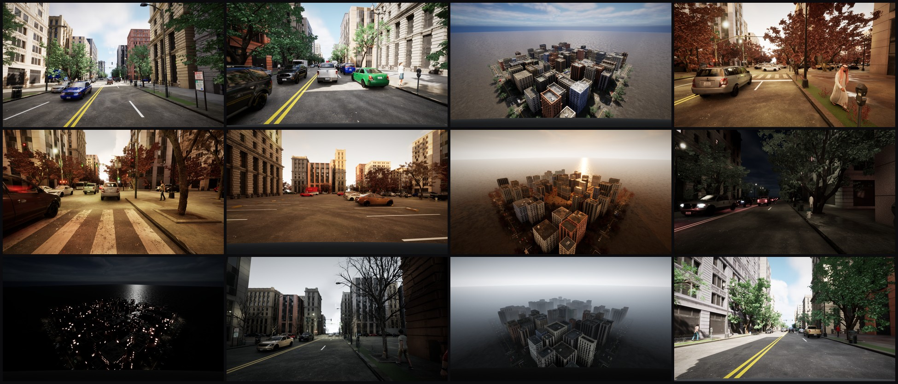
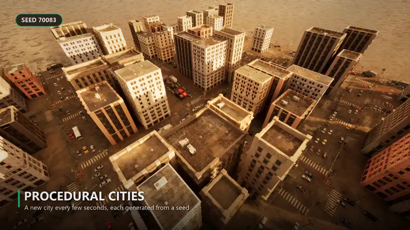
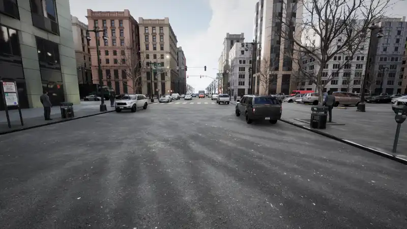
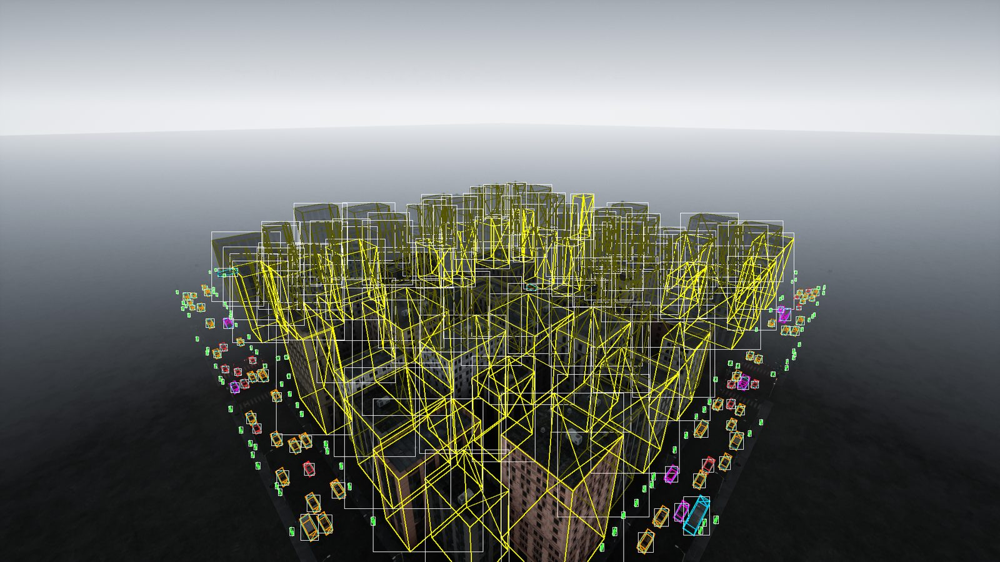
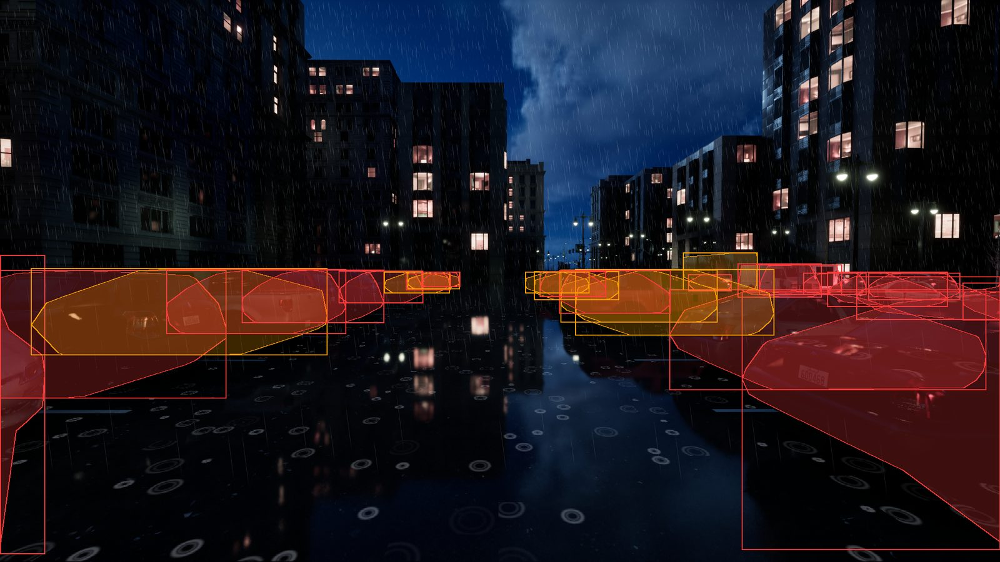
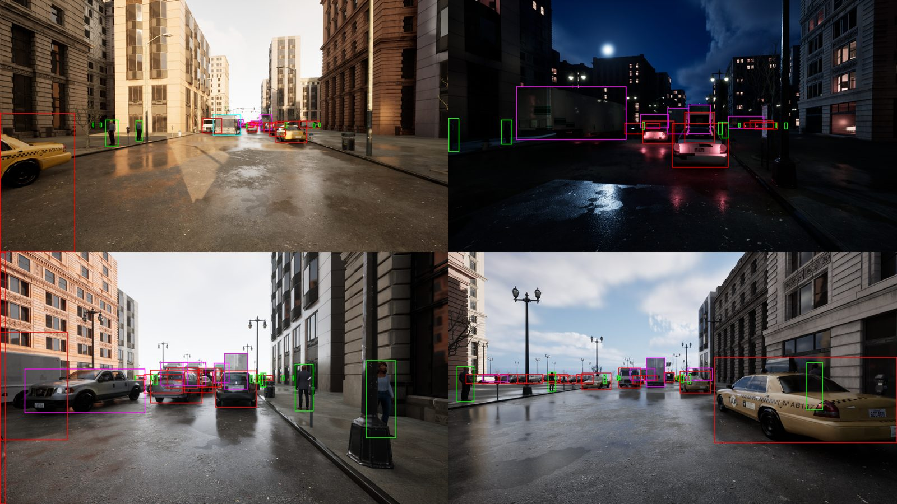
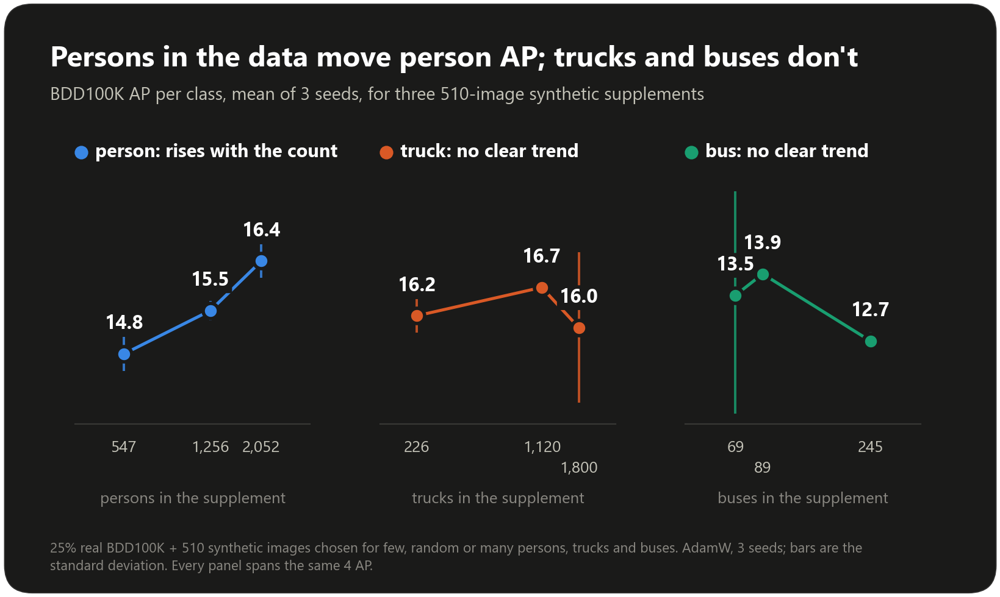

# VantageCV Remastered

### Synthetic AV Dataset Generator V1.2

[](https://github.com/evanpetersen919/VantageCV-V2/actions/workflows/lint_and_test.yml)

[](LICENSE)


**Procedural driving scenes, rendered in real Unreal Engine 5, with pixel-exact labels -- and an open,
honest research log of how well a detector trained on them transfers to real photos
(BDD100K, Cityscapes), including what didn't work.**


*Every annotation type on one vehicle, from a full 360 degree orbit: the labels are the dataset's own, and they follow the object as the viewpoint changes.*

| **+4.7 AP** | **about 0.5 px** | **903 tests** |
|:---:|:---:|:---:|
| synthetic images added to 460 real BDD100K images ([results](#results)) | camera check: projected points against the engine's render | strict mypy, pylint 10/10, CI on every push |

## What you get

| | |
|---|---|
| **Input** | A seed and a YAML scenario template. The same seed reproduces a frame exactly. |
| **Output** | COCO datasets (and a YOLO export) with 2D boxes, segmentation polygons, occlusion and truncation per object, and per-image condition metadata. |
| **Conditions** | Season, weather (clear, overcast, fog, rain, golden hour, sunset, dawn haze) and time of day, drawn per scenario from real conditions data. |
| **Scene** | Procedural road network, lanes, buildings, traffic (including articulated tractor-trailers) and pedestrians, built from City Sample assets and rendered live in UE5.4. |
| **Reliability** | A camera self-check runs before every dataset; a crashed render resumes where it stopped. |

Jump to: [Results](#results) · [Roadmap](#roadmap) · [Quick start](#quick-start) ·
[Project layout](#project-layout) · [Contributing](CONTRIBUTING.md) ·
[Architecture](docs/architecture.rst) · [User guide](docs/user_guide.rst)

## What the generator produces



*Twelve frames from one generator: different seeds, layouts and conditions. Direct renders, with a mild contrast curve and vignette applied to all of them.*

|  |  |
|:---:|:---:|
| *A new city from a new seed every few seconds* | *Same street, same seed, same camera: day to night* |

Every object is placed and tracked as a real 3D box (center, dimensions,
heading) -- that 3D geometry is what drives occlusion ray-casting and 2D
projection, and every generated frame's QA overlay draws it directly (yellow
wireframe below) alongside the exported 2D box (white) and segmentation
silhouette (cyan), so the two stay honestly checkable against each other:



Only the 2D box and segmentation polygon are written into the exported COCO
dataset today -- the 3D boxes stay internal-only for now (no LiDAR point
clouds are generated yet to pair them with; see
[`KNOWN_GAPS_AND_ISSUES.md`](KNOWN_GAPS_AND_ISSUES.md)). Boxes are shrunk to
the visible region for partially-occluded objects (matching BDD100K/
Cityscapes' own annotation convention -- see
[`EXPERIMENT_LOG.md`](EXPERIMENT_LOG.md)):



Season, weather and time-of-day are drawn per scenario from real conditions
data (see `src/procedural/environment.py`), so one dataset run naturally spans
a wide range of real-world driving conditions in the same set of city layouts:



**Measured, not guessed.** Distance cutoffs and night brightness are fit to real
BDD100K/Cityscapes statistics, and the vehicle mix follows real registration data, with
the evidence written down in [`EXPERIMENT_LOG.md`](EXPERIMENT_LOG.md).

<details>
<summary><b>Pipeline and what shipped</b></summary>

The core pipeline is complete: road network → lanes → buildings → traffic → meshes →
validation → sensors/ground truth → export → distributed/resumable generation → docs.
Beyond the original plan it also includes:

- vehicle and pedestrian placement, per-lane turn connectivity, traffic-signal phasing
- a real CLI and YAML config loader
- building types, materials and gable roofs; configurable road setback
- an opt-in sensor noise model; spatial acceleration for LiDAR/depth/segmentation

See [`docs/release_notes.rst`](docs/release_notes.rst) for what shipped in each phase and
[`KNOWN_GAPS_AND_ISSUES.md`](KNOWN_GAPS_AND_ISSUES.md) for every deliberate scope
decision and bug found along the way.

`unreal_plugin/SyntheticDataGen/` is built, compiled and the primary way real
datasets get rendered: a WebSocket JSON-RPC bridge (`src/ue5/backend.py`)
drives a live UE5 game session (`bin/generate_live_dataset.py`) that spawns
each scenario's actual City Sample geometry, vehicles and pedestrians, then
captures and labels the frame.

</details>

## Results

A live-rendered synthetic dataset trains YOLOv10m detectors that are scored on real photos
they have never seen. [`EXPERIMENT_LOG.md`](EXPERIMENT_LOG.md) tracks every training run, what
changed and the measured results, including a Grad-CAM diagnosis, label-convention research
and a rendering-pipeline audit -- an honest, in-progress research log, not a highlight reel.

**Synthetic data helps at every real-data size tested, most when real data is scarce.** Added to 460 real
BDD100K images it raises AP by +4.7 (18.2 to 22.9); to 919, +3.3; to 1,838, +2.0 (optimizer held fixed;
three seeds each, p < 0.01 throughout). It is not a substitute: the same number of real images scores
2-3 AP higher, and roughly 3 to 7 synthetic images are worth one real one.


**What the experiments say so far**

- **Pedestrian count drives person AP.** 550 / 1,256 / about 2,000 persons in a 510-image supplement gave 14.8 / 15.5 / 16.4 person AP.
- **Truck and bus counts do not drive truck or bus AP, and neither does anything else the generator controls (1.1).** Five levers were tested, each with its reading rule written first: the vehicle mix, pickups and vans labelled truck, the box-size distribution, the input size (1280 px) and an added real box-truck model. None raised truck AP. Per box, small boxes are missed in every class and about 30% of medium and large trucks are called cars, at the same rate when training on real images only.
- **A larger input helps people and cars, not trucks (1.1).** At 1280 px instead of 960, person AP rises 1.6 and car AP 1.3; about a quarter of the synthetic gain at 960 is resolution the detector lacked (overall +2.77 over real-only at 960, +2.11 at 1280).
- **The vehicle results do not depend on the pedestrian crowd (1.1).** With the same scenes and no synthetic pedestrians, car and truck AP are unchanged and person AP falls by 3.0.
- **Another synthetic source gives the same AP (1.2).** 512 RealDriveSim frames with person, car and truck counts matched to this pipeline's batch score 20.92 against 20.99 on BDD100K val (three seeds); AP at this size does not separate the two sources.
- **Tight engine-exact labels did not move AP by a resolvable amount (1.2).** Person AP +0.72 (p=0.13) against the registered +1.0 threshold; overall unchanged.
- **MIT-licensed pedestrians keep the person gain (after 1.2, not yet released).** With `pedestrian_source: rocketbox` (38 adult Microsoft Rocketbox avatars, 342 baked poses) in place of City Sample's crowd, in the same scenes with the same exact labels, person AP is 16.95 against 16.96 on BDD100K val (three seeds), 99.8% of the +4.5 gain over real-only. This does not clear publication by itself: Rocketbox's MIT text does not name ML training, and the scenes still use other City Sample assets.
- **Generator v7 reaches parity with the older generator, not a gain.** With the older, higher pedestrian density it scores 20.99 against 20.84 (BDD100K AP at 25% real); with a real-frequency pedestrian density it stays 0.7 behind (20.18).
- **Synthetic-only transfer is still far below real-data baselines.** Grad-CAM shows the detector keys on background texture like foliage and curbs rather than object shape.



<details>
<summary><b>Full version-by-version table, and the v7 detail</b></summary>

Real-benchmark AP (COCO-style, person/car/bus/truck), one change per version:

| Version | What changed | BDD100K scratch / fine-tune | Cityscapes scratch / fine-tune |
|---|---|---|---|
| v1 | first live-rendered dataset | 2.9 / 4.9 | 2.5 / 10.3 |
| v3 | distance cutoffs fit to real box sizes, night-brightness variety, vehicle paint diversity | 2.7 / 6.1 | 4.3 / 12.9 |
| v4b | boxes cover only the visible part of occluded objects | 3.6 / 6.3 | 4.3 / 12.4 |
| v5 | camera pitch, material/tree variety, cab-less-trailer bug fix, no mosaic | **4.0 / 6.4** | **7.8** / 12.0 |
| v6 | always-on material/surface appearance jitter | 4.1 / 6.4 | 6.6 / 12.1 |
| *reference* | COCO-pretrained (no synthetic data) / real images only | 34.8 / 28.1 | 41.6 / 26.1 |

**v7 at 25% real (3 seeds, AdamW, BDD100K AP).** The first 510-image v7 supplement scored 19.97,
0.9 below the same number of random older-generator images (20.84). Controlled selections show
pedestrian count drives person AP (550 / 1,256 / about 2,000 persons in the supplement gave 14.8 /
15.5 / 16.4 person AP), while truck and bus counts do not move truck or bus AP. Rendering v7 again with
the older, higher pedestrian density gives 20.99: parity with the older generator, not better, and
v7 with the real-frequency pedestrian density stays 0.7 behind (20.18). Details in
[`EXPERIMENT_LOG.md`](EXPERIMENT_LOG.md).

Scratch = trained from random weights on synthetic data only; fine-tune = starts from
COCO weights. Synthetic-only transfer is still far below real-data baselines -- the
current diagnosis (Grad-CAM shows the detector keys on background texture like foliage
and curbs rather than object shape) and the experiments aimed at it are in the log.

</details>

## Export formats

A rendered dataset's `annotations.json` is COCO (2D boxes, polygons, occlusion and truncation). Forward-looking
frames also carry a `box3d` per object (a KITTI-convention 3D box in the level camera frame) and a `kitti_P2`
projection matrix per image. Two scripts turn that into other layouts:

```bash
PYTHONPATH=. python bin/export_kitti.py --dataset live_dataset/NAME --out kitti_out --images copy   # label_2, calib, image_2
PYTHONPATH=. python bin/export_masks.py --dataset live_dataset/NAME --out masks_out                 # instance, object-class PNGs
```

The 3D boxes round-trip exactly through the exported calibration (checked in the tests, also for pitched
cameras). Buses are written as `Misc` (KITTI has no bus class). Masks are rasterised from the annotation
polygons (the convex hull of the projected mesh, which is 6 to 16% larger than the true outline: it cannot follow
wheel arches or the gap between a pedestrian's legs), not from a render pass, and only the labelled objects (person, car, bus, truck) are painted; the road,
buildings, vegetation and sky are 0, so this is not full-scene semantic segmentation. Datasets rendered before 1.2
have no `box3d` and need re-rendering.

With `--exact-labels` (about 1.5 s more per frame, game required) every vehicle and pedestrian box, visible fraction
and mask comes from what the game itself renders instead of from proxy shapes: an object's pixels are where its own
depth equals the scene's depth. Those annotations carry a `mask_rle` (COCO run-length, the visible pixels), and
`bin/export_masks.py` paints it in place of the polygon, and the annotation's COCO `segmentation` polygon is traced from it pixel edge by pixel edge (IoU 0.997 with the mask for persons; the hull it replaces scored 0.39). `bin/audit_labels.py` measures the geometric labels against
the game's render: full boxes of vehicles score 0.94 to 0.99 IoU, pedestrians 0.79, visible-part boxes 0.65 to 0.88 and
polygons 0.39 to 0.84 (`EXPERIMENT_LOG.md`).

## Roadmap

The plan after 1.1, with what each step is meant to answer and what is deliberately not being done, is in
[`ROADMAP.md`](ROADMAP.md). Open problems the project is working on (evidence in [`EXPERIMENT_LOG.md`](EXPERIMENT_LOG.md)):

- **Texture/shape bias:** randomize backgrounds so detectors learn object shape
  (started in `bin/stylize_backgrounds.py`; renderer-side randomization next).
- **Camera realism:** roll, field of view and post-process effects need a small RPC/engine change.
- **Scale and variance:** doubling the synthetic set to 3,691 images added little (about +0.9 AP at best). More pedestrians per scene helps person AP; more trucks and buses, a different mix, other box sizes, a larger input and one added box-truck model did not help truck or bus AP (1.1). What is left untested is a larger, more varied truck population (box, dump, utility and delivery trucks of several makes).
- **3D labels and LiDAR:** computed but not exported (see
  [`KNOWN_GAPS_AND_ISSUES.md`](KNOWN_GAPS_AND_ISSUES.md)).

New here? See [`CONTRIBUTING.md`](CONTRIBUTING.md).

## Quick start

**Requirements**

- Python 3.11.8
- [Poetry](https://python-poetry.org/) 1.7.1
- Unreal Engine 5.4 LTS -- required for `bin/generate_live_dataset.py` (the
  real rendering path) and for building `unreal_plugin/SyntheticDataGen/`
  against a City Sample-based UE5 project. Not needed for the offline
  procedural generation path (`bin/generate_dataset.py`, no live game).

**Setup**

```bash
poetry install
poetry run pytest --cov=src tests/
```

If `poetry run pytest` doesn't pick up a module you just added, run
`poetry install` again first -- see `KNOWN_GAPS_AND_ISSUES.md`.

**Generate a dataset**

Command line, using one of the two real (`urban_dense`/`urban_sparse`)
scenario templates under `configs/scenario_templates/`:

```bash
python bin/generate_dataset.py \
    --config configs/scenario_templates/urban_dense.yaml \
    --num-scenarios 10 \
    --base-seed 0 \
    --bounds -250 -250 250 250 \
    --output-dir ./datasets/synthetic_v1
```

Or directly from Python:

```python
from src.procedural.scenario import ScenarioType, ScenarioTypeConfig
from src.orchestration.dataset_generator import generate_dataset
from pathlib import Path

config = ScenarioTypeConfig(
    scenario_type=ScenarioType.URBAN_DENSE,
    avg_block_size=(100.0, 150.0),
    avg_road_width=12.0,
    num_intersections=(4, 9),
    intersection_types=["4way", "3way"],
    building_density=0.8,
    building_heights=(20.0, 40.0),
    traffic_density=(0.6, 1.0),
    vehicle_mix={"sedan": 0.6, "suv": 0.25, "truck": 0.1, "bus": 0.05},
    complexity_score=80,
)

result = generate_dataset(
    num_scenarios=10,
    base_seed=0,
    config=config,
    bounds=(-250.0, -250.0, 250.0, 250.0),
    output_dir=Path("./datasets/synthetic_v1"),
)
```

See [`docs/user_guide.rst`](docs/user_guide.rst) for more (parallel generation
via Ray, resumable/checkpointed generation, and more) -- every example there is
a real, executed `doctest`, not untested prose.

<details>
<summary><b>Live rendering (real UE5 frames)</b></summary>

Requires a running UE5 game session with the plugin loaded (see
`unreal_plugin/SyntheticDataGen/`), reachable over the WebSocket RPC bridge. Launch it with
`bin/launch_ue5.ps1` rather than starting `UnrealEditor.exe` by hand -- it strips the
`ELECTRON_RUN_AS_NODE` environment variable (silently breaks the editor if inherited from a
VS Code/Cursor process tree) and pins the render resolution to 1920x1080 (every dataset in
`EXPERIMENT_LOG.md` was captured at this resolution; without an explicit `-ResX`/`-ResY` the
game window instead matches whatever the desktop's current resolution happens to be):

```powershell
powershell -File bin/launch_ue5.ps1
```

```bash
python bin/generate_live_dataset.py \
    --config configs/scenario_templates/urban_dense.yaml \
    --num-scenarios 20 \
    --seed 0 \
    --out ./live_dataset/my_run
```

`--profile v7` (with `--config configs/scenario_templates/urban_dense_v7.yaml`) renders the
second-generation generator: fleet and pedestrian density matched to BDD100K, tractor-trailer rigs,
dry roads, calibrated night, a hood overlay. The default `v6` behaviour is unchanged. v7 is not
better yet: see the mixed-data results below.

Runs a camera self-check against four known ground squares before rendering
anything, and resumes cleanly if the game crashes mid-run (rerun the same
command). See [`EXPERIMENT_LOG.md`](EXPERIMENT_LOG.md) for how this path is
actually used end-to-end (dataset generation → YOLO training → real-benchmark
evaluation).

</details>

<details>
<summary><b>Building the docs</b></summary>

```bash
poetry run sphinx-build -b html docs docs/_build/html
```

</details>

## Project layout

**Library (`src/`)**

- `src/procedural/` -- road network, lane topology, building placement, traffic, mesh generation
- `src/sensors/` -- camera/LiDAR models
- `src/ground_truth/` -- bbox/segmentation/depth-map extraction
- `src/export/` -- COCO exporter, metadata aggregation
- `src/validation/` -- dataset sanity checks
- `src/orchestration/` -- end-to-end pipeline, Ray-based parallel generation, resumable/checkpointed generation
- `src/evaluation/` -- real-benchmark loaders (BDD100K, Cityscapes), COCO scoring, dataset splits, YOLO export
- `src/ue5/` -- JSON-RPC/WebSocket client for UE5, driving a live game session
- `unreal_plugin/SyntheticDataGen/` -- UE5 C++ plugin: scenario loading, mesh spawning, night lights, RPC server (built and in active use)
- `configs/` -- scenario and sensor YAML templates (`urban_dense`/`urban_sparse` are real and loadable via `src/utils/config_loader.py`; the other three are reference-only, see `KNOWN_GAPS_AND_ISSUES.md`)

**Command-line tools (`bin/`)**

- Generate: `generate_dataset.py` (offline, no live game) and `generate_live_dataset.py` (real UE5 rendering, the primary path for training data); `launch_ue5.ps1` starts the game session it talks to
- Prepare: `split_dataset.py`, `export_yolo.py`, `audit_dataset.py`
- Train and score: `train_detector.py`, `evaluate_detector.py`, `prepare_real_control.py`
- Diagnose: `gradcam_compare.py` (Grad-CAM overlays on a fixed real-image panel)
- Experiment transforms (no re-render): `regenerate_modal_boxes.py`, `apply_image_realism.py`, `stylize_backgrounds.py`
- Measure real statistics the generator is fit to: `fit_max_annotation_distance.py`, `measure_night_brightness.py`, `measure_vehicle_bounds.py`, and the other `measure_*.py` scripts

**Project records**

- `EXPERIMENT_LOG.md` -- every training run in the sim-to-real experiment: what changed, why, and the measured results
- `KNOWN_GAPS_AND_ISSUES.md` -- every deliberate scope decision and bug found along the way
- `docs/` -- Sphinx documentation source; `tests/` -- unit and integration test suites
- `CONTRIBUTING.md` -- how to help; `CITATION.cff` -- how to cite

## License and credits

The code is released under the [MIT license](LICENSE). The rendered images and videos in this
repository were made with Epic Games' City Sample content in Unreal Engine; under Epic's Content
License Agreement (section 3b, linear media), rendered images and video created with the licensed
content may be distributed. No Epic asset files, and no geometry extracted from them, are included in
this repository; the vehicle meshes used for occlusion tests are generated locally from your own copy of
City Sample (`bin/dump_vehicle_meshes.py`), and those tests are skipped where the file is absent.

Unreal Engine and City Sample are the property of Epic Games, Inc.

**Licensing record.** What each asset class comes from, the clauses read, and what is still open are in
[`LICENSING.md`](LICENSING.md).

**Status of the pedestrian assets.** Whether City Sample's crowd characters (adapted from Epic's
MetaHumans) may be used to train models is not settled (a Rocketbox replacement exists, see the findings; new work uses it and the City Sample crowd is kept only to reproduce earlier batches): Epic was asked (2026-10-05) and replied (2026-10-08) that it
cannot give legal or EULA interpretations for a specific distribution model and recommended the developer's own legal
counsel. No datasets or trained weights are published, and results that rely on synthetic pedestrians are provisional.
