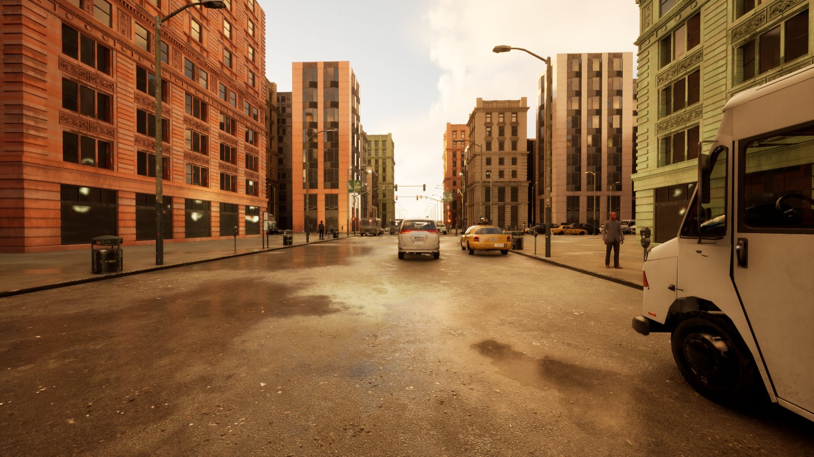
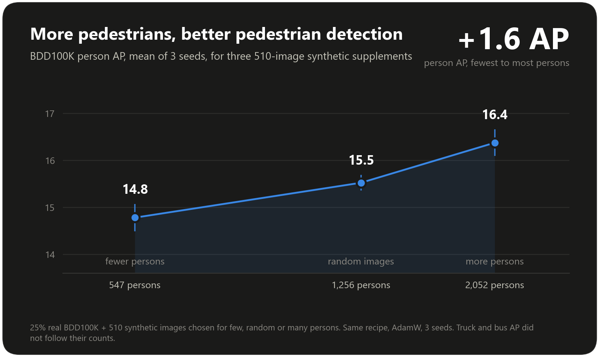

# VantageCV Remastered

### Synthetic AV Dataset Generator

[](https://github.com/evanpetersen919/VantageCV-V2/actions/workflows/lint_and_test.yml)
[](LICENSE)


**Procedural driving scenes, rendered in real UE5, with pixel-exact labels -- and an open,
honest research log of how well a detector trained only on them transfers to real photos
(BDD100K, Cityscapes), including what didn't work.**



Procedural, deterministic, seed-based generation of synthetic autonomous-vehicle
perception datasets: road networks, lane topology, buildings, traffic, sensor
simulation, and ground-truth annotations, rendered live through a real UE5.4
game (City Sample assets) and exported as COCO datasets with 2D boxes,
segmentation, occlusion/truncation, and per-scenario condition metadata
(season, weather, time of day).

## Highlights

- **Real renders, exact labels.** Every object is a tracked 3D box; 2D boxes and
  segmentation polygons are projected through the same camera the engine renders with,
  and a self-check against four known ground squares runs before every dataset
  (typically about 0.5 px of error).
- **Deterministic and resumable.** A scenario seed reproduces a frame exactly, and a
  crashed render run resumes where it stopped.
- **Measured, not guessed.** Distance cutoffs and night brightness are fit to real
  BDD100K/Cityscapes statistics, and the vehicle mix follows real registration data, with
  the evidence written down.
- **An honest research log.** Every training run is scored on real benchmarks, including
  the negative results and a Grad-CAM diagnosis of *why* synthetic-only detectors
  underperform ([results](#ongoing-sim-to-real-transfer-experiment)).
- **Engineered to be checked.** 800+ tests, pylint 10/10, strict mypy, CI on every push.

Jump to: [Results](#ongoing-sim-to-real-transfer-experiment) ·
[Roadmap](#roadmap) · [Quick start](#quick-start) ·
[Project layout](#project-layout) · [Contributing](CONTRIBUTING.md)

See [`docs/architecture.rst`](docs/architecture.rst) (or the built Sphinx docs)
for the full system design, and [`docs/user_guide.rst`](docs/user_guide.rst)
for real, executable usage examples.

## What the generator produces

Every object is placed and tracked as a real 3D box (center, dimensions,
heading) -- that 3D geometry is what drives occlusion ray-casting and 2D
projection, and every generated frame's QA overlay draws it directly (yellow
wireframe below) alongside the exported 2D box (white) and segmentation
silhouette (cyan), so the two stay honestly checkable against each other:


Only the 2D box and segmentation polygon are written into the exported COCO
dataset today -- the 3D boxes stay internal-only for now (no LiDAR point
clouds are generated yet to pair them with; see
[`KNOWN_GAPS_AND_ISSUES.md`](KNOWN_GAPS_AND_ISSUES.md)). Boxes are shrunk to
the visible region for partially-occluded objects (matching BDD100K/
Cityscapes' own annotation convention -- see
[`EXPERIMENT_LOG.md`](EXPERIMENT_LOG.md)):


Season, weather and time-of-day are drawn per scenario from real conditions
data (see `src/procedural/environment.py`), so one dataset run naturally spans
a wide range of real-world driving conditions in the same set of city layouts:


## Status

The core pipeline is complete: road network → lanes → buildings → traffic → meshes →
validation → sensors/ground truth → export → distributed/resumable generation → docs.
Beyond the original plan it also includes:

- vehicle and pedestrian placement, per-lane turn connectivity, traffic-signal phasing
- a real CLI and YAML config loader
- building types, materials and gable roofs; configurable road setback
- an opt-in sensor noise model; spatial acceleration for LiDAR/depth/segmentation

See [`docs/release_notes.rst`](docs/release_notes.rst) for what shipped in each phase and
[`KNOWN_GAPS_AND_ISSUES.md`](KNOWN_GAPS_AND_ISSUES.md) for every deliberate scope
decision and bug found along the way.

`unreal_plugin/SyntheticDataGen/` is built, compiled and the primary way real
datasets get rendered: a WebSocket JSON-RPC bridge (`src/ue5/backend.py`)
drives a live UE5 game session (`bin/generate_live_dataset.py`) that spawns
each scenario's actual City Sample geometry, vehicles and pedestrians, then
captures and labels the frame.

### Ongoing: sim-to-real transfer experiment

A live-rendered synthetic dataset (~2,000 images) trains YOLOv10m detectors that
are scored on real photos they have never seen. [`EXPERIMENT_LOG.md`](EXPERIMENT_LOG.md)
tracks every training run, what changed, the measured real-benchmark results,
and a full evidence-based diagnostic pass (pixel statistics, Grad-CAM, label
convention research, rendering-pipeline audit) -- an honest, in-progress
research log, not a highlight reel.

Real-benchmark AP (COCO-style, person/car/bus/truck), one change per version:

| Version | What changed | BDD100K scratch / fine-tune | Cityscapes scratch / fine-tune |
|---|---|---|---|
| v1 | first live-rendered dataset | 2.9 / 4.9 | 2.5 / 10.3 |
| v3 | distance cutoffs fit to real box sizes, night-brightness variety, vehicle paint diversity | 2.7 / 6.1 | 4.3 / 12.9 |
| v4b | boxes cover only the visible part of occluded objects | 3.6 / 6.3 | 4.3 / 12.4 |
| v5 | camera pitch, material/tree variety, cab-less-trailer bug fix, no mosaic | **4.0 / 6.4** | **7.8** / 12.0 |
| v6 | always-on material/surface appearance jitter | 4.1 / 6.4 | 6.6 / 12.1 |
| *reference* | COCO-pretrained (no synthetic data) / real images only | 34.8 / 28.1 | 41.6 / 26.1 |

**v7 at 25% real (3 seeds, AdamW, BDD100K AP).** The first 510-image v7 supplement scored 19.97,
0.9 below the same number of random older-generator images (20.84). Controlled selections show
pedestrian count drives person AP (550 / 1,256 / about 2,000 persons in the supplement gave 14.8 /
15.5 / 16.4 person AP), while truck and bus counts do not move truck or bus AP. Rendering v7 again with
the older, higher pedestrian density gives 20.99: parity with the older generator, not better, and
v7 with the real-frequency pedestrian density stays 0.7 behind (20.18). Details in
[`EXPERIMENT_LOG.md`](EXPERIMENT_LOG.md).



**Synthetic data helps at every real-data size tested, most when real data is scarce.** Added to 460 real
BDD100K images it raises AP by +4.7 (18.2 to 22.9); to 919, +3.3; to 1,838, +2.0 (optimizer held fixed;
three seeds each, p < 0.01 throughout).
It is not a substitute: the same number of real images scores 2-3 AP higher, and roughly 3 to 7 synthetic
images are worth one real one.


Details and caveats in [`EXPERIMENT_LOG.md`](EXPERIMENT_LOG.md).

Scratch = trained from random weights on synthetic data only; fine-tune = starts from
COCO weights. Synthetic-only transfer is still far below real-data baselines -- the
current diagnosis (Grad-CAM shows the detector keys on background texture like foliage
and curbs rather than object shape) and the experiments aimed at it are in the log.

## Roadmap

Open problems the project is working on (evidence in [`EXPERIMENT_LOG.md`](EXPERIMENT_LOG.md)):

- **Texture/shape bias:** randomize backgrounds so detectors learn object shape
  (started in `bin/stylize_backgrounds.py`; renderer-side randomization next).
- **Camera realism:** roll, field of view and post-process effects need a small RPC/engine change.
- **Scale and variance:** doubling the synthetic set to 3,691 images added little (about +0.9 AP at best). More pedestrians per scene helps person AP; more trucks and buses did not help truck or bus AP, so those are an appearance problem, not a count problem.
- **3D labels and LiDAR:** computed but not exported (see
  [`KNOWN_GAPS_AND_ISSUES.md`](KNOWN_GAPS_AND_ISSUES.md)).

New here? See [`CONTRIBUTING.md`](CONTRIBUTING.md).

## Requirements

- Python 3.11.8
- [Poetry](https://python-poetry.org/) 1.7.1
- Unreal Engine 5.4 LTS -- required for `bin/generate_live_dataset.py` (the
  real rendering path) and for building `unreal_plugin/SyntheticDataGen/`
  against a City Sample-based UE5 project. Not needed for the offline
  procedural generation path (`bin/generate_dataset.py`, no live game).

## Setup

```bash
poetry install
poetry run pytest --cov=src tests/
```

If `poetry run pytest` doesn't pick up a module you just added, run
`poetry install` again first -- see `KNOWN_GAPS_AND_ISSUES.md`.

## Quick start

Command line, using one of the two real (`urban_dense`/`urban_sparse`)
scenario templates under `configs/scenario_templates/`:

```bash
python bin/generate_dataset.py \
    --config configs/scenario_templates/urban_dense.yaml \
    --num-scenarios 10 \
    --base-seed 0 \
    --bounds -250 -250 250 250 \
    --output-dir ./datasets/synthetic_v1
```

Or directly from Python:

```python
from src.procedural.scenario import ScenarioType, ScenarioTypeConfig
from src.orchestration.dataset_generator import generate_dataset
from pathlib import Path

config = ScenarioTypeConfig(
    scenario_type=ScenarioType.URBAN_DENSE,
    avg_block_size=(100.0, 150.0),
    avg_road_width=12.0,
    num_intersections=(4, 9),
    intersection_types=["4way", "3way"],
    building_density=0.8,
    building_heights=(20.0, 40.0),
    traffic_density=(0.6, 1.0),
    vehicle_mix={"sedan": 0.6, "suv": 0.25, "truck": 0.1, "bus": 0.05},
    complexity_score=80,
)

result = generate_dataset(
    num_scenarios=10,
    base_seed=0,
    config=config,
    bounds=(-250.0, -250.0, 250.0, 250.0),
    output_dir=Path("./datasets/synthetic_v1"),
)
```

See [`docs/user_guide.rst`](docs/user_guide.rst) for more (parallel generation
via Ray, resumable/checkpointed generation, and more) -- every example there is
a real, executed `doctest`, not untested prose.

### Live rendering (real UE5 frames)

Requires a running UE5 game session with the plugin loaded (see
`unreal_plugin/SyntheticDataGen/`), reachable over the WebSocket RPC bridge. Launch it with
`bin/launch_ue5.ps1` rather than starting `UnrealEditor.exe` by hand -- it strips the
`ELECTRON_RUN_AS_NODE` environment variable (silently breaks the editor if inherited from a
VS Code/Cursor process tree) and pins the render resolution to 1920x1080 (every dataset in
`EXPERIMENT_LOG.md` was captured at this resolution; without an explicit `-ResX`/`-ResY` the
game window instead matches whatever the desktop's current resolution happens to be):

```powershell
powershell -File bin/launch_ue5.ps1
```

```bash
python bin/generate_live_dataset.py \
    --config configs/scenario_templates/urban_dense.yaml \
    --num-scenarios 20 \
    --seed 0 \
    --out ./live_dataset/my_run
```

`--profile v7` (with `--config configs/scenario_templates/urban_dense_v7.yaml`) renders the
second-generation generator: fleet and pedestrian density matched to BDD100K, tractor-trailer rigs,
dry roads, calibrated night, a hood overlay. The default `v6` behaviour is unchanged. v7 is not
better yet: see the mixed-data results below.

Runs a camera self-check against four known ground squares before rendering
anything, and resumes cleanly if the game crashes mid-run (rerun the same
command). See [`EXPERIMENT_LOG.md`](EXPERIMENT_LOG.md) for how this path is
actually used end-to-end (dataset generation → YOLO training → real-benchmark
evaluation).

## Building the docs

```bash
poetry run sphinx-build -b html docs docs/_build/html
```

## Project layout

**Library (`src/`)**

- `src/procedural/` -- road network, lane topology, building placement, traffic, mesh generation
- `src/sensors/` -- camera/LiDAR models
- `src/ground_truth/` -- bbox/segmentation/depth-map extraction
- `src/export/` -- COCO exporter, metadata aggregation
- `src/validation/` -- dataset sanity checks
- `src/orchestration/` -- end-to-end pipeline, Ray-based parallel generation, resumable/checkpointed generation
- `src/evaluation/` -- real-benchmark loaders (BDD100K, Cityscapes), COCO scoring, dataset splits, YOLO export
- `src/ue5/` -- JSON-RPC/WebSocket client for UE5, driving a live game session
- `unreal_plugin/SyntheticDataGen/` -- UE5 C++ plugin: scenario loading, mesh spawning, night lights, RPC server (built and in active use)
- `configs/` -- scenario and sensor YAML templates (`urban_dense`/`urban_sparse` are real and loadable via `src/utils/config_loader.py`; the other three are reference-only, see `KNOWN_GAPS_AND_ISSUES.md`)

**Command-line tools (`bin/`)**

- Generate: `generate_dataset.py` (offline, no live game) and `generate_live_dataset.py` (real UE5 rendering, the primary path for training data); `launch_ue5.ps1` starts the game session it talks to
- Prepare: `split_dataset.py`, `export_yolo.py`, `audit_dataset.py`
- Train and score: `train_detector.py`, `evaluate_detector.py`, `prepare_real_control.py`
- Diagnose: `gradcam_compare.py` (Grad-CAM overlays on a fixed real-image panel)
- Experiment transforms (no re-render): `regenerate_modal_boxes.py`, `apply_image_realism.py`, `stylize_backgrounds.py`
- Measure real statistics the generator is fit to: `fit_max_annotation_distance.py`, `measure_night_brightness.py`, `measure_vehicle_bounds.py`, and the other `measure_*.py` scripts

**Project records**

- `EXPERIMENT_LOG.md` -- every training run in the sim-to-real experiment: what changed, why, and the measured results
- `KNOWN_GAPS_AND_ISSUES.md` -- every deliberate scope decision and bug found along the way
- `docs/` -- Sphinx documentation source; `tests/` -- unit and integration test suites
- `CONTRIBUTING.md` -- how to help; `CITATION.cff` -- how to cite
