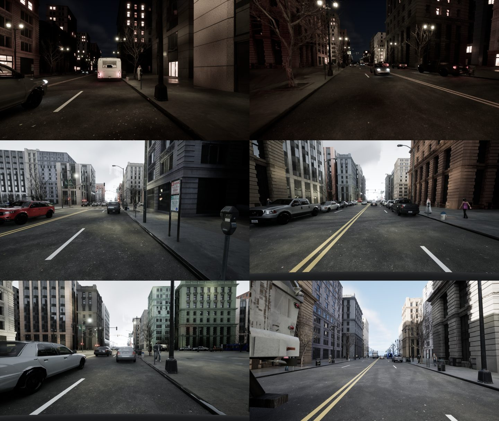
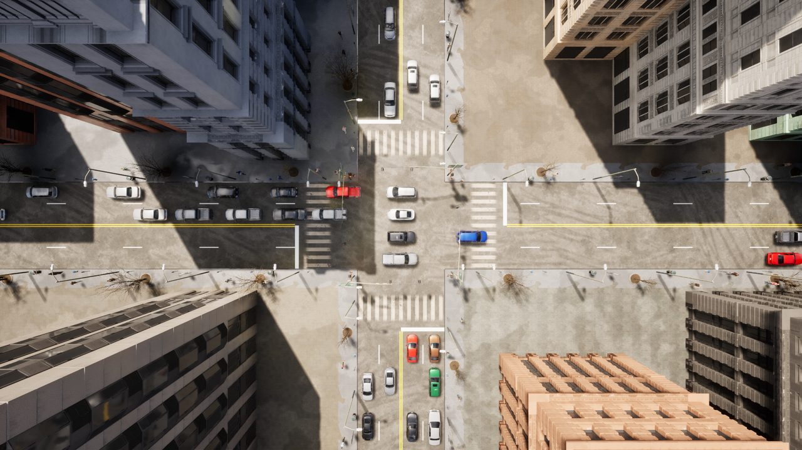

## Lane markings: double yellow centre lines, white lane lines and stop lines (2026-10-09)

The generated streets had crosswalks and parking-lot stripes but no lane lines, a visible difference from every
real street and a plausible contributor to the domain gap (not measured). This entry adds them and records what was
checked. It is off by default (`lane_markings: false`), so every earlier seed gives the same scene; the new
template `configs/scenario_templates/urban_dense_v14.yaml` (v13r plus markings) turns it on.

**What is drawn** (`src/procedural/lane_markings.py`; every dimension from the MUTCD 11th edition, Part 3, read from
the manual's own PDF by a research agent; the section is in the code beside each constant):

| Marking | Value | MUTCD |
|---|---|---|
| Normal line width | 4 to 6 in; choice 4 in with one lane each way, 6 in with two or more | 3A.04 |
| Broken line | 10 ft dash, 30 ft gap | 3A.04 paragraph 6 |
| Centre line, two-way road | double solid yellow (a single solid yellow is not allowed on two-lane streets; required with four or more lanes) | 3B.01 |
| Double line gap | at most twice a line's width; choice one line width | 3A.04 |
| Lane line, same direction | white, broken | 3B.06 |
| Stop line | 12 to 24 in wide (choice 24 in), at least 4 ft ahead of the painted crosswalk | 3B.19 |
| Edge lines | not drawn: required only on freeways, expressways and busy rural arterials, may be omitted at curbs and parking | 3B.09, 3B.10 |

Lines end at the stop line and are not continued through intersections (optional dotted extensions are not drawn).
Paint is a quad 1 cm above the flat road in two project-owned materials: `M_PaintWhite` (already used for parking
stripes) and the new `M_PaintYellow` (created by `unreal_plugin/tools/create_paint_material.py`, resolved by the
`paint_yellow` tag in `MaterialResolver.cpp`). Nothing from Epic content is used. Paint is labelled `road` in the class
map.

**Correction after review (same day).** The first version put the stop line 15.0 m beyond the intersection edge,
derived from the crosswalk's 15 m mesh footprint. From directly above, the stop line lay under the first queued car and
the road lines ended far from the intersection. Two facts were wrong in that version:

1. The stripe mesh is a 5.12 m square decal and only part of it is painted. Rendered alone from above at the scale
   `crosswalks.py` uses (probe `demo/bar_probe.py`, not tracked), the painted strip is **3.69 m long, 0.58 m wide, and
   centred 0.24 m beyond the mesh pivot, away from the node** (the direction was fixed with a second marker at a known
   world position). So the painted crosswalk spans **4.40 to 8.09 m** beyond the node's clearance, not 15 m. Constants
   `CROSSWALK_PAINT_*` in `crosswalks.py`; an overhead render of a real intersection agrees (about 4.2 to 8.6 m).
2. The generator stops queued cars with the front bumper 13.5 m beyond the clearance, the far edge of the whole 15 m
   footprint (`VEHICLE_STOP_LINE_CROSSWALK_SETBACK_M`), so they stopped 5 m past the painted crosswalk.

Now, with markings on: the stop line is 4 ft beyond the painted crosswalk (**9.30 to 9.91 m** from the clearance), the
yellow and white road lines run up to it, and the queue's front bumper stops 0.3 m behind the line (**10.21 m**,
`VEHICLE_STOP_SETBACK_M`; a choice for the 0.3 m). The old 13.5 m remains for every template without markings, so earlier
seeds give the same scenes.

**Checks run**
- 11 unit tests (`tests/unit/test_lane_markings.py`): dash and gap lengths, the double-line gap, lines ending at the stop
  line, the stop line 4 ft beyond the painted crosswalk and the queue bumper behind it, no stop line on a road too short for
  a crosswalk, upward-facing triangles at the paint height, markings off by default, and **no queued car overlaps a stop
  line** over three seeds (345 queued cars; of 1,180 vehicles, the 30 that overlap a line are all moving cars driving
  through on green, as in real traffic). Lint 10/10 and mypy strict clean.
- Rendered 4 scenarios (8 frames, day and night) with the v14 template and 3 straight-down intersection views. By eye the
  lines read as street paint with no flicker or z-fighting, and the class maps had **0 unlabeled pixels** out of 16.6
  million (first version).
- **Yellow colour against real frames** (crude probe, not a calibration): in 250 BDD100K validation frames (daytime,
  clear), pixels with yellow hue (35 to 65 degrees), saturation at least 0.30 and value at least 0.35 in the road rows
  have median saturation 0.37 and value 0.64; in our 3 frames that had any, 0.35 and 0.66. The real probe also catches
  yellow cars, taxis and signs, and ours is 3 frames, so this is a sanity check only.

**Not done, and limits**
- Not measured: whether the markings change a detector's AP, or the domain gap. No training was run.
- Not drawn: edge lines, dotted extensions, turn-lane arrows and words, two-way left-turn lanes, bike lanes, parking
  stall lines on streets, paint wear. Night paint is plain matte; real marking paint is retroreflective (MUTCD 3A.05
  sets a 50 mcd/m2/lx minimum for longitudinal lines at 35 mph or more), which would make it brighter in headlights.
- The crosswalk stripes themselves are unchanged (4 m painted depth, bars 0.58 m wide, spacing as before). They are
  deeper than the MUTCD minimum width of 6 ft (1.8 m) and the generator places them from a 15 m footprint; this entry does
  not change them.
- Yellow is a plain traffic yellow chosen by eye and checked only by the probe above; the MUTCD defines yellow by
  chromaticity, not RGB.
- The measured painted extent comes from one render of the stripe asset (0.03 m per pixel); the overhead view is
  consistent with it but is not an independent measurement of every crosswalk.
- The existing 66 `kaggle_v1` scenes were rendered without markings.
