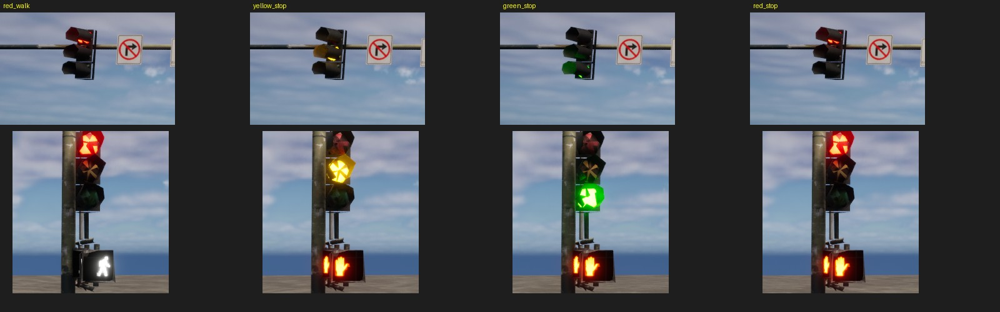
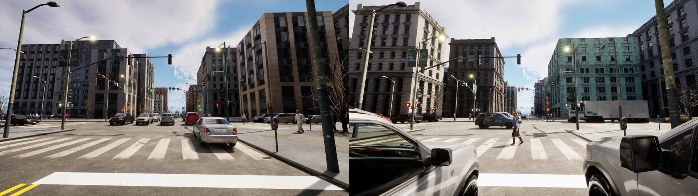

## Signal poles show their intersection's phase (2026-10-09)

Every traffic-signal pole in the generated scenes showed red on every head, whatever the intersection's signal phase
(known gap 37). The vehicle placement already followed the phase (cars flow on green, queue on red), so the frames
contradicted their own labels. This entry makes each pole show the colour its approach has, and the pedestrian heads
the matching symbol. It is off by default (`signal_states: false`), so every earlier seed gives the same scene; the new
template `configs/scenario_templates/urban_dense_v15.yaml` (v14 plus signal states) turns it on.

**How the colour is selected (measured, not assumed).** The pole mesh has three emissive material slots: the vehicle
heads (`Prop_Emissive_StopLight`) and the pedestrian heads (`Prop_Emissive_Walk_01`, `_02`, `_03`). Their instances pick
the shown state through a static switch, `MassTraffic Controlled`, driven by Epic's Mass-AI per-instance data that this
project never sets. Findings from the live game:

- With the switch on (the shipped state), the value of `MassTraffic PackedParam1` has **no effect**: 8 values from 0 to 7
  render the same red head and the same hand.
- With the switch off, the lens that lights depends on the scalar `Crosswalk Control`. Sweeping it from 0 to 1 with all
  three intensities on: **0 to 0.4 lights red and the pedestrian head shows the walking figure; 0.5 lights yellow; 0.6 to 1.0
  lights green and the pedestrian head shows the hand.** `Stoplight Control` makes no difference.

So seven project-owned material-instance copies are made in `/Game/VantageCV/Signals` by
`unreal_plugin/tools/create_signal_materials.py` (switch off, `Crosswalk Control` 0, 0.5 or 1): red, yellow and green for
the vehicle heads, walk and stop for each of the two pedestrian-head materials. The originals are never opened for
writing, because flipping the switch on the shared instance once broke other content (gap 37). The payload swaps a pole's
slots to the copies through the existing `material_replacements` mechanism.

**Which colour a pole shows** (`signal_phasing.approach_light`, `traffic_lights.py`): a pole stands at the far corner of
the intersection an approach arrives at, so it shows that node's phase for that approach's axis: green while its axis pair
owns a GREEN phase, yellow during that pair's own YELLOW_CHANGE, red otherwise (the other pair's green and yellow, every
ALL_RED). The phase is the one `ActorPlacementGenerator` already resolved for the scene's vehicles and crossing
pedestrians, now kept as `active_phases`, so the poles, the cars and the crossing pedestrians agree. The pedestrian heads
face back along the approach, at the crosswalk that runs with it, so they show WALK only while the approach is green (a
design choice: the real clearance interval, flashing hand, is not modelled in a single frame).

**What changes with the flag on:** poles stand only at signalized (four-way) intersections. Before, every directed edge
got a pole, including the stop-sign T-junctions and corners, where a real street has none. The scene's roads, buildings,
vehicles and pedestrians are unchanged for a seed (the pole pieces are generated after them).

**Checks run**
- 19 unit tests (`tests/unit/test_signal_states.py`): `approach_light` for all six phases and four directions, the two axes
  never both showing a go colour, the walk symbol only on green, each pole against `approach_light` for every phase of every
  signalized node of a real network (all three colours occur), no pole without a phase, the serializer carrying the swaps and
  nothing else gaining any, and the old template leaving every pole unchanged. Lint 10/10, mypy strict and black clean.
- Rendered the three states and the pedestrian symbols on isolated poles (the contact sheet above), and a real v15 scene
  (16 poles): different intersections show red and green heads as expected. By eye only; the colours were not compared with
  real photographs.

**Not done:** the pole's own two heads on a mast arm are each lit by the same material slot, so both mast heads of one pole
always show the same colour (a real approach's heads also agree). Stop-sign intersections get no pole with the flag on and no
other signal; whether they need stop signs is separate work. Night rendering of the lit lenses was not checked.
