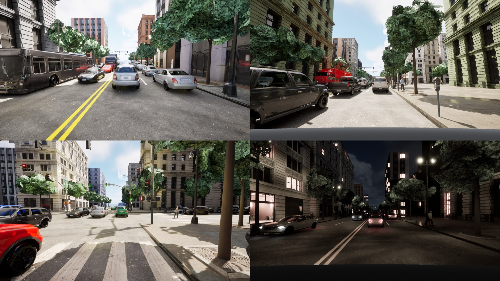

## Leafy street trees: vegetation share from 0 to 15% (2026-10-09)

Epic's City Sample tree kits are bare branch skeletons, so the generator drew **no trees at all in spring and summer**
and leafless ones in fall and winter. In our class maps vegetation was **0.0% of pixels in forced-summer scenes (16
frames) and 1.8% over a random-season set (8 frames)**, against **17.1%** in Cityscapes validation (167 images, every
third, polygons rasterized; `demo/veg_share.py`, not tracked). This entry adds leafy trees. It is off by default
(`road_network.foliage: false`), so every earlier seed gives the same scene; `configs/scenario_templates/urban_dense_v16.yaml`
(v15 plus foliage and a denser tree spacing) turns it on.

**What a tree is** (`src/procedural/foliage.py`; everything is generated, no third-party asset): a tapered six-sided
trunk and four thin branches, and a canopy of about 220 leaf cards (flat quads, 1.1 to 1.8 m) scattered through 3 to 5
overlapping ellipsoid lumps, so the crown is irregular rather than a ball. Cards carry a generated leaf-cluster texture
(`unreal_plugin/tools/make_leaf_texture.py`: 300 pointed-oval leaves with midribs, drawn with Pillow, grey brightness
only) and are masked by its alpha in a two-sided project-owned material (`unreal_plugin/tools/create_foliage_material.py`:
`M_Foliage`, three season tints `MI_Foliage_Spring/Summer/Fall`, and `M_Bark`). Size ranges (7 to 11 m tall, trunk clear
of 3 to 4 m, crown 5 to 7 m wide) are design choices for a mature street tree, not measurements. The trees stand at the
street-tree spots `street_furniture.py` already places (the tree pits stay); the bare Epic tree at each is dropped.
Winter keeps Epic's bare trees (no leaves to draw). Trunks and canopies are merged into two meshes per scene.

**Colour, from data.** Mean sRGB of vegetation pixels in the same Cityscapes images: **(51, 62, 49)**, hue 116 degrees,
median saturation 0.27, median luma 44 (`demo/veg_colour.py`, not tracked). The summer tint was set against it. In our
16-frame final run the vegetation mean is **(56, 60, 39)**: brightness is close, but the **blue channel is low** (the
real foliage is greyer-green than ours). Raising the tint's blue 0.18 to 0.32 moved ours only from 38 to about 40-44, so
part of the cast comes from the lighting; not resolved. Spring and fall tints are set relative to summer by eye, not
fitted.

**Density.** One tree per 20.21 m of curb (Epic's measured spacing) gave 9.4% vegetation in a first 12-frame render; one
per **12 m** (`road_network.street_tree_spacing_m: 12.0`, a design choice made to reach the real share, default stays
20.21) gave the numbers below.

**Result** (16 frames of 8 scenes, forced summer, v16, class maps; `demo/summer_run.py`, not tracked):

| Class | Cityscapes val | Ours (v16) | Ours before (forced summer, v15) |
|---|---|---|---|
| vegetation | 17.1% | **14.8%** | 0.0% |
| building | 20.9% | 28.6% | 41.4% |
| sky | 3.3% | 7.6% | 8.7% |

Per frame, vegetation has median **15.1%** (min 7.8, max 19.0) against Cityscapes' median 16.2% (quartiles 8.0 and 25.0).
Ours is **narrower**: no frame reaches the real upper quartile, and the real frames with dense tree walls are not
covered. Buildings and sky are still over-represented (their share fell as trees covered them). A fall render
(2 scenes, night) shows the orange-brown tint reading as foliage; winter was not re-rendered (unchanged by design).

**Mask check.** The class map is built by drawing each class group alone and comparing depth, so it depends on the
leaf alpha being honoured in that pass. Overlaying the vegetation class on a frame shows the mask following the ragged
leaf edges, with lamp posts in front of a tree correctly excluded. Trunks and canopies are labelled `vegetation`
(`semantic_classes.mesh_class`).

**Checks run**
- 13 unit tests (`tests/unit/test_foliage.py`): two meshes per leafy season with the right tags and consistent buffers,
  nothing in winter, determinism and seed dependence, trunks on their spots and no leaf below 1.8 m, card count, old
  templates unchanged (no trees in summer), v16 replacing the Epic trees in spring, summer and fall and keeping them in
  winter, and 12 m spacing giving more than 1.3 times the trees of 20.21 m. Full suite, lint 10/10, mypy strict and
  black clean.

**Not done, and open**
- Grass and shrubs: no terrain or understory vegetation is drawn (Cityscapes `terrain` is 0.6%, ours 0.0%). Vegetation
  that is not a street tree (hedges, grass strips, trees in courtyards) is absent, which is why the share cannot reach
  the real upper quartile yet.
- The tree's shape is one generator: no species variation beyond tint and lump layout, flat-shaded leaf cards (the
  procedural mesh component's normals are per card), no wind or sway, no leaf litter.
- Night: trees look pale where lamps hit them; not calibrated.
- No detection result yet measures whether leafy trees help or hurt a trained detector; this entry is about the images
  matching real class shares, not about downstream accuracy.
