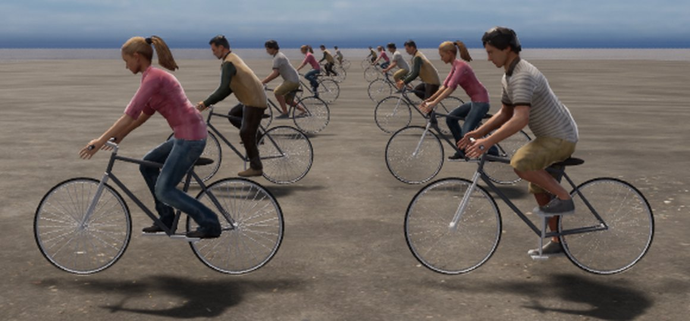
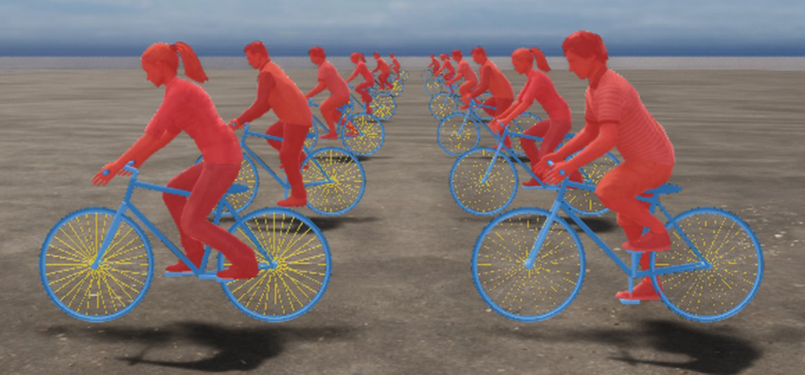

# Riders step 2: the bicycle spike (measured)

Date: 2026-10-09. A bicycle was modelled in Blender from published geometry, Rocketbox riders were posed on it, both
were imported into Unreal and rendered with exact engine masks at 6 to 65 m. This tests the pipeline and the main
technical risk (thin wheel spokes in depth-based masks). It does **not** test whether synthetic riders help a detector;
that is the pre-registered experiment (`preregistration.md`) and the headroom check that should come before more build.

## What was built

- `scripts/bike_model.py`: a parametric bicycle (frame, fork and bars, saddle, grips, cranks and pedals, two wheels
  with tyre, rim, hub and 32 spokes) from the published Trek FX 2 Disc size-L geometry (`step0_findings.md`). Two
  published numbers are recomputed from the others as a transcription check: BB height 281.0 mm (published 281) and
  fork offset 49.7 mm (published 50). The Trek page itself was unreachable, so these are third-party transcriptions
  that agree with each other. Head-tube length, spacer height, grip length, saddle and pedal size and the pedal's
  lateral position are not published and are modelling choices (marked in the file).
- `scripts/rider_bake.py`: an analytic pose solver on the Rocketbox biped. The pelvis is moved until the buttocks
  touch the saddle, the torso leans (55 degrees from horizontal, inside the published 40 to 80), each limb is a
  two-bone chain solved with the law of cosines, and the hands are aimed at the grips and the feet at the pedals (ball of
  the foot over the spindle). The saddle height (0.576 m from the bottom bracket along the seat tube) is the value at
  which the right knee bends 40 degrees at the bottom of the pedal stroke, the middle of the published 35 to 45 for
  recreational riding, found on `Male_Adult_01`. The same saddle is used for every avatar.
- `bin/bake_riders.py`: bakes four crank angles (0, 90, 180, 270) of the rider and the bicycle (two spoke
  variants: a real 2 mm spoke and a 6 mm one) in one frame, and imports them under `/Game/VantageCV/Riders/Spike`. The bike
  imports as 13 separate static meshes (one per part), so wheels and cranks can later be rotated independently.
- `scripts/rider_spike_probe.py`: the scene and measurements below.

## Pose contact (3 avatars x 4 crank angles, all solved)

| Avatar | Crank angle | Worst hand/foot error (mm) | Knee bend R / L (deg) | Elbow angle (deg) | Buttock to saddle (mm) |
|---|---|---|---|---|---|
| Female_Adult_01 | 0 | 0.0 | 48.1 / 119.7 | 148 | 0.0 |
| Female_Adult_01 | 90 | 0.0 | 83.1 / 86.8 | 148 | 0.0 |
| Female_Adult_01 | 180 | 0.0 | 119.8 / 48.3 | 147 | 0.0 |
| Female_Adult_01 | 270 | 0.0 | 86.6 / 82.9 | 149 | 0.0 |
| Male_Adult_01 | 0 | 0.0 | 40.0 / 118.3 | 124 | 0.0 |
| Male_Adult_01 | 90 | 0.0 | 79.5 / 83.2 | 124 | 0.0 |
| Male_Adult_01 | 180 | 0.0 | 118.3 / 40.0 | 124 | 0.0 |
| Male_Adult_01 | 270 | 0.0 | 83.2 / 79.5 | 124 | 0.0 |
| Male_Adult_05 | 0 | 0.0 | 38.2 / 117.6 | 125 | 0.0 |
| Male_Adult_05 | 90 | 0.0 | 78.9 / 82.6 | 125 | 0.0 |
| Male_Adult_05 | 180 | 0.0 | 117.6 / 38.2 | 125 | 0.0 |
| Male_Adult_05 | 270 | 0.0 | 82.6 / 78.9 | 125 | 0.0 |

Every hand and foot target is met exactly and the buttocks touch the saddle in every pose. The knee bend at the bottom of the
stroke is the pose where the crank angle puts that leg down (right at 0, left at 180). `Female_Adult_01` has a 48
degree bend, above the published 35 to 45, because her legs are shorter and the saddle is shared.

## Wheel spokes and masks (engine-exact, controlled)

The same six riders, positions and crank angles were rendered twice, once with real 2 mm spokes and once with 6 mm
spokes, so the two runs differ only in the spokes (`results/rider_spike_probe_real.json` and `_thick.json`; an earlier
run with the two variants side by side in different positions was dropped, because the difference between rows could
not be attributed to the spokes).

| Distance (m) | Wheel radius (px) | Rider mask, real / thick (px) | Bicycle mask without spokes, real / thick (px) | Spoke mask, real / thick (px) | Spokes share of bicycle, real / thick |
|---|---|---|---|---|---|
| 6 | 37.3 | 7,109 / 7,108 | 3,589 / 3,561 (-0.8%) | 471 / 1,384 | 11.6% / 28.0% |
| 10 | 22.4 | 2,210 / 2,210 | 956 / 951 (-0.5%) | 153 / 409 | 13.8% / 30.1% |
| 16 | 14.0 | 907 / 906 | 322 / 320 (-0.6%) | 46 / 145 | 12.5% / 31.2% |
| 25 | 9.0 | 365 / 363 | 138 / 138 (+0.0%) | 21 / 60 | 13.2% / 30.3% |
| 40 | 5.6 | 125 / 125 | 54 / 54 (+0.0%) | 6 / 23 | 10.0% / 29.9% |
| 65 | 3.4 | 58 / 58 | 14 / 14 (+0.0%) | 1 / 10 | 6.7% / 41.7% |

- **The spoke thickness does not change the rider mask** (at most 1 px) **or the bicycle mask without its spokes**
  (0.0% to -0.8%), at any distance from 6 to 65 m. The bicycle's box, which the tyres define, is not affected either.
- **It does change the spoke mask:** the thick spokes give two to three times the pixels (and about ten times at 65 m,
  where a 2 mm spoke is a single pixel). If the spokes are counted as part of the bicycle's instance mask, the mask area
  therefore depends on the modelled spoke thickness: the real spokes are about 10 to 13% of a bicycle's mask pixels out
  to 40 m (7% at 65 m), the thick ones about 24 to 31%. The choice of whether a spoke counts as bicycle is a labelling
  decision, not a rendering failure.
- Real 2 mm spokes appear in the mask as dotted partial coverage (see the overlay) because they are sub-pixel; this is
  what the engine's depth shows, and the picture shows the same.
- The thin-spoke risk named in the research is small for boxes and for the rider and frame masks in this setup. It was
  measured on a flat road with no other geometry and one lighting setup, not in the full city scenes.

## Not done and known limits

- Wheels do not turn, steering is neutral and there is no lean, so riders are in a fixed pose per crank angle.
  Fingers: the open hand of the spike was replaced on 2026-10-10 by a wrap (see the update below); the thumb is still extended.
- One bicycle model (a hybrid) and three avatars; no motorcycle or scooter; no helmets or bags.
- Riders are not yet placed by the scenario generator or exported as labels. The label convention (rider and
  vehicle as separate boxes) is possible with these two instances, but the exporter does not do it yet.
- The test scene is a flat road, not a city; occlusion by buildings, parked cars and other riders is untested.
- The class-map depth fix (commit `f69e2e0`) was in the plugin used for these renders; the probe uses only the
  exact-mask path.

## Update 2026-10-10: fingers wrap the grip

`scripts/rider_bake.py` now closes the four fingers of each hand around the grip (`wrap_fingers`): every finger is three
segments of the rig's own lengths whose joints are placed on a circle of radius grip + finger half thickness (0.016 +
0.0075 m, a MODEL choice) around the grip's axis, over the top and down the front, with the first segment's far end at
the circle point that matches its length, and each bone aimed with the same `aim` the arms use. Fingers are spread across
the grip at 17.5 mm (MODEL). The report gains `R_finger_gap` and `L_finger_gap` (the worst fingertip's distance from the
grip surface minus the finger half thickness: 0.1 mm in the Male_Adult_01 crank-0 pose). That number is by
construction; the check that matters is the close-up render (`--render` writes `hand_side`, `hand_front` and `hand_above`
views): the grip passes through a closed hand. The thumb is left extended along the grip (a MODEL simplification) and
the fingertips bunch where the fingers meet at the same circle positions.

The meshes in Unreal were baked before this change and are replaced only when the riders are re-baked and re-imported.
